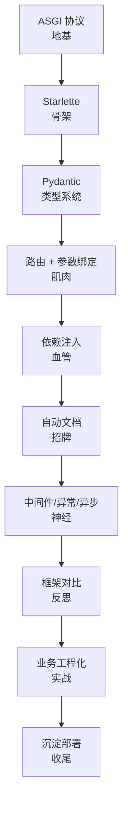

# 学习路径总览

本文档是整个学习项目的导航地图。先讲**整体设计思路**，再给出**分阶段路径**、**造轮子里程碑**、**推荐资料**与**写作规范**。

---

## 一、整体设计思路

### 1.1 设计原则

| 原则 | 说明 |
|------|------|
| **造轮子为主线** | 从零实现类 FastAPI 框架是贯穿全程的主线，而非单独一个阶段 |
| **理论→造轮子→笔记 三循环** | 每个主题按"读源码理解原理 → 自己实现最小版本 → 写笔记沉淀"三步走 |
| **渐进式逼近 FastAPI 子集** | 造轮子分 v0.1→v1.0 共 8 个里程碑，每个只新增一个核心能力 |
| **业务实践后置但并行** | 理解内部机制后，再用官方 FastAPI 做规范业务项目 |
| **文档站随学随更** | 每完成一个阶段就把笔记推上 GitHub Pages，最终自然成书 |

### 1.2 阶段顺序的编排逻辑

顺序对应 FastAPI 源码的依赖层次：

先打地基再起楼，读源码时不会有"这个类哪来的"困惑。

---

## 二、分阶段路径

### 阶段 0 · 环境与基础准备

- **目标**：搭好学习基建，后续不为环境分心
- **动作**：uv 创建两个项目、Git 仓库、MkDocs Material 文档站、克隆 FastAPI 源码备读
- **产出**：可访问的文档站首页 + 两个空项目骨架

### 阶段 1 · ASGI 协议与 Starlette

- **目标**：理解 FastAPI 的"地基"和"骨架"
- **核心概念**：WSGI vs ASGI、`scope/receive/send`、Starlette 在 FastAPI 中的定位、事件循环
- **实践**：手写 20 行 ASGI app、读 Starlette 源码
- **产出**：mini-fastapi v0.0

### 阶段 2 · Pydantic 与类型系统

- **目标**：理解"类型优先"哲学的根基
- **核心概念**：BaseModel、JSON Schema 自动生成、Pydantic v2 Rust 内核、与 dataclass 对比
- **产出**：基于注解的参数验证脚本

### 阶段 3 · 造轮子 v0.1–v0.3 · 路由与参数绑定

- **v0.1**：路由装饰器 + 路径参数
- **v0.2**：查询参数 + 请求体（Pydantic 验证 + 422 错误）
- **v0.3**：响应模型 + 状态码
- **产出**：能写 CRUD 接口（内存存储）的 mini 框架

### 阶段 4 · 依赖注入系统

- **目标**：理解 FastAPI 最精妙的 `Depends` 设计
- **核心概念**：依赖树递归解析、yield 依赖、缓存作用域、与中间件的边界
- **产出**：mini-fastapi v0.4

### 阶段 5 · 自动文档生成

- **目标**：理解"类型优先"如何消灭样板代码
- **核心概念**：OpenAPI 3.1 规范、从签名生成 schema、Swagger UI / ReDoc
- **产出**：mini 框架 `/docs` 能看到 Swagger UI

### 阶段 6 · 中间件、异常处理、异步深入

- **核心概念**：洋葱模型、异常处理器分发、异步 DB 驱动连接池
- **实践**：CORS/计时中间件、压测同步 vs 异步吞吐差异
- **产出**：mini-fastapi v0.6 + 压测报告

### 阶段 7 · 框架对比与选型

- **目标**：跳出 FastAPI，建立选型判断力
- **对比**：Flask / Django / FastAPI 在同步异步、类型系统、文档、ORM、性能、适用场景等维度的差异
- **产出**：一篇深度对比长文

### 阶段 8 · 业务工程化实践

用真 FastAPI 做博客 API（用户/权限/文章/标签），覆盖：

- 项目分层结构（api → service → repository → model）
- 配置管理（pydantic-settings 多环境）
- 数据库集成（SQLAlchemy 2.0 async + Alembic）
- 认证与权限（OAuth2 + JWT + RBAC）
- 错误处理与结构化日志（structlog + trace_id）
- API 版本管理
- 测试策略（pytest + httpx + testcontainers）
- 性能优化与部署

### 阶段 9 · 沉淀与部署

- 补全文档站导航与首页
- 每章检查 ≥ 700 行深度，补齐初学者友好解释
- 画整体架构图
- GitHub Actions 自动构建 MkDocs 推 Pages

---

## 三、造轮子里程碑路线图

| 版本 | 能力 | 对应阶段 |
|------|------|----------|
| v0.0 | 纯 ASGI app 跑通 | 阶段 1 |
| v0.1 | 路由装饰器 + 路径参数 | 阶段 3 |
| v0.2 | 查询参数 + 请求体（Pydantic） | 阶段 3 |
| v0.3 | 响应模型 + 状态码 | 阶段 3 |
| v0.4 | 依赖注入 Depends（含 yield、缓存） | 阶段 4 |
| v0.5 | OpenAPI 自动文档 + Swagger UI | 阶段 5 |
| v0.6 | 中间件 + 异常处理 | 阶段 6 |
| v0.7 | 异步 DB 集成示例 | 阶段 6/8 |
| v1.0 | 完整示例应用 + 测试套件 + 文档 | 阶段 9 |

每个版本打 git tag，并对应一篇"我是怎么实现 X 的"笔记。

---

## 四、推荐资料

| 资料 | 用途 |
|------|------|
| [FastAPI 官方文档](https://fastapi.tiangolo.com/) | 最权威，"教程"部分过一遍 |
| FastAPI 源码（`applications.py`、`routing.py`、`dependencies/`） | 造轮子对照 |
| [Starlette 源码](https://github.com/encode/starlette) | 理解骨架 |
| [Pydantic v2 文档](https://docs.pydantic.dev/) | 类型系统 |
| [ASGI 规范](https://asgi.readthedocs.io/) | 协议地基 |
| PEP 484 / 593（`Annotated`） | 类型注解机制 |
| [SQLAlchemy 2.0 异步文档](https://docs.sqlalchemy.org/en/20/orm/extensions/asyncio.html) | 业务实践 |

---

## 五、写作规范

!!! info "约束（只增不减）"
    笔记的深度和数量均不得减少。每章 ≥ 700 行，面向初学者，详细精细。

- 代码示例必须可运行，附预期输出
- 架构关系优先用 mermaid 图
- 关键概念先讲"为什么"再讲"怎么做"
- 每章开头给出本章学习目标与小节目录
- 每章结尾给出小结与下一章衔接