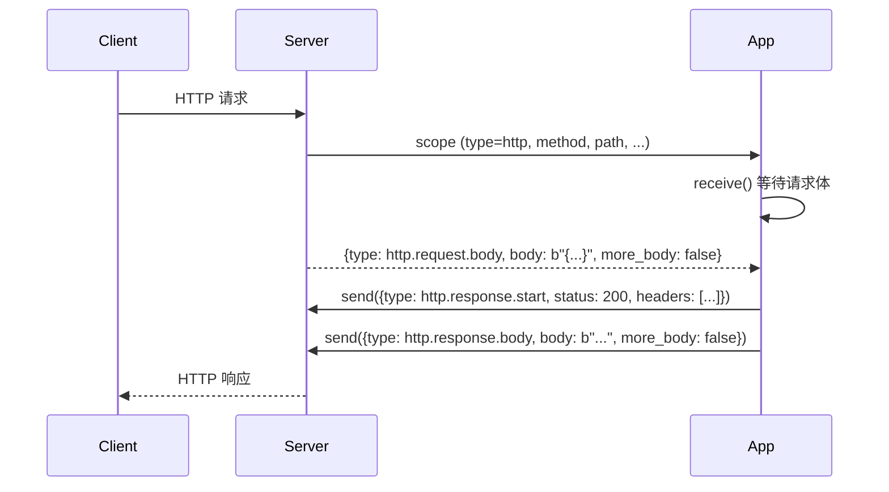
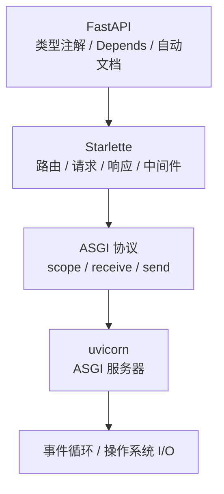

# 阶段 1 · ASGI 协议与 Starlette

!!! info "本章定位"
    FastAPI 的"地基"与"骨架"。理解了 ASGI 协议和 Starlette，就理解了 FastAPI 运行的底座。

---

## 本章学习目标

读完本章后，你应当能够：

1. 说清 WSGI 与 ASGI 的本质区别，以及为什么异步 Web 框架需要新协议
2. 准确描述 ASGI 三要素 `scope / receive / send` 的含义与用法
3. 手写一个不依赖任何框架的 ASGI 应用并用 uvicorn 跑起来
4. 解释 FastAPI、Starlette、ASGI 三者的层次关系
5. 读懂 Starlette 的 `Request / Response / Routing / Middleware` 核心源码
6. 理解事件循环与 `async/await` 的并发模型
7. 看懂我们在 `mini-fastapi` 中实现的 ASGI 入口与路由匹配

---

## 小节目录

1. 从 WSGI 到 ASGI：为什么需要新协议
2. ASGI 协议规范详解
3. 手写第一个 ASGI 应用
4. Starlette 在 FastAPI 中的定位
5. Starlette 核心组件源码导读
6. 事件循环与 async/await 基础
7. mini-fastapi 中的实现解读
8. 实践任务与产出
9. 小结与下一章衔接

---

## 1.1 从 WSGI 到 ASGI：为什么需要新协议

### 1.1.1 WSGI 回顾

WSGI（Web Server Gateway Interface，PEP 3333）是 Python Web 应用与服务器之间的**同步**接口标准，自 2003 年提出以来一直是 Flask、Django 等框架的基石。其核心签名非常简单：

```python
def app(environ: dict, start_response: Callable) -> Iterable[bytes]:
    """WSGI 应用：接收 environ 字典与 start_response 回调，返回响应体可迭代对象。"""
    start_response("200 OK", [("Content-Type", "text/plain")])
    return [b"Hello World"]
```

三个要素：

| 要素 | 类型 | 作用 |
|------|------|------|
| `environ` | `dict` | 包含请求所有信息的字典（`PATH_INFO`、`QUERY_STRING`、`REQUEST_METHOD`、`wsgi.input` 等） |
| `start_response` | `Callable` | 用于发送响应状态与头的回调 |
| 返回值 | `Iterable[bytes]` | 响应体的字节串可迭代对象 |

用 Flask 的话说，WSGI 就是"服务器把请求装进一个字典，丢给你的应用；你的应用把响应头通过回调发回去，再返回响应体"。整个过程**同步阻塞**：一个请求占用一个线程（或进程），处理完才能接下一个。

### 1.1.2 同步模型的局限

在 I/O 密集场景下，同步模型的瓶颈非常明显。假设一个接口需要查一次数据库（耗时 50ms）再调一次外部 API（耗时 100ms），同步模型下这个线程在这 150ms 里完全阻塞，什么也做不了。

| 场景 | 同步模型表现 | 异步模型表现 |
|------|------------|------------|
| CPU 密集（纯计算） | 好，充分利用线程 | 无优势，甚至略差（事件循环开销） |
| I/O 密集（DB/HTTP 调用） | 线程阻塞，吞吐受限 | 单线程高并发，I/O 等待时切换其他任务 |
| 长连接（SSE/WebSocket） | 每连接占一线程，资源浪费 | 事件复用，开销极低 |
| 并发连接数 | 受线程/进程上限（C10k 问题） | 单线程可处理数万连接 |

**关键洞察**：Web 应用绝大多数是 I/O 密集型（等数据库、等下游服务、等客户端），而非 CPU 密集型。异步模型在 I/O 等待时不闲着，而是去处理其他请求，从而在单线程内实现高并发。

### 1.1.3 ASGI 的设计动机

ASGI（Asynchronous Server Gateway Interface）由 Encode 团队（Starlette、uvicorn 的作者）提出，目标是：

1. **异步原生**：基于 `async/await`，I/O 密集场景高吞吐
2. **兼容 WSGI**：可以运行同步应用（通过线程池桥接）
3. **统一协议**：HTTP、WebSocket、生命周期事件用同一套 `scope/receive/send` 接口
4. **多协议**：原生支持 HTTP 与 WebSocket，不像 WSGI 只能处理 HTTP

ASGI 的提出直接催生了 FastAPI——它需要一个异步原生的底座，而 WSGI 给不了。

---

## 1.2 ASGI 协议规范详解

### 1.2.1 ASGI 三要素

ASGI 应用是一个**异步可调用对象**，签名固定为：

```python
async def app(scope: dict, receive: Callable, send: Callable) -> None:
    """ASGI 应用：接收 scope、receive、send，无返回值（通过 send 发响应）。"""
    ...
```

与 WSGI 对比：

| 对比项 | WSGI | ASGI |
|--------|------|------|
| 函数类型 | 同步 `def` | 异步 `async def` |
| 请求信息 | `environ` 字典 | `scope` 字典 |
| 接收请求体 | `environ["wsgi.input"]` 流 | `receive()` 异步调用 |
| 发送响应 | `start_response` + 返回值 | `send()` 异步调用 |
| 返回值 | 响应体可迭代 | 无（通过 `send` 发出） |

| 参数 | 类型 | 作用 |
|------|------|------|
| `scope` | `dict` | 连接元信息（请求类型、路径、头、查询串等），整个连接生命周期内不变 |
| `receive` | `async Callable` | 异步获取入站消息（请求体分片），每次调用返回一个消息字典 |
| `send` | `async Callable` | 异步发出出站消息（响应头、响应体分片），每次调用发送一个消息字典 |

注意：`scope` 在一个连接内是固定的，而 `receive` 和 `send` 是用来收发**消息流**的——请求体和响应体都可能被分成多个消息。

### 1.2.2 scope 字段详解

对于 HTTP 请求，`scope` 包含以下关键字段：

| 字段 | 类型 | 示例 | 说明 |
|------|------|------|------|
| `type` | `str` | `"http"` | 连接类型，HTTP 请求为 `"http"`，WebSocket 为 `"websocket"`，生命周期为 `"lifespan"` |
| `asgi` | `dict` | `{"version": "3.0", "spec_version": "2.3"}` | ASGI 规范版本 |
| `http_version` | `str` | `"1.1"` | HTTP 协议版本 |
| `method` | `str` | `"GET"` | 请求方法，大写 |
| `scheme` | `str` | `"http"` 或 `"https"` | 协议方案 |
| `path` | `str` | `"/users/42"` | 请求路径（已 URL 解码，不含查询串） |
| `query_string` | `bytes` | `b"limit=10&skip=0"` | 原始查询串（字节，未解码） |
| `headers` | `list[tuple[bytes, bytes]]` | `[(b"host", b"localhost"), ...]` | 请求头列表，键值均为小写字节 |
| `client` | `tuple[str, int] \| None` | `("127.0.0.1", 12345)` | 客户端地址与端口 |
| `server` | `tuple[str, int \| None]` | `("127.0.0.1", 8000)` | 服务器地址与端口 |

!!! tip "headers 为什么是小写字节"
    HTTP 头名是大小写不敏感的，ASGI 规范要求统一转为小写字节串，避免匹配时的大小写问题。值也是字节串而非字符串，因为头部可能包含非 ASCII 字符（如经编码的中文）。

### 1.2.3 receive 与 send 的事件流

ASGI 是**事件驱动**的，请求与响应都被建模为一系列消息事件。一次 HTTP 请求的完整消息流如下：



**入站消息（receive）**：

| 消息类型 | 字段 | 说明 |
|---------|------|------|
| `http.request.body` | `body: bytes`、`more_body: bool` | 请求体一个分片；`more_body=True` 表示还有后续分片 |

**出站消息（send）**：

| 消息类型 | 字段 | 说明 |
|---------|------|------|
| `http.response.start` | `status: int`、`headers: list[tuple[bytes, bytes]]` | 响应起始：状态码与头，每个响应只发一次 |
| `http.response.body` | `body: bytes`、`more_body: bool` | 响应体一个分片；流式响应可多次发送 |

!!! warning "more_body 的含义"
    请求体和响应体都可能很大，ASGI 允许分片发送。`more_body=True` 表示"后面还有分片"，接收方需要继续 `receive()`；`more_body=False`（或省略）表示这是最后一片。大多数小请求只有一片且 `more_body=False`。

### 1.2.4 生命周期事件

ASGI 还定义了 `lifespan` 类型事件，用于应用**启动与关闭**时执行初始化与清理逻辑（如建立数据库连接池、关闭连接池）。

```python
async def app(scope, receive, send):
    if scope["type"] == "lifespan":
        while True:
            message = await receive()
            if message["type"] == "lifespan.startup":
                # 启动时初始化资源
                await send({"type": "lifespan.startup.complete"})
            elif message["type"] == "lifespan.shutdown":
                # 关闭时清理资源
                await send({"type": "lifespan.shutdown.complete"})
                break
        return
    # ... 处理 http
```

| 事件 | 说明 |
|------|------|
| `lifespan.startup` | 服务器启动时触发，应用完成初始化后回 `lifespan.startup.complete` |
| `lifespan.shutdown` | 服务器关闭时触发，应用完成清理后回 `lifespan.shutdown.complete` |

FastAPI 的 `lifespan` 上下文管理器就是对这个协议的封装。

---

## 1.3 手写第一个 ASGI 应用

### 1.3.1 20 行 hello world

不用任何框架，纯 ASGI 协议写一个能跑的应用：

```python
async def app(scope, receive, send):
    assert scope["type"] == "http"
    await send({
        "type": "http.response.start",
        "status": 200,
        "headers": [(b"content-type", b"text/plain; charset=utf-8")],
    })
    await send({"type": "http.response.body", "body": b"Hello, ASGI"})
```

运行（保存为 `hello.py`）：

```bash
uv run uvicorn hello:app
```

访问 http://127.0.0.1:8000 看到 `Hello, ASGI`。

逐行解读：

- `async def app(scope, receive, send)`：ASGI 应用必须是异步函数，三参数固定
- `assert scope["type"] == "http"`：区分 HTTP 请求与 lifespan 事件；这里只处理 HTTP
- `await send({...http.response.start...})`：发送响应起始——状态码 200 和响应头
- `await send({...http.response.body...})`：发送响应体——字节串 `b"Hello, ASGI"`

### 1.3.2 解析路径与查询串

`scope["path"]` 是已解码的路径字符串，`scope["query_string"]` 是原始字节查询串。下面实现一个带路由和查询参数的纯 ASGI 应用（对应 `examples/asgi_raw.py`）：

```python
from urllib.parse import parse_qs

async def app(scope, receive, send):
    assert scope["type"] == "http"
    path = scope["path"]
    method = scope["method"]

    if path == "/" and method == "GET":
        await _send_json(send, 200, {"message": "hello, raw ASGI"})
        return

    if path == "/echo" and method == "GET":
        query_string = scope.get("query_string", b"")
        params = parse_qs(query_string.decode("utf-8"))
        msg = params.get("msg", [""])[0]
        await _send_json(send, 200, {"msg": msg})
        return

    await _send_json(send, 404, {"detail": "Not Found"})


async def _send_json(send, status, payload):
    import json
    body = json.dumps(payload).encode("utf-8")
    await send({
        "type": "http.response.start",
        "status": status,
        "headers": [(b"content-type", b"application/json; charset=utf-8")],
    })
    await send({"type": "http.response.body", "body": body})
```

测试：

```bash
uv run uvicorn examples.asgi_raw:app --reload
# GET /            → {"message": "hello, raw ASGI"}
# GET /echo?msg=hi → {"msg": "hi"}
# GET /missing     → {"detail": "Not Found"}
```

可以看到，**没有框架时路由就是一堆 if/else**，查询参数要手动 `parse_qs` 解析，JSON 响应要手动序列化。这正是框架要解决的问题——但理解这个"裸"的过程，才能明白框架帮你省了什么。

### 1.3.3 读取请求体

对于 POST/PUT 请求，请求体通过 `receive()` 异步读取。完整读取需要循环直到 `more_body` 为假：

```python
async def read_body(receive):
    body = b""
    more_body = True
    while more_body:
        message = await receive()
        body += message.get("body", b"")
        more_body = message.get("more_body", False)
    return body
```

用法：

```python
async def app(scope, receive, send):
    if scope["method"] == "POST" and scope["path"] == "/upper":
        body = await read_body(receive)
        result = body.upper()
        await send({
            "type": "http.response.start",
            "status": 200,
            "headers": [(b"content-type", b"text/plain")],
        })
        await send({"type": "http.response.body", "body": result})
        return
```

`curl -X POST localhost:8000/upper -d "hello"` → `HELLO`。

### 1.3.4 返回 JSON 响应

上面已经封装了 `_send_json` 辅助函数。核心就是：`json.dumps` 序列化 → `encode("utf-8")` 转字节 → 通过 `send` 发出。Starlette 的 `JSONResponse` 做的也是这件事，只是封装得更完善（支持自定义编码、状态码、头）。

---

## 1.4 Starlette 在 FastAPI 中的定位

### 1.4.1 层次关系



**FastAPI 之于 Starlette ≈ Flask 之于 Werkzeug**：

- Flask 没有自己实现请求/响应/路由，这些来自 Werkzeug；Flask 在其上加了装饰器路由、蓝图、模板集成等
- FastAPI 没有自己实现请求/响应/路由/中间件，这些来自 Starlette；FastAPI 在其上加了**类型驱动的参数绑定、依赖注入、自动文档生成**

理解这个分层很重要：当你用 `Request`、`Response`、`APIRouter`、中间件时，你用的是 Starlette；当你用 `Depends`、`response_model`、`Body()`、自动 `/docs` 时，你用的是 FastAPI 的增量。

### 1.4.2 Starlette 提供什么

| 能力 | Starlette 类/模块 | FastAPI 是否增强 |
|------|-------------------|----------------|
| 请求对象 | `starlette.requests.Request` | 否，直接复用 |
| 响应对象 | `starlette.responses.{JSON,PlainText,Streaming,...}Response` | 否，直接复用 |
| 路由 | `starlette.routing.{Route,Router,Mount}` | 是，`APIRoute` 增加参数绑定 |
| 中间件 | `starlette.middleware.{BaseHTTPMiddleware,...}` | 否，直接复用 |
| WebSocket | `starlette.websockets.WebSocket` | 否，直接复用 |
| 测试客户端 | `starlette.testclient.TestClient` | 否，直接复用 |
| 静态文件 | `starlette.staticfiles.StaticFiles` | 否，直接复用 |
| 后台任务 | `starlette.background.BackgroundTask` | 是，封装进 `BackgroundTasks` |

### 1.4.3 FastAPI 在其上加了什么

| 增量能力 | FastAPI 实现 | 依赖 |
|---------|-------------|------|
| 类型驱动参数绑定 | 从函数签名注解自动解析 path/query/body 参数并用 Pydantic 验证 | Pydantic |
| 依赖注入 | `Depends` 递归解析依赖树、缓存、yield 清理 | `inspect` |
| 自动文档 | 从签名 + Pydantic schema 生成 OpenAPI JSON，挂载 `/docs`、`/redoc` | Pydantic |
| `response_model` | 输出过滤与二次校验 | Pydantic |
| `Body / Query / Path / Header / Cookie` | 参数来源与约束的显式标记 | Pydantic |

一句话总结：**Starlette 是异步 Web 框架的骨架，FastAPI 在骨架上嫁接了类型系统（Pydantic）从而获得自动验证与自动文档**。

---

## 1.5 Starlette 核心组件源码导读

> 以下基于 Starlette 源码，建议对照阅读。安装后路径一般在 `.venv/Lib/site-packages/starlette/`。

### 1.5.1 Starlette 类

`starlette/applications.py` 的 `Starlette` 类是框架的组装中心：

```python
class Starlette:
    def __init__(self, middleware=None, routes=None, ...):
        self.router = Router(routes)
        self.user_middleware = middleware or []
        # 组装中间件栈：最外层是 ExceptionMiddleware，最内层是 Router
        self.middleware_stack = self.build_middleware_stack()

    async def __call__(self, scope, receive, send):
        scope["app"] = self
        await self.middleware_stack(scope, receive, send)
```

关键设计：`__call__` 不直接处理请求，而是委托给 `middleware_stack`——一个层层包裹的中间件链，最内层才是 `Router`。这就是**中间件洋葱模型**的源头。

### 1.5.2 Request

`starlette/requests.py` 的 `Request` 包装 `scope/receive`，提供友好的属性访问：

```python
class Request:
    def __init__(self, scope, receive=None, send=None):
        self.scope = scope
        self._receive = receive
        self._send = send

    @property
    def method(self) -> str:
        return self.scope["method"]

    @property
    def url(self) -> URL:
        return URL(scope=self.scope)

    async def body(self) -> bytes:
        if self._body is None:
            chunks = []
            more_body = True
            while more_body:
                message = await self._receive()
                chunks.append(message.get("body", b""))
                more_body = message.get("more_body", False)
            self._body = b"".join(chunks)
        return self._body

    async def json(self) -> Any:
        return json.loads(await self.body())
```

注意 `body()` 和 `json()` 都是 `async`——因为读取请求体需要 `await receive()`。且 `body()` 会缓存结果（`self._body`），避免重复读取。

### 1.5.3 Response

`starlette/responses.py` 的 `Response` 通过 `send` 发送响应：

```python
class Response:
    media_type = None

    def __init__(self, content, status_code=200, headers=None):
        self.body = self.render(content)
        self.status_code = status_code
        ...

    def render(self, content) -> bytes:
        if isinstance(content, bytes):
            return content
        return content.encode(self.charset)

    async def __call__(self, scope, receive, send):
        await send({"type": "http.response.start", "status": ..., "headers": ...})
        await send({"type": "http.response.body", "body": self.body})
```

`JSONResponse` 覆盖 `render` 用 `json.dumps`，`StreamingResponse` 覆盖 `__call__` 多次发送 body 分片。我们的 `mini-fastapi` 采用了同样的设计（`render()` + `__call__(send)`）。

### 1.5.4 Routing

`starlette/routing.py` 的 `Route` 用正则编译路径模式，`Router` 负责匹配与分发：

```python
class Route:
    def __init__(self, path, endpoint, methods=None):
        self.path = path
        self.endpoint = endpoint
        # 把 /users/{id} 编译为正则，提取参数
        self.path_regex, self.path_format, self.param_convertors = compile_path(path)

    def matches(self, scope):
        match = self.path_regex.match(scope["path"])
        if match:
            path_params = match.groupdict()
            return Match.FULL, path_params
        return Match.NONE, {}
```

`compile_path` 是核心：把 `{id}` 转为命名捕获组 `(?P<id>[^/]+)`。我们的 `mini-fastapi` 的 `compile_path` 做了同样的事，只是简化了（Starlette 还支持参数类型转换器，如 `{id:int}`）。

### 1.5.5 Middleware

Starlette 提供两种中间件写法：

**纯 ASGI 中间件**（性能最高，直接操作 scope/receive/send）：

```python
class TimingMiddleware:
    def __init__(self, app):
        self.app = app

    async def __call__(self, scope, receive, send):
        start = time.time()
        await self.app(scope, receive, send)
        print(f"耗时: {time.time() - start:.3f}s")
```

**BaseHTTPMiddleware**（易写，包装成 Request/Response，但有额外开销）：

```python
class TimingMiddleware(BaseHTTPMiddleware):
    async def dispatch(self, request, call_next):
        start = time.time()
        response = await call_next(request)
        response.headers["x-duration"] = str(time.time() - start)
        return response
```

我们的 `mini-fastapi` 在阶段 6 会实现中间件链。

---

## 1.6 事件循环与 async/await 基础

### 1.6.1 协程与事件循环

理解 ASGI 必须理解 Python 异步的基础概念：

| 概念 | 说明 |
|------|------|
| **协程函数** | `async def` 定义的函数，调用它返回一个协程对象（不立即执行） |
| **协程对象** | `coro = async_func()` 的返回值，需要被 `await` 或事件循环调度才执行 |
| **事件循环** | `asyncio` 的核心，负责注册 I/O 事件、调度就绪的回调、驱动协程执行 |
| **`await`** | 挂起当前协程，把控制权交还事件循环，直到被 await 的结果就绪 |

```python
import asyncio

async def fetch_data():
    await asyncio.sleep(1)  # 模拟 I/O，让出控制权 1 秒
    return "data"

# asyncio.run 启动事件循环并运行协程
result = asyncio.run(fetch_data())
```

uvicorn 启动时就会创建一个事件循环，持续驱动 ASGI app 处理请求。

### 1.6.2 并发模型：asyncio.gather vs 顺序 await

顺序 `await` 是串行的——一个完成才开始下一个：

```python
async def sequential():
    a = await fetch_data()  # 等 1 秒
    b = await fetch_data()  # 再等 1 秒
    return [a, b]  # 总耗时 2 秒
```

`asyncio.gather` 是并发的——多个任务同时启动，事件循环在 I/O 等待时切换：

```python
async def concurrent():
    a, b = await asyncio.gather(fetch_data(), fetch_data())  # 同时等，总耗时 1 秒
    return [a, b]
```

这就是异步高并发的本质：**单线程内，I/O 等待时不闲着，去推进其他任务**。FastAPI 的异步端点天然支持这种并发——一个端点里 `await` 多个 DB/HTTP 调用时，用 `asyncio.gather` 就能并行。

### 1.6.3 异步生态的坑

!!! danger "在异步代码里调用同步阻塞函数会卡死整个事件循环"
    事件循环是单线程的。如果一个"异步"端点里调用了 `time.sleep(1)` 或 `requests.get(url)`（同步阻塞），整个事件循环在这期间无法处理任何其他请求——所有并发优势归零。

| 错误用法 | 正确替代 |
|---------|---------|
| `time.sleep(1)` | `await asyncio.sleep(1)` |
| `requests.get(url)` | `await httpx.AsyncClient().get(url)` |
| `psycopg2` 同步查询 | `asyncpg` / `psycopg` 异步查询 |
| `open().read()` 大文件 | `aiofiles.open()` |

如果必须用同步库（没有异步替代），用 `asyncio.to_thread` 把阻塞调用丢到线程池：

```python
result = await asyncio.to_thread(blocking_function, arg1, arg2)
```

这样阻塞调用在另一个线程执行，不卡事件循环。但注意线程池大小有限，不能滥用。

---

## 1.7 mini-fastapi 中的实现解读

本阶段我们在 `mini-fastapi` 中实现了 v0.1：ASGI 入口 + 路由匹配 + 路径参数。下面解读关键代码。

### 1.7.1 路径编译（routing.py）

```python
_PARAM_RE = re.compile(r"\{(\w+)\}")

def compile_path(path: str) -> tuple[re.Pattern[str], list[str]]:
    param_names = _PARAM_RE.findall(path)
    regex = _PARAM_RE.sub(r"(?P<\1>[^/]+)", path)
    pattern = re.compile(f"^{regex}$")
    return pattern, param_names
```

工作原理：

1. `_PARAM_RE` 匹配 `{name}` 形式的参数标记
2. `findall` 提取所有参数名，如 `["user_id", "post_id"]`
3. `sub` 把 `{name}` 替换为命名捕获组 `(?P<name>[^/]+)`——`[^/]+` 表示"匹配除斜杠外的任意字符"
4. 加上 `^...$` 锚定首尾，编译为正则

示例：`"/users/{user_id}/posts/{post_id}"` → `^/users/(?P<user_id>[^/]+)/posts/(?P<post_id>[^/]+)$`

### 1.7.2 路由匹配（routing.py）

```python
def match(self, method: str, path: str) -> tuple[Route, dict[str, str]] | None:
    for route in self.routes:
        if method not in route.methods:
            continue
        matched = route.pattern.match(path)
        if matched is not None:
            path_params = matched.groupdict()
            return route, path_params
    return None
```

遍历路由表，先检查方法是否允许，再用编译后的正则匹配路径。`groupdict()` 直接拿到路径参数字典，如 `{"user_id": "42"}`。

### 1.7.3 ASGI 入口（application.py）

```python
async def __call__(self, scope, receive, send):
    if scope["type"] == "lifespan":
        await self._handle_lifespan(scope, receive, send)
        return
    if scope["type"] == "http":
        await self._handle_http(scope, receive, send)
        return
```

入口按 `scope["type"]` 分发到 lifespan 或 http 处理器——这正是 1.2.4 讲的协议分支。

```python
async def _handle_http(self, scope, receive, send):
    method = scope["method"]
    path = scope["path"]
    matched = self.router.match(method, path)
    if matched is None:
        await JSONResponse({"detail": "Not Found"}, status_code=404)(send)
        return
    route, path_params = matched
    try:
        result = await self._invoke_endpoint(route.endpoint, path_params)
    except Exception:
        await JSONResponse({"detail": "Internal Server Error"}, status_code=500)(send)
        return
    response = self._coerce_result(result)
    await response(send)
```

HTTP 处理流程：解析 method/path → 路由匹配 → 404 兜底 → 调用端点 → 500 兜底 → 返回值转 Response → 发送。

```python
async def _invoke_endpoint(self, endpoint, path_params):
    if inspect.iscoroutinefunction(endpoint):
        return await endpoint(**path_params)
    return endpoint(**path_params)
```

用 `inspect.iscoroutinefunction` 判断端点是 `async def` 还是普通 `def`，分别处理——这样用户既能写同步端点也能写异步端点。

```python
def _coerce_result(self, result):
    if isinstance(result, Response):
        return result
    if isinstance(result, (dict, list)):
        return JSONResponse(result)
    return PlainTextResponse(str(result))
```

端点返回值的自动转换：`Response` 实例直接用，`dict`/`list` 转 JSON，其他转纯文本。这就是为什么端点直接 `return {"msg": "hi"}` 就能返回 JSON。

---

## 1.8 实践任务与产出

### 任务 1：纯 ASGI app

已实现 `examples/asgi_raw.py`——不依赖框架，直接用 ASGI 协议实现路由、查询参数、JSON 响应。

### 任务 2：mini-fastapi v0.1

已实现 `src/mini_fastapi/` 的 `routing.py`、`responses.py`、`application.py`，支持：

- `@app.get`/`@app.post` 路由装饰器
- 路径参数提取（`/users/{user_id}`）
- 同步与异步端点
- 返回 dict/list 自动转 JSON，返回 Response 直接使用
- 404 与 500 兜底

运行 `examples/hello.py`：

```bash
uv run uvicorn examples.hello:app --reload
# GET /            → {"message": "hello, mini-fastapi"}
# GET /users/42    → {"user_id": "42"}
# GET /users/1/posts/2 → {"user_id": "1", "post_id": "2"}
# POST /echo       → {"echo": True}
# GET /missing     → 404
```

### 任务 3：测试

已编写 23 个测试，覆盖路由编译/匹配、响应发送、ASGI 入口全流程：

```bash
uv run pytest -v  # 23 passed
```

### 产出

- `mini-fastapi` v0.1（ASGI 入口 + 路由 + 路径参数）
- 本章笔记（≥ 700 行）
- 23 个通过的测试

---

## 1.9 小结与下一章衔接

本章打好了"地基"：

1. **ASGI 协议**：`scope/receive/send` 三要素，事件驱动，支持 HTTP/WebSocket/lifespan
2. **Starlette 定位**：FastAPI 的骨架，提供请求/响应/路由/中间件
3. **事件循环**：单线程高并发的原理，`await` 让出控制权，`gather` 并发
4. **mini-fastapi v0.1**：ASGI 入口 + 路由匹配 + 路径参数，23 测试通过

但 FastAPI 最显著的特征——**类型优先、自动验证**——还藏在 Pydantic 里。当前 mini-fastapi 的路径参数都是字符串（`user_id` 是 `"42"` 而非 `42`），没有类型转换与验证。下一章我们进入类型系统，理解 Pydantic 如何从类型注解驱动运行时验证。

---

!!! success "阶段 1 完成"
    - mini-fastapi v0.1 实现并测试通过
    - 本章笔记已展开为完整正文
    - 下一章：阶段 2 · Pydantic 与类型系统
