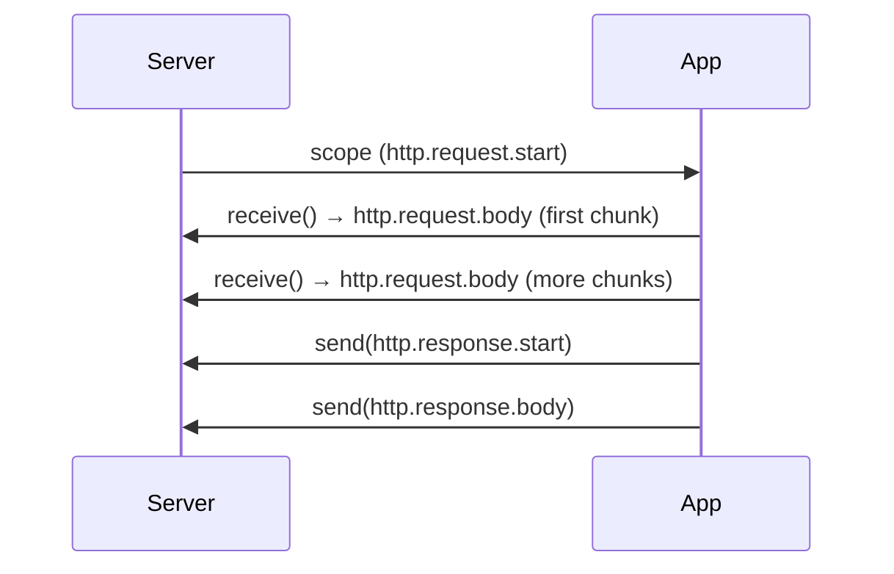
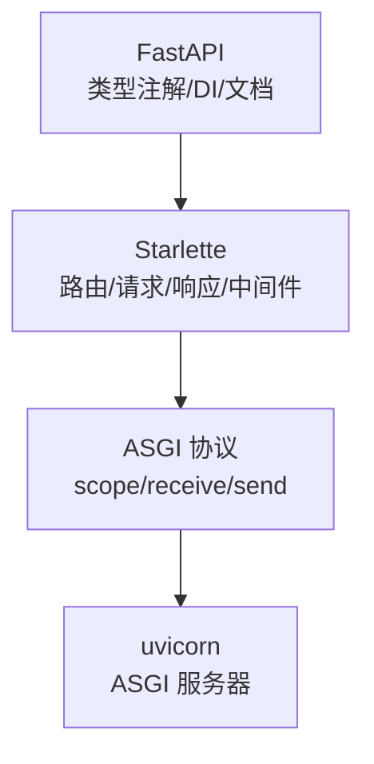

# 阶段 1 · ASGI 协议与 Starlette

!!! info "本章定位"
    FastAPI 的"地基"与"骨架"。理解了 ASGI 协议和 Starlette，就理解了 FastAPI 运行的底座。

---

## 本章学习目标

读完本章后，你应当能够：

1. 说清 WSGI 与 ASGI 的本质区别，以及为什么异步 Web 框架需要新协议
2. 准确描述 ASGI 三要素 `scope / receive / send` 的含义与用法
3. 手写一个不依赖任何框架的 ASGI 应用并用 uvicorn 跑起来
4. 解释 FastAPI、Starlette、ASGI 三者的层次关系
5. 读懂 Starlette 的 `Request / Response / Routing / Middleware` 核心源码
6. 理解事件循环与 `async/await` 的并发模型

---

## 小节目录

1. [从 WSGI 到 ASGI：为什么需要新协议](#11-从-wsgi-到-asgi为什么需要新协议)
2. [ASGI 协议规范详解](#12-asgi-协议规范详解)
3. [手写第一个 ASGI 应用](#13-手写第一个-asgi-应用)
4. [Starlette 在 FastAPI 中的定位](#14-starlette-在-fastapi-中的定位)
5. [Starlette 核心组件源码导读](#15-starlette-核心组件源码导读)
6. [事件循环与 async/await 基础](#16-事件循环与-asyncawait-基础)
7. [实践任务与产出](#17-实践任务与产出)
8. [小结与下一章衔接](#18-小结与下一章衔接)

---

## 1.1 从 WSGI 到 ASGI：为什么需要新协议

### 1.1.1 WSGI 回顾

WSGI（PEP 3333）是 Python Web 应用与服务器之间的同步接口标准。其核心签名：

```python
def app(environ: dict, start_response: Callable) -> Iterable[bytes]:
    start_response("200 OK", [("Content-Type", "text/plain")])
    return [b"Hello World"]
```

要点：

- `environ` 是一个字典，包含请求的所有信息（`PATH_INFO`、`QUERY_STRING` 等）
- `start_response` 用于发送响应头
- 返回一个可迭代字节串作为响应体
- **全程同步**：一个请求占用一个线程/进程，处理完才能接下一个

### 1.1.2 同步模型的局限

待补充：用一张表对比同步模型在 I/O 密集场景下的瓶颈（线程开销、上下文切换、C10k 问题）。

| 场景 | 同步模型表现 | 异步模型表现 |
|------|------------|------------|
| CPU 密集 | 好 | 无优势 |
| I/O 密集（DB/HTTP 调用） | 线程阻塞，吞吐受限 | 单线程高并发 |
| 长连接（SSE/WebSocket） | 每连接占一线程，资源浪费 | 事件复用，开销极低 |

### 1.1.3 ASGI 的设计动机

ASGI（Asynchronous Server Gateway Interface）由 Encode 团队提出，目标是：

1. **异步原生**：基于 `async/await`，I/O 密集场景高吞吐
2. **兼容 WSGI**：可运行同步应用
3. **统一协议**：HTTP、WebSocket、生命周期事件用同一套接口
4. **多协议**：支持 HTTP 与 WebSocket

---

## 1.2 ASGI 协议规范详解

### 1.2.1 ASGI 三要素

ASGI 应用是一个异步可调用对象，签名固定：

```python
async def app(scope: dict, receive: Callable, send: Callable) -> None:
    ...
```

| 参数 | 类型 | 作用 |
|------|------|------|
| `scope` | `dict` | 连接元信息（请求类型、路径、头、查询串等） |
| `receive` | `async Callable` | 异步获取入站消息（请求体分片） |
| `send` | `async Callable` | 异步发出出站消息（响应头、响应体分片） |

### 1.2.2 scope 字段详解

待补充：列出 `scope` 在 HTTP 请求下的完整字段表（`type`、`asgi`、`http_version`、`method`、`scheme`、`path`、`query_string`、`headers`、`client`、`server` 等），逐字段解释。

### 1.2.3 receive 与 send 的事件流

ASGI 是**事件驱动**的，请求与响应都被建模为一系列消息事件：



待补充：详细讲 `http.request.body` 的 `more_body` 标志、`http.response.start` 与 `http.response.body` 的结构。

### 1.2.4 生命周期事件

ASGI 还定义了 `lifespan` 类型事件，用于应用启动/关闭时初始化与清理（如数据库连接池）。

待补充：`lifespan.startup`、`lifespan.shutdown` 的处理流程与示例。

---

## 1.3 手写第一个 ASGI 应用

### 1.3.1 20 行 hello world

```python
async def app(scope, receive, send):
    assert scope["type"] == "http"
    await send({
        "type": "http.response.start",
        "status": 200,
        "headers": [(b"content-type", b"text/plain")],
    })
    await send({"type": "http.response.body", "body": b"Hello, ASGI"})
```

运行：

```bash
uv run uvicorn hello:app
```

待补充：逐行解读，并说明 `assert scope["type"] == "http"` 的意义（区分 http 与 lifespan）。

### 1.3.2 解析 scope 中的路径与查询串

待补充：写一个根据 `scope["path"]` 返回不同内容的路由雏形，演示从 `scope["query_string"]`（原始字节）解析查询参数。

### 1.3.3 读取请求体

待补充：用 `receive` 循环读取 `http.request.body` 直到 `more_body` 为假，拼出完整请求体。

### 1.3.4 返回 JSON 响应

待补充：封装一个 `JSONResponse`，把 dict 序列化后通过 `send` 发出。

---

## 1.4 Starlette 在 FastAPI 中的定位

### 1.4.1 层次关系



**FastAPI 之于 Starlette ≈ Flask 之于 Werkzeug**：FastAPI 在 Starlette 之上增加了类型驱动的参数绑定、依赖注入、自动文档，而底层的请求/响应/路由/中间件都来自 Starlette。

### 1.4.2 Starlette 提供什么

待补充：列出 Starlette 提供的核心能力清单（Request、Response 及其子类、Router、Middleware、HTTPEndpoint、WebSocket、TestClient、静态文件、后台任务等）。

### 1.4.3 FastAPI 在其上加了什么

待补充：列出 FastAPI 相对 Starlette 的增量（Pydantic 参数绑定、Depends、OpenAPI 自动生成、response_model、BackgroundTasks 封装等）。

---

## 1.5 Starlette 核心组件源码导读

### 1.5.1 Starlette 类

待补充：导读 `starlette/applications.py` 的 `Starlette` 类——`__init__` 如何组装 router、middleware、lifespan，`__call__` 如何分发 http 与 lifespan。

### 1.5.2 Request

待补充：导读 `starlette/requests.py`——`Request` 如何包装 `scope/receive`，`json()`、`form()`、`body()` 如何异步读取。

### 1.5.3 Response

待补充：导读 `starlette/responses.py`——`Response.__call__` 如何通过 send 发送响应，JSONResponse/PlainTextResponse/StreamingResponse 的差异。

### 1.5.4 Routing

待补充：导读 `starlette/routing.py`——`Route` 如何编译路径模式，`Router` 如何匹配与分发，`Mount` 如何嵌套子应用。

### 1.5.5 Middleware

待补充：导读 `starlette/middleware/`——纯 ASGI 中间件与 `BaseHTTPMiddleware` 的区别与性能取舍。

---

## 1.6 事件循环与 async/await 基础

### 1.6.1 协程与事件循环

待补充：讲清协程函数（`async def`）与协程对象、事件循环的职责（注册 I/O、调度就绪回调）、`await` 的语义（让出控制权直到结果就绪）。

### 1.6.2 并发模型：asyncio.gather vs 顺序 await

待补充：用代码对比顺序 `await` 与 `asyncio.gather` 的耗时差异，直观展示并发收益。

### 1.6.3 异步生态的坑

待补充：同步阻塞调用在异步代码中的危害（阻塞整个事件循环）、`asyncio.to_thread` / `run_in_executor` 的逃生通道。

---

## 1.7 实践任务与产出

### 任务 1：纯 ASGI app

手写一个 ASGI app，实现 `GET /` 返回 JSON、`GET /echo?msg=x` 返回 `{msg: x}`、其他路径返回 404。

### 任务 2：读请求体

实现 `POST /upper`，读取请求体并返回大写形式。

### 任务 3：读 Starlette 源码

阅读上述 5 个核心文件，在笔记中记录关键行号与设计决策。

### 产出

- `mini-fastapi` v0.0（一个能跑的纯 ASGI app）
- 本章笔记（≥ 700 行）

---

## 1.8 小结与下一章衔接

本章打好了"地基"：理解了 ASGI 协议与 Starlette 骨架。但 FastAPI 最显著的特征——**类型优先、自动验证**——还藏在 Pydantic 里。下一章我们进入类型系统。

---

!!! todo "待填充标记说明"
    本文件为大纲骨架，标注「待补充」处为后续要展开的内容点。每个待补充点都已规划好要讲的核心问题与示例方向，填充时直接展开即可达到 ≥ 700 行深度。**笔记深度与数量只增不减**，本骨架的小节结构在填充时只会扩充不会删减。