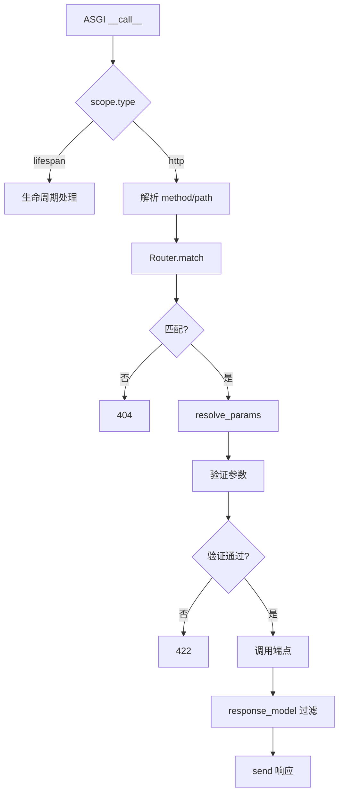

# 阶段 3 · 造轮子：路由与参数绑定

!!! info "本章定位"
    造轮子的第一波高潮。把阶段 1 的 ASGI 地基与阶段 2 的 Pydantic 类型系统合起来，实现 `@app.get("/users/{id}")` 真正可用，覆盖 v0.1–v0.3 三个里程碑。

---

## 本章学习目标

读完本章后，你应当能够：

1. 实现路由装饰器与路径参数提取（正则编译路径模式）
2. 用 `inspect.signature` 解析端点函数参数注解，区分路径/查询/请求体参数
3. 集成 Pydantic 完成请求体验证，并产出对齐 FastAPI 的 422 错误结构
4. 实现 `response_model` 输出过滤与 `status_code` 控制
5. 让 mini-fastapi 跑通一个内存存储的 CRUD 接口

---

## 小节目录

1. [v0.1 · 路由装饰器与路径参数](#31-v01--路由装饰器与路径参数)
2. [v0.2 · 查询参数与请求体](#32-v02--查询参数与请求体)
3. [v0.2 · 422 验证错误响应](#33-v02--422-验证错误响应)
4. [v0.3 · 响应模型与状态码](#34-v03--响应模型与状态码)
5. [ASGI 请求分发全流程](#35-asgi-请求分发全流程)
6. [与 FastAPI 源码对照](#36-与-fastapi-源码对照)
7. [实践任务与产出](#37-实践任务与产出)
8. [小结与下一章衔接](#38-小结与下一章衔接)

---

## 3.1 v0.1 · 路由装饰器与路径参数

### 3.1.1 路径模式编译

将 `/users/{user_id}/posts/{post_id}` 编译为正则 `^/users/(?P<user_id>[^/]+)/posts/(?P<post_id>[^/]+)$`，同时提取参数名列表。

待补充：给出 `compile_path` 函数的完整实现与逐行解读。

### 3.1.2 路由匹配

待补充：`Router.match(method, path)` 遍历路由表，用编译后的正则匹配，返回 `(route, path_params)`。

### 3.1.3 装饰器注册

待补充：`@app.get(path)` 如何把端点函数连同方法、路径注册到 router。

### 3.1.4 跑通第一个接口

```python
app = MiniFastAPI()

@app.get("/users/{user_id}")
def get_user(user_id: int):
    return {"user_id": user_id}
```

待补充：展示 `GET /users/42` → `{"user_id": 42}` 的完整请求-响应流程。

---

## 3.2 v0.2 · 查询参数与请求体

### 3.2.1 参数分类策略

用 `inspect.signature` 拿到端点函数每个参数的注解，按以下规则分类：

| 注解类型 | 归类 | 来源 |
|---------|------|------|
| 出现在路径模式 `{name}` 中 | 路径参数 | URL 路径 |
| `int / str / float / bool` 等基本类型 | 查询参数 | URL 查询串 |
| `BaseModel` 子类 | 请求体 | 请求体 JSON |
| `Annotated[T, Path/Query/Body]` | 显式指定 | 对应来源 |

待补充：给出 `resolve_params(func, path_param_names)` 的完整实现。

### 3.2.2 查询参数解析与类型转换

待补充：从 `scope["query_string"]` 解析查询串，按注解做类型转换（`int(x)`、`bool(x)` 等），缺失参数用默认值或报错。

### 3.2.3 请求体解析与 Pydantic 验证

待补充：用 `receive` 读取完整请求体，`json.loads` 后用 `Model.model_validate()` 验证，成功得到模型实例注入参数。

---

## 3.3 v0.2 · 422 验证错误响应

### 3.3.1 FastAPI 的 422 结构

```json
{
  "detail": [
    {"loc": ["body", "price"], "msg": "field required", "type": "value_error.missing"}
  ]
}
```

待补充：讲清 `loc`（错误位置路径）、`msg`、`type` 三字段的含义，以及为什么 FastAPI 用 422 而非 400。

### 3.3.2 捕获 ValidationError 转换

待补充：捕获 `pydantic.ValidationError`，把 `err.errors()` 转成上述结构，返回 422 响应。

---

## 3.4 v0.3 · 响应模型与状态码

### 3.4.1 response_model 输出过滤

待补充：`@app.get("/", response_model=UserRead)` 如何在端点返回后，用 `UserRead.model_validate()` 重新序列化，过滤掉敏感字段（如 `hashed_password`）。

### 3.4.2 status_code 控制

待补充：装饰器 `status_code=201` 如何在响应中生效。

### 3.4.3 响应类选择

待补充：`response_class=PlainTextResponse` 的处理。

---

## 3.5 ASGI 请求分发全流程



待补充：把这张流程图的每个节点对应到 mini-fastapi 的代码行。

---

## 3.6 与 FastAPI 源码对照

待补充：对照阅读 `fastapi/routing.py` 的 `APIRoute`、`get_request_handler`，找出你的实现与官方的差异（如背景任务、响应字段校验严格度等），分析差异原因。

---

## 3.7 实践任务与产出

### 任务：内存 CRUD

用 v0.3 的 mini-fastapi 实现一个 `Item` 资源的 CRUD（内存 dict 存储），包含：

- `POST /items`（请求体 `ItemCreate`，返回 `ItemRead`，201）
- `GET /items/{id}`（404 处理）
- `GET /items`（查询参数 `skip`/`limit` 分页）
- `PUT /items/{id}`
- `DELETE /items/{id}`

### 产出

- mini-fastapi v0.1–v0.3（打三个 git tag）
- 本章笔记（≥ 700 行）

---

## 3.8 小结与下一章衔接

本章让 mini-fastapi 有了"肌肉"：路由、参数绑定、响应控制。但还缺 FastAPI 最精妙的设计——依赖注入。下一章实现 `Depends`。

---

!!! todo "待填充标记说明"
    本文件为大纲骨架，标注「待补充」处为后续要展开的内容点。每个待补充点都已规划好要讲的核心问题与示例方向，填充时直接展开即可达到 ≥ 700 行深度。**笔记深度与数量只增不减**，本骨架的小节结构在填充时只会扩充不会删减。