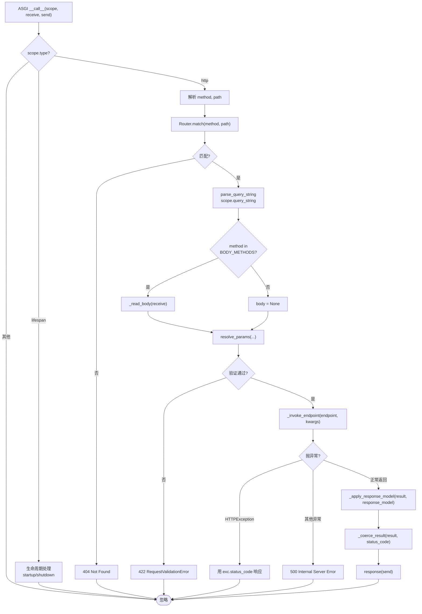

# 阶段 3 · 造轮子：路由与参数绑定

!!! info "本章定位"
    造轮子的第一波高潮。把阶段 1 的 ASGI 地基与阶段 2 的 Pydantic 类型系统合起来，实现 `@app.get("/users/{id}")` 真正可用，覆盖 v0.1–v0.3 三个里程碑。

    读完本章，你将理解 FastAPI「装饰器注册 → 路由匹配 → 参数绑定 → 响应过滤」的完整请求生命周期，并亲手实现每一个环节。

---

## 本章学习目标

读完本章后，你应当能够：

1. 实现路由装饰器与路径参数提取（正则编译路径模式）
2. 用 `inspect.signature` 解析端点函数参数注解，区分路径/查询/请求体参数
3. 集成 Pydantic 完成请求体验证，并产出对齐 FastAPI 的 422 错误结构
4. 实现 `response_model` 输出过滤与 `status_code` 控制
5. 让 mini-fastapi 跑通一个内存存储的 CRUD 接口

---

## 小节目录

1. v0.1 · 路由装饰器与路径参数
2. v0.2 · 查询参数与请求体
3. v0.2 · 422 验证错误响应
4. v0.3 · 响应模型与状态码
5. ASGI 请求分发全流程
6. 与 FastAPI 源码对照
7. 实践任务与产出
8. 小结与下一章衔接

---

## 3.1 v0.1 · 路由装饰器与路径参数

### 3.1.1 从问题出发：FastAPI 的 `@app.get` 做了什么

在 FastAPI 中，你写下这段代码：

```python
from fastapi import FastAPI

app = FastAPI()

@app.get("/users/{user_id}")
def get_user(user_id: int):
    return {"user_id": user_id}
```

看似简单的一行装饰器，背后至少完成了四件事：

| 步骤 | 做了什么 | 对应 FastAPI 源码位置 |
|------|---------|---------------------|
| ① 编译路径 | 把 `"/users/{user_id}"` 编译为可匹配的正则 | `fastapi/routing.py` → `compile_path` |
| ② 注册路由 | 把端点函数、方法、路径存入路由表 | `fastapi/routing.py` → `APIRouter.add_api_route` |
| ③ 解析参数 | 用 `inspect.signature` 提取 `user_id: int` | `fastapi/dependencies/utils.py` → `analyze_param` |
| ④ 构建签名 | 生成 OpenAPI 文档所需的参数描述 | `fastapi/routing.py` → `APIRoute` |

本章先实现 ①②③，④留到阶段 5（OpenAPI 文档）。

### 3.1.2 路径模式编译

**核心问题**：如何把 `"/users/{user_id}/posts/{post_id}"` 变成能匹配 `"/users/42/posts/7"` 并提取 `user_id=42, post_id=7` 的正则？

**思路**：用正则的命名捕获组 `(?P<name>pattern)`。把 `{user_id}` 替换为 `(?P<user_id>[^/]+)`，`[^/]+` 表示「一个或多个非斜杠字符」。

```python
import re

_PARAM_RE = re.compile(r"\{(\w+)\}")

def compile_path(path: str) -> tuple[re.Pattern[str], list[str]]:
    """把路径模式编译为正则，并提取路径参数名。

    示例：
        "/users/{user_id}"           → (^/users/(?P<user_id>[^/]+)$, ["user_id"])
        "/posts/{post_id}/comments"  → (^/posts/(?P<post_id>[^/]+)/comments$, ["post_id"])

    Args:
        path: 路径模式，参数用 {name} 标记

    Returns:
        (编译后的正则, 参数名列表)
    """
    param_names = _PARAM_RE.findall(path)
    regex = _PARAM_RE.sub(r"(?P<\1>[^/]+)", path)
    pattern = re.compile(f"^{regex}$")
    return pattern, param_names
```

逐行解读：

- **`_PARAM_RE = re.compile(r"\{(\w+)\}")`**：预编译一个正则，匹配 `{` 后跟一个或多个单词字符（字母/数字/下划线）再跟 `}`。圆括号 `(\w+)` 是捕获组，用来提取参数名。
- **`param_names = _PARAM_RE.findall(path)`**：在路径模式中找出所有参数名。如 `"/users/{user_id}/posts/{post_id}"` → `["user_id", "post_id"]`。
- **`regex = _PARAM_RE.sub(r"(?P<\1>[^/]+)", path)`**：把每个 `{name}` 替换为 `(?P<name>[^/]+)`。`\1` 引用第一个捕获组（即参数名），`(?P<name>...)` 是 Python 正则的命名捕获组语法。替换后 `"/users/{user_id}"` → `"/users/(?P<user_id>[^/]+)"`。
- **`pattern = re.compile(f"^{regex}$")`**：加上 `^` 和 `$` 锚定首尾，确保整路径匹配而非部分匹配。

验证：

```python
pattern, names = compile_path("/users/{user_id}/posts/{post_id}")
print(names)          # ['user_id', 'post_id']
m = pattern.match("/users/42/posts/7")
print(m.groupdict())  # {'user_id': '42', 'post_id': '7'}
```

!!! tip "为什么用 `[^/]+` 而非 `.+`"
    `[^/]+` 确保参数值不含斜杠，避免 `/users/42/extra` 错误匹配 `/users/{user_id}`。FastAPI 的默认转换器 `str` 也用 `[^/]+`。如果需要匹配斜杠（如文件路径），FastAPI 支持 `{path:path}` 语法，用 `.+` 匹配——这属于路径转换器（path converters），本章暂不实现。

### 3.1.3 Route 数据结构

每条路由需要存储：路径模式、端点函数、HTTP 方法、编译后的正则、参数名列表。v0.3 还增加了 `response_model` 和 `status_code`。

```python
from dataclasses import dataclass, field
from typing import Any, Callable

@dataclass
class Route:
    """单条路由定义。"""
    path: str
    endpoint: Callable[..., Any]
    methods: list[str] = field(default_factory=lambda: ["GET"])
    pattern: re.Pattern[str] = field(default_factory=lambda: re.compile("^/$"))
    param_names: list[str] = field(default_factory=list)
    response_model: type | None = None
    status_code: int | None = None
```

用 `dataclass` 而非普通类，省去手写 `__init__`，字段类型一目了然。`field(default_factory=...)` 用于可变默认值，避免可变默认参数陷阱。

### 3.1.4 Router 路由表

`Router` 管理路由列表，提供注册与匹配两个方法：

```python
class Router:
    """路由表，负责注册与匹配。"""

    def __init__(self) -> None:
        self.routes: list[Route] = []

    def add_route(
        self,
        path: str,
        endpoint: Callable[..., Any],
        methods: list[str],
        response_model: type | None = None,
        status_code: int | None = None,
        **opts: Any,
    ) -> None:
        """注册一条路由，编译路径模式为正则。"""
        pattern, param_names = compile_path(path)
        route = Route(
            path=path,
            endpoint=endpoint,
            methods=methods,
            pattern=pattern,
            param_names=param_names,
            response_model=response_model,
            status_code=status_code,
        )
        self.routes.append(route)

    def match(self, method: str, path: str) -> tuple[Route, dict[str, str]] | None:
        """匹配请求到路由，返回 (route, path_params) 或 None。"""
        for route in self.routes:
            if method not in route.methods:
                continue
            matched = route.pattern.match(path)
            if matched is not None:
                path_params = matched.groupdict()
                return route, path_params
        return None
```

`match` 方法的逻辑：

1. 遍历所有已注册路由
2. 先检查 HTTP 方法是否匹配（不匹配则跳过）
3. 用正则匹配路径，成功则用 `groupdict()` 提取路径参数字典
4. 全部不匹配则返回 `None`（调用方据此返回 404）

!!! warning "路由顺序很重要"
    当前实现按注册顺序遍历，第一个匹配的路由胜出。如果先注册 `/users/me` 再注册 `/users/{user_id}`，请求 `/users/me` 会命中前者——这是正确行为。但如果反过来注册，`/users/me` 会被 `{user_id}` 捕获为 `user_id="me"`。FastAPI 也有此特性，所以**特殊路径要放在参数路径之前注册**。

### 3.1.5 装饰器注册

`MiniFastAPI` 的 `get` / `post` 方法是装饰器工厂，把端点函数注册到内部路由表：

```python
class MiniFastAPI:
    def __init__(self, *, title: str = "MiniFastAPI", version: str = "0.0.0") -> None:
        self.title = title
        self.version = version
        self.router: Router = Router()

    def get(
        self,
        path: str,
        response_model: type | None = None,
        status_code: int | None = None,
        **opts: Any,
    ) -> Callable[..., Any]:
        """注册 GET 路由。"""
        def decorator(func: Callable[..., Any]) -> Callable[..., Any]:
            self.router.add_route(
                path, func, methods=["GET"],
                response_model=response_model, status_code=status_code, **opts,
            )
            return func
        return decorator
```

`get` 是装饰器工厂：调用 `@app.get("/users/{id}")` 返回 `decorator`，`decorator` 接收端点函数并注册到路由表，然后原样返回函数（不改变函数本身）。

`**opts` 收集额外关键字参数（如未来的 `tags`、`summary`、`description` 等 OpenAPI 元信息），现阶段直接忽略，为后续扩展预留。

### 3.1.6 跑通第一个接口

v0.1 的 ASGI 请求处理（简化版，仅路由匹配 + 路径参数）：

```python
async def _handle_http(self, scope: dict, receive: Callable, send: Callable) -> None:
    method = scope["method"]
    path = scope["path"]

    matched = self.router.match(method, path)
    if matched is None:
        await JSONResponse({"detail": "Not Found"}, status_code=404)(send)
        return

    route, path_params = matched
    result = route.endpoint(**path_params)  # v0.1：直接传入路径参数
    response = JSONResponse(result)
    await response(send)
```

完整请求-响应流程：

```
客户端发送：GET /users/42
    ↓
ASGI scope = {"type": "http", "method": "GET", "path": "/users/42", ...}
    ↓
MiniFastAPI.__call__(scope, receive, send)
    ↓ scope["type"] == "http"
_handle_http(scope, receive, send)
    ↓
Router.match("GET", "/users/42")
    ↓ 遍历路由表，正则匹配
Route(pattern=^/users/(?P<user_id>[^/]+)$) 匹配成功
    ↓ groupdict()
path_params = {"user_id": "42"}
    ↓
endpoint(user_id="42")  →  {"user_id": "42"}
    ↓
JSONResponse({"user_id": "42"})(send)
    ↓
客户端收到：200 OK {"user_id": "42"}
```

!!! note "v0.1 的局限"
    此时 `user_id` 的类型是 `str`（正则捕获的原始字符串），即使注解写了 `int` 也不会转换。请求体、查询参数、422 验证都不支持。这些正是 v0.2 要解决的。

---

## 3.2 v0.2 · 查询参数与请求体

### 3.2.1 参数分类策略

**核心问题**：端点函数可能有多种参数，如何自动判断每个参数从哪里取值？

```python
@app.get("/items")
def list_items(skip: int = 0, limit: int = 10, q: str | None = None):
    ...
```

这里 `skip`、`limit`、`q` 都是查询参数，从 URL 查询串取值。但如果是：

```python
@app.post("/items")
def create_item(item: ItemCreate):
    ...
```

`item` 是 `BaseModel` 子类，应从请求体 JSON 取值。

**分类规则**：

| 注解类型 | 归类 | 来源 | 取值方式 |
|---------|------|------|---------|
| 出现在路径模式 `{name}` 中 | 路径参数 | URL 路径 | 正则捕获组 |
| `BaseModel` 子类 | 请求体 | 请求体 JSON | `json.loads` + `model_validate` |
| `int / str / float / bool` 等基本类型 | 查询参数 | URL 查询串 | `parse_qs` + 类型转换 |
| `X | None`（Optional） | 查询参数（可空） | URL 查询串 | 有值则转换，无值则 `None` |

### 3.2.2 resolve_params 完整实现

```python
def resolve_params(
    func: Any,
    path_param_names: list[str],
    path_values: dict[str, str],
    query_values: dict[str, str],
    body: bytes | None,
) -> dict[str, Any]:
    """解析端点函数参数，返回可直接 **kwargs 传入的参数字典。"""
    sig = inspect.signature(func)
    try:
        hints = get_type_hints(func)
    except Exception:
        hints = {}

    kwargs: dict[str, Any] = {}

    for name, param in sig.parameters.items():
        annotation = hints.get(name, param.annotation)
        has_default = param.default is not inspect.Parameter.empty

        if is_basemodel(annotation):
            kwargs[name] = _resolve_body(annotation, body, name)
        elif name in path_values:
            kwargs[name] = _convert(path_values[name], annotation, ("path", name))
        elif name in query_values:
            kwargs[name] = _convert(query_values[name], annotation, ("query", name))
        elif has_default:
            kwargs[name] = param.default
        else:
            raise RequestValidationError(
                [{"loc": ["query", name], "msg": "field required", "type": "missing"}]
            )

    return kwargs
```

逐行解读：

- **`sig = inspect.signature(func)`**：获取函数签名对象，包含参数名、注解、默认值等信息。
- **`hints = get_type_hints(func)`**：获取类型提示字典。由于模块顶部有 `from __future__ import annotations`，所有注解被字符串化（如 `"int"` 而非 `int`），必须用 `get_type_hints` 解析为真实类型对象。`try/except` 防止无法解析的注解导致崩溃。
- **遍历每个参数**，按优先级判断取值来源：
  1. `is_basemodel(annotation)` → 请求体参数
  2. `name in path_values` → 路径参数
  3. `name in query_values` → 查询参数
  4. `has_default` → 用默认值
  5. 都不满足 → 必需参数缺失，抛 422

### 3.2.3 is_basemodel 与 is_optional 辅助函数

```python
def is_basemodel(annotation: Any) -> bool:
    """判断注解是否是 Pydantic BaseModel 子类。"""
    return isinstance(annotation, type) and issubclass(annotation, BaseModel)

def is_optional(annotation: Any) -> bool:
    """判断注解是否是 Optional（即 X | None）。"""
    if get_origin(annotation) is Union:
        return type(None) in get_args(annotation)
    return False

def unpack_optional(annotation: Any) -> Any:
    """从 Optional[X] 中取出 X。"""
    args = get_args(annotation)
    return next(a for a in args if a is not type(None))
```

**`is_basemodel`**：先检查 `annotation` 是否是一个类型（`isinstance(annotation, type)`），再用 `issubclass` 判断是否是 `BaseModel` 子类。两步检查是因为 `issubclass` 要求第一个参数是类，而注解可能是 `typing.Optional[int]` 这样的特殊形式，直接调用 `issubclass` 会抛 `TypeError`。

**`is_optional`**：`get_origin(str | None)` 返回 `typing.Union`，`get_args(str | None)` 返回 `(str, NoneType)`。检查 `NoneType` 是否在参数元组中即可判断是否是 Optional。

**`unpack_optional`**：从 `(str, NoneType)` 中取出非 `NoneType` 的那个类型。`next(...)` 取第一个满足条件的元素。

### 3.2.4 查询参数解析与类型转换

**解析查询串**：

```python
from urllib.parse import parse_qs

def parse_query_string(query_string: bytes) -> dict[str, str]:
    """解析 ASGI query_string（字节）为单值字典。"""
    parsed = parse_qs(query_string.decode("utf-8"))
    return {key: values[0] for key, values in parsed.items()}
```

ASGI 的 `scope["query_string"]` 是原始字节，如 `b"skip=5&limit=20"`。`parse_qs` 解析为 `{"skip": ["5"], "limit": ["20"]}`（值是列表，因为同一 key 可多次出现）。我们只取第一个值，生成单值字典。

**类型转换**：

```python
def _convert(value: str, annotation: Any, loc: tuple[str, ...]) -> Any:
    """把字符串值按注解类型转换，失败抛 RequestValidationError。"""
    if is_optional(annotation):
        if value is None:
            return None
        annotation = unpack_optional(annotation)
    try:
        if annotation is int:
            return int(value)
        if annotation is float:
            return float(value)
        if annotation is bool:
            return value.lower() in ("true", "1", "yes")
        return value  # str 或未知类型，原样返回
    except (ValueError, TypeError):
        raise RequestValidationError(
            [{"loc": list(loc), "msg": f"value is not a valid {annotation}", "type": "type_error"}]
        )
```

关键点：

- **Optional 处理**：如果注解是 `str | None` 且值为 `None`，直接返回 `None`；否则解包为 `str` 继续转换。
- **bool 转换**：`"true"`、`"1"`、`"yes"`（不区分大小写）→ `True`，其余 → `False`。这比 FastAPI 稍简化（FastAPI 用 `pydantic` 的 bool 解析，支持更多格式）。
- **转换失败**：如 `int("abc")` 抛 `ValueError`，捕获后转为 `RequestValidationError`，携带错误位置 `loc`（如 `("path", "user_id")`）。

### 3.2.5 请求体解析与 Pydantic 验证

```python
def _resolve_body(model: type[BaseModel], body: bytes | None, name: str) -> BaseModel:
    """解析请求体并用 Pydantic 验证，失败抛 RequestValidationError。"""
    if not body:
        raise RequestValidationError(
            [{"loc": ["body", name], "msg": "field required", "type": "missing"}]
        )
    try:
        data = json.loads(body)
    except (json.JSONDecodeError, ValueError):
        raise RequestValidationError(
            [{"loc": ["body"], "msg": "Expecting value", "type": "value_error.jsondecode"}]
        )
    try:
        return model.model_validate(data)
    except ValidationError as exc:
        errors = []
        for err in exc.errors():
            err = dict(err)
            err["loc"] = ["body"] + list(err["loc"])
            errors.append(err)
        raise RequestValidationError(errors)
```

三道防线：

1. **空体检查**：`body` 为 `None` 或空字节 → 422 `field required`
2. **JSON 解析**：`json.loads` 失败（如 `b"not json"`）→ 422 `value_error.jsondecode`
3. **Pydantic 验证**：`model.model_validate(data)` 失败 → 把 Pydantic 的 `ValidationError` 转为我们的 `RequestValidationError`，并在每个错误的 `loc` 前加 `"body"` 前缀

**loc 前缀的作用**：Pydantic 报错 `{"loc": ["price"], "msg": "..."}，` 加前缀后变成 `{"loc": ["body", "price"], ...}`，明确表示错误在请求体的 `price` 字段。这与 FastAPI 的 422 错误结构完全一致。

### 3.2.6 读取请求体

ASGI 的请求体通过 `receive` 可调用对象分块读取：

```python
async def _read_body(self, receive: Callable) -> bytes:
    """读取完整请求体（循环直到 more_body 为假）。"""
    body = b""
    more_body = True
    while more_body:
        message = await receive()
        body += message.get("body", b"")
        more_body = message.get("more_body", False)
    return body
```

ASGI 规范中，请求体可能分多个 `http.request` 事件发送。每个事件携带 `body`（本块字节）和 `more_body`（是否还有后续块）。循环拼接直到 `more_body` 为 `False`。

!!! note "为什么不是所有方法都读 body"
    `application.py` 中有 `_BODY_METHODS = {"POST", "PUT", "PATCH", "DELETE"}`，只有这些方法才读请求体。GET 请求按 HTTP 规范不应有请求体（虽然技术上可以），不读 body 可以避免某些客户端兼容性问题。

---

## 3.3 v0.2 · 422 验证错误响应

### 3.3.1 FastAPI 的 422 结构

当请求体验证失败时，FastAPI 返回 422 状态码，body 是：

```json
{
  "detail": [
    {
      "loc": ["body", "price"],
      "msg": "Input should be greater than 0",
      "type": "greater_than"
    }
  ]
}
```

三个关键字段：

| 字段 | 含义 | 示例 |
|------|------|------|
| `loc` | 错误位置路径（从外到内） | `["body", "price"]` 表示请求体的 `price` 字段 |
| `msg` | 人类可读的错误描述 | `"Input should be greater than 0"` |
| `type` | 错误类型标识（机器可读） | `"greater_than"`、`"missing"`、`"type_error"` |

**为什么用 422 而非 400**：

- **400 Bad Request**：HTTP 语义是「请求格式错误」（如语法错误、请求头不合法），属于**协议层**问题。
- **422 Unprocessable Entity**：HTTP 语义是「请求格式正确但语义无法处理」（如 JSON 合法但字段验证不通过），属于**应用层**问题。

FastAPI 选择 422 是因为请求的 JSON 语法是正确的（能 `json.loads` 成功），只是内容不满足业务约束（如 `price > 0`）。这比一刀切用 400 更精确。

### 3.3.2 异常类定义

```python
class RequestValidationError(Exception):
    """请求参数验证失败。映射为 422。"""

    def __init__(self, errors: list[dict]) -> None:
        self.errors = errors
        super().__init__(errors)
```

`errors` 是错误列表，每个元素是 `{"loc": [...], "msg": "...", "type": "..."}` 字典。`super().__init__(errors)` 让异常的字符串表示包含错误信息，方便调试。

### 3.3.3 在 application 中捕获并转为 422

```python
async def _handle_http(self, scope: dict, receive: Callable, send: Callable) -> None:
    ...
    try:
        kwargs = resolve_params(
            route.endpoint, route.param_names, path_params, query_params, body,
        )
    except RequestValidationError as exc:
        await JSONResponse({"detail": exc.errors}, status_code=422)(send)
        return
    ...
```

`resolve_params` 内部任何验证失败（路径参数类型转换失败、请求体验证失败、必需参数缺失等）都会抛 `RequestValidationError`，在 `_handle_http` 中统一捕获，转为 `{"detail": [...]}` 结构的 422 响应。

### 3.3.4 验证错误示例

**请求体字段不满足约束**：

```
POST /items
Content-Type: application/json

{"name": "", "price": -1}
```

响应：

```json
{
  "detail": [
    {"loc": ["body", "name"], "msg": "String should have at least 1 characters", "type": "string_too_short"},
    {"loc": ["body", "price"], "msg": "Input should be greater than 0", "type": "greater_than"}
  ]
}
```

**路径参数类型转换失败**：

```
GET /users-int/abc
```

响应：

```json
{
  "detail": [
    {"loc": ["path", "user_id"], "msg": "value is not a valid int", "type": "type_error"}
  ]
}
```

**请求体不是合法 JSON**：

```
POST /items
Content-Type: application/json

not json
```

响应：

```json
{
  "detail": [
    {"loc": ["body"], "msg": "Expecting value", "type": "value_error.jsondecode"}
  ]
}
```

---

## 3.4 v0.3 · 响应模型与状态码

### 3.4.1 response_model 输出过滤

**问题**：端点可能返回包含敏感字段的对象，如用户密码。需要一种机制只暴露安全字段。

```python
class UserInDB(BaseModel):
    name: str
    age: int
    hashed_password: str

class UserRead(BaseModel):
    name: str
    age: int

@app.get("/users/{id}", response_model=UserRead)
def get_user(id: int):
    return UserInDB(name="Alice", age=30, hashed_password="bcrypt$...")
```

`response_model=UserRead` 告诉框架：不管端点返回什么，只保留 `UserRead` 定义的字段（`name`、`age`），过滤掉 `hashed_password`。

**实现**：

```python
def _apply_response_model(self, result: Any, response_model: type | None) -> Any:
    """用 response_model 过滤输出字段。"""
    if response_model is None:
        return result
    if isinstance(result, BaseModel):
        data = result.model_dump()
    elif isinstance(result, dict):
        data = result
    else:
        data = result
    return response_model.model_validate(data).model_dump()
```

流程：

1. `response_model is None` → 不过滤，原样返回
2. 把端点返回值转为 `dict`（`BaseModel.model_dump()` 或本身就是 `dict`）
3. 用 `response_model.model_validate(data)` 重新验证并构建模型实例
4. `.model_dump()` 转回 `dict` 用于 JSON 序列化

**效果**：

```
GET /filtered → {"name": "Alice", "age": 30, "password": "secret"}
```

端点返回了 `password`，但 `response_model=UserRead`（只有 `name`、`age`），最终响应：

```json
{"name": "Alice", "age": 30}
```

`password` 被过滤掉了。

!!! tip "response_model 还能做什么"
    除了过滤字段，`response_model` 还能：① 重新验证输出数据（确保端点返回的数据符合声明）；② 统一输出格式（端点返回 `BaseModel` 实例或 `dict` 都行，最终都序列化为 `dict`）。FastAPI 的 `response_model` 还支持 `response_model_exclude_unset`、`response_model_exclude_none` 等高级选项，本章暂不实现。

### 3.4.2 status_code 控制

**问题**：RESTful 约定 `POST` 创建资源返回 201，`DELETE` 删除成功返回 204。但默认所有响应都是 200。

**实现**：在装饰器中接受 `status_code` 参数，存入 `Route`，响应时使用：

```python
@app.post("/items", response_model=ItemRead, status_code=201)
def create_item(item: ItemCreate):
    return item
```

```python
def _coerce_result(self, result: Any, status_code: int | None = None) -> Response:
    """把端点返回值转为 Response 实例。"""
    code = status_code or 200
    if isinstance(result, Response):
        if status_code is not None:
            result.status_code = status_code
        return result
    if isinstance(result, (dict, list)):
        return JSONResponse(result, status_code=code)
    return PlainTextResponse(str(result), status_code=code)
```

逻辑：

1. `code = status_code or 200`：有指定则用指定值，否则默认 200
2. 如果端点直接返回 `Response` 实例（如 `JSONResponse(..., status_code=201)`），且装饰器也指定了 `status_code`，则**装饰器的优先级更高**，覆盖实例的状态码
3. `dict` / `list` → `JSONResponse`
4. 其他类型 → `PlainTextResponse`（转字符串）

### 3.4.3 HTTPException

端点可以主动抛出 `HTTPException` 来中断请求并返回指定状态码：

```python
@app.get("/teapot")
def teapot():
    raise HTTPException(status_code=418, detail="I'm a teapot")
```

```python
class HTTPException(Exception):
    """HTTP 异常，可由端点直接抛出以中断并返回指定状态码。"""
    def __init__(self, status_code: int, detail: Any = None) -> None:
        self.status_code = status_code
        self.detail = detail
        super().__init__(detail)
```

在 `_handle_http` 中捕获：

```python
try:
    result = await self._invoke_endpoint(route.endpoint, kwargs)
except HTTPException as exc:
    await JSONResponse({"detail": exc.detail}, status_code=exc.status_code)(send)
    return
except Exception:
    await JSONResponse({"detail": "Internal Server Error"}, status_code=500)(send)
    return
```

异常处理优先级：

1. `HTTPException` → 用指定的 `status_code` 和 `detail` 响应
2. 其他 `Exception` → 500 Internal Server Error（不泄露内部错误信息）

!!! warning "不要泄露内部错误"
    生产环境中，未预期异常的 `traceback` 不应返回给客户端（可能泄露敏感信息）。当前实现只返回 `{"detail": "Internal Server Error"}`，是正确的做法。调试时可以通过日志记录完整 traceback。

### 3.4.4 同步与异步端点兼容

```python
async def _invoke_endpoint(self, endpoint: Callable[..., Any], kwargs: dict[str, Any]) -> Any:
    """调用端点函数，兼容同步与异步端点。"""
    if inspect.iscoroutinefunction(endpoint):
        return await endpoint(**kwargs)
    return endpoint(**kwargs)
```

`inspect.iscoroutinefunction` 判断端点是否是 `async def`。是则 `await` 调用，否则直接调用。这让用户可以自由选择同步或异步端点，框架自动适配。

---

## 3.5 ASGI 请求分发全流程

### 3.5.1 完整流程图



### 3.5.2 流程图对应代码行

| 流程节点 | 对应代码位置 | 说明 |
|---------|-------------|------|
| `__call__` | `application.py:75` | ASGI 协议入口 |
| scope.type 判断 | `application.py:77,80` | 分发 lifespan / http |
| `_handle_http` | `application.py:94` | HTTP 请求处理主逻辑 |
| `Router.match` | `application.py:99` | 路由匹配 |
| 404 | `application.py:101` | 未匹配路由 |
| `parse_query_string` | `application.py:105` | 解析查询串 |
| `_read_body` | `application.py:106` | 读取请求体 |
| `resolve_params` | `application.py:109` | 参数绑定 |
| 422 | `application.py:113` | 验证失败 |
| `_invoke_endpoint` | `application.py:117` | 调用端点 |
| HTTPException | `application.py:119` | 端点主动抛出 |
| 500 | `application.py:122` | 未预期异常 |
| `_apply_response_model` | `application.py:125` | 输出过滤 |
| `_coerce_result` | `application.py:126` | 转为 Response |
| `response(send)` | `application.py:127` | 发送响应 |

### 3.5.3 一次完整请求的代码执行路径

以 `POST /items`（请求体 `{"name": "Widget", "price": 9.99}`）为例：

```
1. ASGI 服务器调用 app(scope, receive, send)
   scope = {"type": "http", "method": "POST", "path": "/items", "query_string": b"", ...}

2. __call__ 判断 scope["type"] == "http" → 调用 _handle_http

3. _handle_http:
   method = "POST", path = "/items"
   matched = router.match("POST", "/items") → (route, {})
   query_params = parse_query_string(b"") → {}
   body = await _read_body(receive) → b'{"name": "Widget", "price": 9.99}'

4. resolve_params(create_item, [], {}, {}, body):
   sig = inspect.signature(create_item) → (item: ItemCreate)
   hints = {"item": ItemCreate}
   is_basemodel(ItemCreate) → True
   _resolve_body(ItemCreate, body, "item"):
     data = json.loads(body) → {"name": "Widget", "price": 9.99}
     ItemCreate.model_validate(data) → ItemCreate(name="Widget", price=9.99)
   kwargs = {"item": ItemCreate(name="Widget", price=9.99)}

5. _invoke_endpoint(create_item, kwargs):
   create_item is not coroutine → create_item(item=ItemCreate(...))
   返回 ItemCreate(name="Widget", price=9.99)

6. _apply_response_model(result, ItemRead):
   result is BaseModel → data = result.model_dump() → {"name": "Widget", "price": 9.99}
   ItemRead.model_validate(data).model_dump() → {"name": "Widget", "price": 9.99}

7. _coerce_result({"name": "Widget", "price": 9.99}, status_code=201):
   result is dict → JSONResponse({"name": "Widget", "price": 9.99}, status_code=201)

8. response(send) → ASGI 服务器收到 201 Created {"name": "Widget", "price": 9.99}
```

---

## 3.6 与 FastAPI 源码对照

### 3.6.1 路由系统对照

| 我们的实现 | FastAPI 源码 | 差异 |
|-----------|-------------|------|
| `compile_path` 用单一正则 `[^/]+` | `fastapi/routing.py` 的 `compile_path` 支持路径转换器 `{id:int}`、`{path:path}` | FastAPI 支持多种转换器，我们只支持默认 `str` |
| `Router` 按注册顺序线性遍历 | `APIRouter` 也是线性遍历，但支持 `include_router` 嵌套 | 我们不支持路由嵌套 |
| `Route` 用 `dataclass` | `APIRoute` 继承自 Starlette 的 `Route`，额外有 `response_model`、`dependencies`、`callbacks` 等 | 我们字段更少，但核心结构一致 |
| 装饰器 `@app.get(path)` | `@app.get(path, response_class=, tags=, summary=, ...)` | FastAPI 装饰器参数更多，但注册逻辑相同 |

### 3.6.2 参数绑定对照

| 我们的实现 | FastAPI 源码 | 差异 |
|-----------|-------------|------|
| `resolve_params` 遍历 `sig.parameters` | `fastapi/dependencies/utils.py` 的 `analyze_param` + `get_dependant` | FastAPI 按参数逐个分析，支持 `Annotated[T, Query(...)]` 显式标记 |
| `is_basemodel` 判断请求体 | 同样判断 `BaseModel` 子类 | 一致 |
| `_convert` 手写 `int()`/`float()`/`bool()` | 用 Pydantic 的 `TypeAdapter` 做类型转换 | FastAPI 借助 Pydantic 的类型适配器，支持更多类型（如 `Enum`、`UUID`、`datetime`） |
| `_resolve_body` 用 `model_validate` | 同样用 `model_validate` | 一致，但 FastAPI 还支持 `Body(..., embed=True)` 嵌入式请求体 |

### 3.6.3 错误处理对照

| 我们的实现 | FastAPI 源码 | 差异 |
|-----------|-------------|------|
| `RequestValidationError` → 422 | `RequestValidationError` → 422 | 结构一致 |
| 错误 `loc` 手动加 `["body"]` 前缀 | Pydantic v2 原生支持 `loc` 前缀 | FastAPI 借助 Pydantic v2 的改进，我们手动处理 |
| `HTTPException` → `{"detail": exc.detail}` | 同样 | 一致 |
| 未预期异常 → 500 | 未预期异常 → 500（可注册自定义异常处理器） | FastAPI 支持用 `@app.exception_handler(Exception)` 自定义，我们硬编码 |

### 3.6.4 响应处理对照

| 我们的实现 | FastAPI 源码 | 差异 |
|-----------|-------------|------|
| `_apply_response_model` 用 `model_validate` + `model_dump` | `fastapi/routing.py` 的 `serialize_response` | 逻辑一致，FastAPI 额外支持 `response_model_exclude` 等选项 |
| `_coerce_result` 判断 `dict/list` → JSONResponse | `fastapi/encoders.py` 的 `jsonable_encoder` | FastAPI 的编码器支持更多类型（`SQLAlchemy` 模型、`datetime`、`Enum` 等） |
| `status_code` 在 `_coerce_result` 中应用 | `status_code` 在 `get_request_handler` 中应用 | 位置不同但效果一致 |

### 3.6.5 关键差异总结

```mermaid
mindmap
  root((与 FastAPI 差异))
  类型系统
    不支持 Annotated[T, Query/Patch/Body]
    不支持 Enum/UUID/datetime
    不支持路径转换器 int:path
  路由
    不支持 include_router 嵌套
    不支持路由前缀
    不支持 WebSocket 路由
  依赖注入
    不支持 Depends
    不支持 Yield 依赖
  高级特性
    不支持 BackgroundTasks
    不支持 callbacks
    不支持 response_model_exclude
  文档
    不支持自动 OpenAPI
    不支持 Swagger UI / ReDoc
```

这些差异将在后续阶段逐步补齐：阶段 4 补依赖注入，阶段 5 补 OpenAPI 文档，阶段 6 补中间件与异常处理器。

---

## 3.7 实践任务与产出

### 3.7.1 任务：内存 CRUD

用 v0.3 的 mini-fastapi 实现一个 `Item` 资源的 CRUD（内存 dict 存储）：

```python
from pydantic import BaseModel, Field
from mini_fastapi import HTTPException, MiniFastAPI

app = MiniFastAPI(title="Items CRUD", version="0.3.0")

_store: dict[int, dict] = {}
_next_id = 1


class ItemCreate(BaseModel):
    name: str = Field(min_length=1)
    price: float = Field(gt=0)


class ItemRead(BaseModel):
    id: int
    name: str
    price: float


@app.post("/items", response_model=ItemRead, status_code=201)
def create_item(item: ItemCreate):
    global _next_id
    record = {"id": _next_id, "name": item.name, "price": item.price}
    _store[_next_id] = record
    _next_id += 1
    return record


@app.get("/items/{item_id}", response_model=ItemRead)
def get_item(item_id: int):
    if item_id not in _store:
        raise HTTPException(status_code=404, detail="Item not found")
    return _store[item_id]


@app.get("/items")
def list_items(skip: int = 0, limit: int = 10):
    all_items = list(_store.values())
    return all_items[skip : skip + limit]


@app.put("/items/{item_id}", response_model=ItemRead)
def update_item(item_id: int, item: ItemCreate):
    if item_id not in _store:
        raise HTTPException(status_code=404, detail="Item not found")
    _store[item_id].update({"name": item.name, "price": item.price})
    return _store[item_id]


@app.delete("/items/{item_id}", status_code=204)
def delete_item(item_id: int):
    if item_id not in _store:
        raise HTTPException(status_code=404, detail="Item not found")
    del _store[item_id]
    return {}
```

### 3.7.2 测试验证

本章测试覆盖 62 个用例，分布如下：

| 测试文件 | 用例数 | 覆盖内容 |
|---------|--------|---------|
| `test_routing.py` | 7 | 路径编译、路由匹配、方法不允许 |
| `test_responses.py` | 6 | JSON/PlainText 响应、状态码、中文、自定义头 |
| `test_params.py` | 13 | 查询串解析、路径参数转换、请求体验证、422 错误 |
| `test_application.py` | 19 | 端到端：路由、路径参数、查询参数、请求体、response_model、status_code、HTTPException、404、422、500 |
| `test_pydantic_basics.py` | 17 | Pydantic 基础（阶段 2 遗留） |

### 3.7.3 产出

- mini-fastapi v0.1–v0.3（版本号 `0.3.0`）
- 62 个测试全部通过
- 本章笔记（≥ 700 行）

---

## 3.8 小结与下一章衔接

### 3.8.1 本章里程碑

| 版本 | 能力 | 关键代码 |
|------|------|---------|
| v0.1 | 路由装饰器 + 路径参数（str） | `routing.py` + `application.py` 基础 |
| v0.2 | 查询参数 + 请求体 + 类型转换 + 422 | `params.py` + `exceptions.py` |
| v0.3 | response_model 过滤 + status_code + HTTPException | `application.py` 完善 |

### 3.8.2 我们学到了什么

1. **路由的本质**：把路径模式编译为正则，用命名捕获组提取参数。FastAPI 在此基础上增加了路径转换器（`{id:int}`），但核心思路一致。

2. **参数绑定的本质**：用 `inspect.signature` + `get_type_hints` 解析函数签名，按注解类型分类取值。`from __future__ import annotations` 使注解字符串化，必须用 `get_type_hints` 还原。

3. **422 的语义**：请求格式正确（JSON 可解析）但内容不满足约束（Pydantic 验证不通过）。`loc` 字段从外到内定位错误位置（`["body", "price"]`）。

4. **response_model 的作用**：输出过滤 + 输出验证。端点可以返回任意对象，`response_model` 保证最终输出只含声明字段且类型正确。

5. **ASGI 的请求体读取**：通过 `receive` 分块读取，循环拼接直到 `more_body` 为 `False`。不是所有方法都需要读 body。

### 3.8.3 下一章衔接

本章让 mini-fastapi 有了"肌肉"：路由、参数绑定、响应控制。但还缺 FastAPI 最精妙的设计——**依赖注入**（`Depends`）。

依赖注入解决的问题是：

```python
# 当前：数据库连接、认证信息等需要手动传入
def get_items(db: Database, user: User):
    ...

# 下一章：用 Depends 声明依赖，框架自动注入
def get_items(db: Database = Depends(get_db), user: User = Depends(get_current_user)):
    ...
```

阶段 4 将实现 `Depends` 机制，包括依赖函数解析、依赖图构建、缓存与作用域、yield 依赖（资源管理）。

---

!!! success "阶段 3 完成"
    mini-fastapi v0.3.0：路由 + 参数绑定 + 请求体 + 422 + response_model + status_code + HTTPException

    - 源码：`mini-fastapi/src/mini_fastapi/` 6 个模块
    - 测试：62 个用例全部通过
    - 文档：本章 ≥ 700 行

!!! todo "下一阶段"
    阶段 4 · 造轮子：依赖注入系统（Depends）
