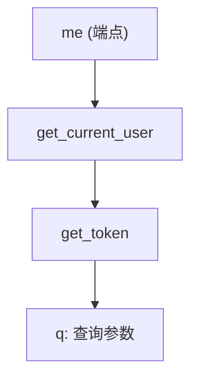
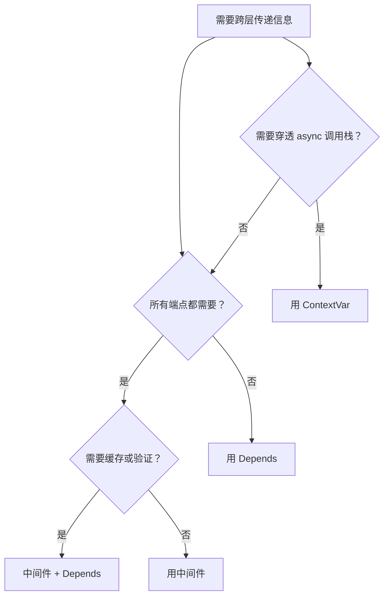

# 阶段 4 · 依赖注入系统

!!! info "本章定位"
    FastAPI 最精妙的设计——`Depends`。本章理解其设计哲学并亲手实现，对应 mini-fastapi v0.4。

    读完本章，你将理解 FastAPI 如何把"获取依赖"建模为普通函数，实现声明式、可缓存、可测试、可组合的依赖注入系统，并亲手实现递归依赖解析、缓存与 yield 资源清理。

---

## 本章学习目标

读完本章后，你应当能够：

1. 说清 `Depends` 解决的问题与设计哲学
2. 实现依赖树递归解析与按拓扑顺序执行
3. 实现同请求内依赖缓存
4. 实现 `yield` 依赖的资源清理（try/finally 语义）
5. 厘清 `Depends` 与中间件、上下文变量的边界
6. 对照 FastAPI 源码 `solve_dependencies` 找出实现差异

---

## 小节目录

1. Depends 解决什么问题
2. 设计哲学：依赖即函数
3. 依赖树与递归解析
4. 依赖缓存
5. yield 依赖与资源清理
6. 在 mini-fastapi 中实现 Depends
7. Depends vs 中间件 vs ContextVar
8. 与 FastAPI 源码对照
9. 实践任务与产出
10. 小结与下一章衔接

---

## 4.1 Depends 解决什么问题

### 4.1.1 没有 Depends 的世界

假设你要实现一个"获取当前登录用户"的功能。没有 Depends 时，每个需要认证的端点都要重复写认证逻辑：

```python
@app.get("/profile")
def get_profile(q: str | None = None):
    # 重复的认证逻辑
    if q != "secret":
        raise HTTPException(status_code=401, detail="Unauthorized")
    user = {"username": "alice", "role": "admin"}
    # 业务逻辑
    return {"profile": user}


@app.get("/settings")
def get_settings(q: str | None = None):
    # 又一遍重复的认证逻辑
    if q != "secret":
        raise HTTPException(status_code=401, detail="Unauthorized")
    user = {"username": "alice", "role": "admin"}
    # 业务逻辑
    return {"settings": "dark", "user": user}


@app.get("/orders")
def get_orders(q: str | None = None):
    # 第三遍重复的认证逻辑
    if q != "secret":
        raise HTTPException(status_code=401, detail="Unauthorized")
    user = {"username": "alice", "role": "admin"}
    # 业务逻辑
    return {"orders": [], "user": user}
```

**问题**：

1. **代码重复**：认证逻辑在每个端点重复出现
2. **耦合**：端点函数既关心认证又关心业务逻辑
3. **难测试**：测试端点时必须同时设置认证环境
4. **难修改**：认证逻辑变更需要改每个端点

### 4.1.2 有 Depends 的世界

用 Depends 把认证逻辑提取为依赖函数：

```python
def get_token(q: str | None = None):
    """从查询参数提取 token。"""
    return q

def get_current_user(token: str = Depends(get_token)):
    """根据 token 获取当前用户。"""
    if token == "secret":
        return {"username": "alice", "role": "admin"}
    raise HTTPException(status_code=401, detail="Unauthorized")

@app.get("/profile")
def get_profile(user=Depends(get_current_user)):
    return {"profile": user}

@app.get("/settings")
def get_settings(user=Depends(get_current_user)):
    return {"settings": "dark", "user": user}

@app.get("/orders")
def get_orders(user=Depends(get_current_user)):
    return {"orders": [], "user": user}
```

**改善**：

1. **无重复**：认证逻辑只在 `get_current_user` 中写一次
2. **解耦**：端点函数只关心业务逻辑，认证由框架自动处理
3. **易测试**：测试端点时可以直接调用 `get_profile(user=fake_user)`，绕过认证
4. **易修改**：认证逻辑变更只需改 `get_current_user`

### 4.1.3 三个真实场景

**场景一：获取当前用户**（如上所示）

**场景二：获取 DB 会话**

```python
def get_db():
    db = SessionLocal()
    try:
        yield db
    finally:
        db.close()

@app.get("/items")
def list_items(db=Depends(get_db)):
    return db.query(Item).all()
```

**场景三：分页参数复用**

```python
def get_pagination(skip: int = 0, limit: int = 10):
    if limit > 100:
        raise HTTPException(status_code=400, detail="limit too large")
    return {"skip": skip, "limit": limit}

@app.get("/items")
def list_items(pagination=Depends(get_pagination)):
    ...

@app.get("/users")
def list_users(pagination=Depends(get_pagination)):
    ...
```

三个场景都体现了同一个模式：**把横切关注点提取为可复用的依赖函数**。

---

## 4.2 设计哲学：依赖即函数

### 4.2.1 核心洞察

FastAPI 依赖注入的核心洞察是：**把"获取依赖"建模为普通函数**。

这听起来简单，但与传统的 DI 容器对比：

| 特性 | 传统 DI 容器（Spring 等） | FastAPI Depends |
|------|------------------------|----------------|
| 声明方式 | XML 配置 / 注解 + 容器 | 函数参数默认值 |
| 依赖定义 | 接口 + 实现类 | 普通函数 |
| 解析方式 | 容器启动时反射 | 请求时递归解析 |
| 缓存 | 容器级单例 | 请求级缓存 |
| 测试替换 | Mock 容器 | 直接传参覆盖 |
| 学习成本 | 高（需学容器 API） | 低（就是函数参数） |

### 4.2.2 可声明

依赖通过参数默认值声明，类型检查器能理解：

```python
def list_items(db: Database = Depends(get_db)):
    ...
```

`db` 的类型是 `Database`，默认值是 `Depends(get_db)`。类型检查器看到的是 `Database`，框架看到的是 `Depends(get_db)`。

### 4.2.3 可缓存

同一请求内，同一个 `Depends(get_db)` 只执行一次：

```python
def handler(
    a=Depends(get_db),   # 执行 get_db
    b=Depends(get_db),   # 复用缓存，不执行
):
    ...
```

`use_cache=False` 可禁用缓存，每次都重新执行。

### 4.2.4 可测试

测试时直接传参，绕过依赖解析：

```python
# 生产环境：框架自动调用 get_db
def list_items(db=Depends(get_db)):
    return db.query(Item).all()

# 测试环境：直接传 mock db
def test_list_items():
    result = list_items(db=MockDB())
    assert result == []
```

不需要 mock 容器、不需要依赖注入框架——因为依赖只是函数参数的默认值。

### 4.2.5 可组合

依赖可以依赖子依赖，形成依赖树：

```python
def get_token(header: str = Header()): ...
def get_user(token: str = Depends(get_token)): ...
def require_admin(user: User = Depends(get_user)): ...

@app.get("/admin")
def admin_endpoint(admin=Depends(require_admin)):
    ...
```

框架自动递归解析整棵依赖树。

---

## 4.3 依赖树与递归解析

### 4.3.1 依赖树示例

```python
def get_token(q: str | None = None):
    return q

def get_current_user(token: str = Depends(get_token)):
    if token == "secret":
        return {"username": "alice"}
    raise HTTPException(status_code=401, detail="Unauthorized")

@app.get("/me")
def me(user=Depends(get_current_user)):
    return user
```

依赖树：



解析顺序（从叶到根）：

1. 解析 `get_token` 的参数 `q` → 从查询串取值
2. 执行 `get_token(q=...)` → 得到 token
3. 解析 `get_current_user` 的参数 `token` → 已由上一步得到
4. 执行 `get_current_user(token=...)` → 得到 user
5. 解析 `me` 的参数 `user` → 已由上一步得到
6. 执行 `me(user=...)` → 得到响应

### 4.3.2 递归解析算法

```python
async def solve_dependencies(func, path_values, query_values, body, cache):
    """递归解析 func 的所有参数。"""
    sig = inspect.signature(func)
    kwargs = {}
    cleaners = []

    for name, param in sig.parameters.items():
        default = param.default

        if isinstance(default, Depends):
            # 递归解析子依赖
            sub_kwargs, sub_cleaners = await solve_dependencies(
                default.dependency, path_values, query_values, body, cache,
            )
            cleaners.extend(sub_cleaners)
            # 执行依赖函数
            result, cleaner = await _call_dependency(default.dependency, sub_kwargs)
            kwargs[name] = result
            # 缓存
            if default.use_cache:
                cache[default.dependency] = result
            if cleaner:
                cleaners.append(cleaner)
        else:
            # 非 Depends 参数：路径/查询/请求体（复用 params.py 逻辑）
            ...

    return kwargs, cleaners
```

核心思路：**遇到 Depends 就递归**。递归自然实现了拓扑排序——子依赖先解析先执行，父依赖后执行。

### 4.3.3 递归 vs 迭代

FastAPI 实际实现分两步：① `get_dependant(func)` 静态分析构建依赖树；② `solve_dependencies(request, dependant)` 按树执行。我们简化为一步：递归即分析即执行。

| 方面 | FastAPI（两步） | mini-fastapi（一步） |
|------|----------------|---------------------|
| 性能 | 依赖树只构建一次（路由注册时） | 每次请求都重新分析 |
| 复杂度 | 更高（需维护 Dependant 数据结构） | 更低（递归即一切） |
| OpenAPI | 可从依赖树提取参数描述 | 需额外实现 |

---

## 4.4 依赖缓存

### 4.4.1 缓存机制

```python
async def _resolve_dependency(dep, path_values, query_values, body, cache, cleaners):
    dep_func = dep.dependency
    cache_key = dep_func

    # 检查缓存
    if dep.use_cache and cache_key in cache:
        return cache[cache_key]

    # 递归解析 + 执行
    sub_kwargs, sub_cleaners = await solve_dependencies(...)
    result, cleaner = await _call_dependency(dep_func, sub_kwargs)

    # 写入缓存
    if dep.use_cache:
        cache[cache_key] = result

    return result
```

**缓存 key**：用依赖函数对象本身（`dep_func`）作为 key。因为 Python 函数对象是唯一的（`id(get_db)` 唯一），同一个函数的多个 `Depends(get_db)` 共享缓存。

**缓存作用域**：`cache` 字典在每次请求开始时新建（`solve_dependencies` 第一次调用时 `cache=None` → 创建空字典），请求结束后丢弃。这是**请求级缓存**，不是应用级单例。

### 4.4.2 use_cache=False

```python
def handler(
    a=Depends(get_counter, use_cache=False),
    b=Depends(get_counter, use_cache=False),
):
    ...
```

禁用缓存后，`get_counter` 执行两次，`a` 和 `b` 得到不同的值。适用场景：

- 依赖函数有副作用且需要每次执行（如生成随机 ID）
- 依赖函数返回可变对象且不希望共享引用

### 4.4.3 缓存陷阱

```python
def get_db():
    return FakeDB()  # 每次返回新实例

@app.get("/a")
def a(db=Depends(get_db), db2=Depends(get_db)):
    # db 和 db2 是同一个实例（缓存）！
    assert db is db2  # True
```

如果需要两个独立的 DB 连接，用 `use_cache=False`：

```python
def a(db=Depends(get_db), db2=Depends(get_db, use_cache=False)):
    assert db is not db2  # True
```

---

## 4.5 yield 依赖与资源清理

### 4.5.1 yield 语义

```python
def get_session():
    session = Session()           # ① 初始化（yield 前）
    yield session                 # ② 注入的值（yield 的值）
    session.close()               # ③ 清理（yield 后）
```

三段语义：

| 阶段 | 代码位置 | 执行时机 |
|------|---------|---------|
| 初始化 | yield 前 | 依赖解析时 |
| 注入值 | yield 的值 | 作为参数传给端点 |
| 清理 | yield 后 | 请求结束后（无论成功或异常） |

### 4.5.2 实现原理

```python
def _call_dependency(func, kwargs):
    if inspect.isgeneratorfunction(func):
        gen = func(**kwargs)       # 创建生成器，执行到 yield 前
        result = next(gen)         # 推进到 yield，取 yield 的值

        def cleaner():
            try:
                next(gen)          # 推进到 yield 后（执行清理代码）
            except StopIteration:
                pass               # 生成器结束，正常

        return result, cleaner
    ...
```

关键点：

1. `gen = func(**kwargs)` 创建生成器但**不执行任何代码**
2. `next(gen)` 启动生成器，执行到 `yield` 并暂停，返回 `yield` 的值
3. `cleaner` 函数再调 `next(gen)` 恢复执行，运行 `yield` 后的清理代码
4. `StopIteration` 表示生成器正常结束（清理代码执行完毕）

### 4.5.3 异步 yield 依赖

```python
async def get_async_session():
    session = await create_async_session()
    yield session
    await session.close()
```

实现：

```python
if inspect.isasyncgenfunction(func):
    gen = func(**kwargs)
    result = await gen.__anext__()    # 异步推进到 yield

    async def cleaner():
        try:
            await gen.__anext__()     # 异步推进清理代码
        except StopAsyncIteration:
            pass

    return result, cleaner
```

### 4.5.4 清理的执行时机

在 `application.py` 的 `_handle_http` 中：

```python
cleaners: list[Callable] = []
try:
    kwargs, cleaners = await solve_dependencies(...)  # 收集 cleaners
    result = await self._invoke_endpoint(route.endpoint, kwargs)
    response = self._coerce_result(result, ...)
    await response(send)
finally:
    await self._run_cleaners(cleaners)  # 无论成功或异常都执行清理
```

`finally` 块保证：**无论端点成功返回、抛 HTTPException、还是抛其他异常，清理函数都会执行**。

### 4.5.5 LIFO 清理顺序

```python
async def _run_cleaners(self, cleaners):
    for cleaner in reversed(cleaners):  # 逆序执行
        ...
```

`reversed` 保证后获取的资源先释放（LIFO），符合资源管理的栈语义：

```python
def get_a():
    print("open A")
    yield "A"
    print("close A")

def get_b(a=Depends(get_a)):
    print("open B")
    yield "B"
    print("close B")

@app.get("/")
def handler(b=Depends(get_b)):
    ...
```

输出顺序：

```
open A    # 先开 A（B 依赖 A）
open B    # 再开 B
close B   # 先关 B（后开先关）
close A   # 再关 A
```

### 4.5.6 DB 会话实战示例

```python
from sqlalchemy import create_engine
from sqlalchemy.orm import sessionmaker

engine = create_engine("sqlite:///./app.db")
SessionLocal = sessionmaker(bind=engine)

def get_db():
    """yield 依赖：每个请求一个 DB 会话，请求结束自动关闭。"""
    db = SessionLocal()
    try:
        yield db
    finally:
        db.close()

@app.get("/items")
def list_items(db=Depends(get_db)):
    return db.query(Item).all()
```

`try/finally` 保证即使查询抛异常，`db.close()` 也会执行。框架的 `_run_cleaners` 保证即使端点抛异常，yield 后的代码也会执行。双重保障。

---

## 4.6 在 mini-fastapi 中实现 Depends

### 4.6.1 Depends 标记

```python
@dataclass
class Depends:
    """依赖标记。"""
    dependency: Callable[..., Any]
    use_cache: bool = True
```

用 `dataclass` 定义，`dependency` 是依赖函数，`use_cache` 控制缓存。作为参数默认值使用：

```python
def handler(db=Depends(get_db)):
    ...
```

`inspect.signature(handler)` 会看到 `param.default` 是一个 `Depends` 实例。

### 4.6.2 solve_dependencies 完整实现

```python
async def solve_dependencies(
    func: Any,
    path_values: dict[str, str],
    query_values: dict[str, str],
    body: bytes | None,
    cache: dict[Any, Any] | None = None,
) -> tuple[dict[str, Any], list[Callable]]:
    """递归解析并执行依赖树。"""
    if cache is None:
        cache = {}

    sig = inspect.signature(func)
    try:
        hints = get_type_hints(func)
    except Exception:
        hints = {}

    kwargs: dict[str, Any] = {}
    cleaners: list[Callable] = []

    for name, param in sig.parameters.items():
        annotation = hints.get(name, param.annotation)
        default = param.default

        if isinstance(default, Depends):
            kwargs[name] = await _resolve_dependency(
                default, path_values, query_values, body, cache, cleaners,
            )
        elif is_basemodel(annotation):
            kwargs[name] = _resolve_body(annotation, body, name)
        elif name in path_values:
            kwargs[name] = _convert(path_values[name], annotation, ("path", name))
        elif name in query_values:
            kwargs[name] = _convert(query_values[name], annotation, ("query", name))
        elif default is not inspect.Parameter.empty:
            kwargs[name] = default
        else:
            raise RequestValidationError(
                [{"loc": ["query", name], "msg": "field required", "type": "missing"}]
            )

    return kwargs, cleaners
```

参数分类逻辑：

| 条件 | 处理 | 来源 |
|------|------|------|
| `isinstance(default, Depends)` | 递归解析子依赖 | 依赖函数 |
| `is_basemodel(annotation)` | 请求体验证 | 请求体 JSON |
| `name in path_values` | 类型转换 | URL 路径 |
| `name in query_values` | 类型转换 | URL 查询串 |
| 有默认值 | 用默认值 | 函数定义 |
| 都不满足 | 422 错误 | — |

### 4.6.3 _call_dependency 四种形式

```python
async def _call_dependency(func, kwargs):
    """支持四种依赖函数形式。"""
    # 1. async def + yield（异步生成器）
    if inspect.isasyncgenfunction(func):
        gen = func(**kwargs)
        result = await gen.__anext__()
        async def cleaner():
            try:
                await gen.__anext__()
            except StopAsyncIteration:
                pass
        return result, cleaner

    # 2. def + yield（同步生成器）
    if inspect.isgeneratorfunction(func):
        gen = func(**kwargs)
        result = next(gen)
        def cleaner():
            try:
                next(gen)
            except StopIteration:
                pass
        return result, cleaner

    # 3. async def（异步函数）
    if inspect.iscoroutinefunction(func):
        return await func(**kwargs), None

    # 4. def（同步函数）
    return func(**kwargs), None
```

四种形式对应四种使用场景：

| 形式 | 示例 | 场景 |
|------|------|------|
| 同步函数 | `def get_db(): return db` | 简单依赖 |
| 异步函数 | `async def get_db(): return await ...` | 异步初始化 |
| 同步 yield | `def get_db(): yield db; db.close()` | 同步资源管理 |
| 异步 yield | `async def get_db(): yield db; await db.close()` | 异步资源管理 |

### 4.6.4 集成到请求分发

```python
async def _handle_http(self, scope, receive, send):
    ...
    cleaners: list[Callable] = []
    try:
        try:
            kwargs, cleaners = await solve_dependencies(
                route.endpoint, path_params, query_params, body,
            )
        except RequestValidationError as exc:
            await JSONResponse({"detail": exc.errors}, status_code=422)(send)
            return
        except HTTPException as exc:
            await JSONResponse({"detail": exc.detail}, status_code=exc.status_code)(send)
            return

        try:
            result = await self._invoke_endpoint(route.endpoint, kwargs)
        except HTTPException as exc:
            await JSONResponse({"detail": exc.detail}, status_code=exc.status_code)(send)
            return
        except Exception:
            await JSONResponse({"detail": "Internal Server Error"}, status_code=500)(send)
            return

        result = self._apply_response_model(result, route.response_model)
        response = self._coerce_result(result, route.status_code)
        await response(send)
    finally:
        await self._run_cleaners(cleaners)
```

关键变化（相比 v0.3）：

1. `resolve_params` → `solve_dependencies`（支持 Depends）
2. 依赖解析阶段也捕获 `HTTPException`（依赖函数可以抛 HTTPException）
3. `finally` 块执行清理函数（yield 依赖的资源释放）

### 4.6.5 跑通示例

```python
from mini_fastapi import Depends, HTTPException, MiniFastAPI

app = MiniFastAPI(title="Hello", version="0.4.0")

def get_token(q: str | None = None):
    return q

def get_current_user(token: str = Depends(get_token)):
    if token == "secret":
        return {"username": "alice", "role": "admin"}
    raise HTTPException(status_code=418, detail="I'm a teapot")

def get_session():
    session = {"opened": True, "queries": []}
    yield session
    session["opened"] = False

@app.get("/me")
def me(user=Depends(get_current_user)):
    return user

@app.get("/session")
def use_session(session=Depends(get_session)):
    return {"opened": session["opened"]}
```

请求流程：

```
GET /me?q=secret
  → solve_dependencies(me, ...)
    → _resolve_dependency(Depends(get_current_user), ...)
      → solve_dependencies(get_current_user, ...)
        → _resolve_dependency(Depends(get_token), ...)
          → solve_dependencies(get_token, ...)
            → q = "secret" (查询参数)
          → get_token(q="secret") → "secret"
        → token = "secret"
      → get_current_user(token="secret") → {"username": "alice", "role": "admin"}
    → user = {"username": "alice", "role": "admin"}
  → me(user={"username": "alice", "role": "admin"})
  → {"username": "alice", "role": "admin"}
```

---

## 4.7 Depends vs 中间件 vs ContextVar

三者都能"跨层传递信息"，但适用边界不同。

### 4.7.1 对比表

| 机制 | 适合 | 不适合 | 缓存 | 验证 | 测试替换 |
|------|------|--------|------|------|---------|
| **Depends** | 请求级、可缓存、需验证 | 跨中间件层的信息 | ✅ 请求级 | ✅ Pydantic | ✅ 直接传参 |
| **中间件** | 所有请求统一处理 | 单个端点的特定依赖 | ❌ | ❌ | 需 mock |
| **ContextVar** | 异步上下文穿透 | 需要缓存与验证的逻辑 | ❌ | ❌ | 需 set/reset |

### 4.7.2 Depends

```python
def get_current_user(token=Depends(get_token)):
    ...

@app.get("/profile")
def profile(user=Depends(get_current_user)):
    return user
```

- **粒度**：单个端点
- **缓存**：同请求内复用
- **验证**：可在依赖函数中抛 HTTPException
- **测试**：`profile(user=fake_user)` 直接绕过

### 4.7.3 中间件

```python
@app.middleware("http")
async def add_process_time_header(request, call_next):
    start = time.time()
    response = await call_next(request)
    response.headers["X-Process-Time"] = str(time.time() - start)
    return response
```

- **粒度**：所有请求
- **缓存**：无
- **验证**：不适合（中间件抛异常处理复杂）
- **测试**：需 mock 中间件链

### 4.7.4 ContextVar

```python
import contextvars

request_id_var: contextvars.ContextVar[str] = contextvars.ContextVar("request_id")

@app.middleware("http")
async def set_request_id(request, call_next):
    request_id_var.set(str(uuid.uuid4()))
    return await call_next(request)

# 任何地方都能取到
def log(msg):
    print(f"[{request_id_var.get()}] {msg}")
```

- **粒度**：异步上下文（可穿透 async 调用栈）
- **缓存**：无（但值在上下文中持久）
- **验证**：无
- **测试**：需 `request_id_var.set("test-id")`

### 4.7.5 选型建议



---

## 4.8 与 FastAPI 源码对照

### 4.8.1 架构对照

| 我们的实现 | FastAPI 源码 | 差异 |
|-----------|-------------|------|
| `Depends` dataclass | `fastapi/dependencies/models.py` 的 `Depends` | 一致 |
| `solve_dependencies` 递归即分析即执行 | `get_dependant`（静态分析）+ `solve_dependencies`（动态执行）两步 | 我们合并为一步，性能略低但更简洁 |
| 缓存 key = 依赖函数对象 | 缓存 key = `Dependant` 对象（包含依赖函数 + 参数签名） | 我们简化，FastAPI 更精确 |
| `_call_dependency` 四种形式 | `run_endpoint_function` + `solve_generator` | 逻辑一致，FastAPI 还支持背景任务 |

### 4.8.2 get_dependant vs 递归

FastAPI 的 `get_dependant(func)` 在路由注册时递归分析函数签名，构建 `Dependant` 树：

```python
# FastAPI 简化伪码
def get_dependant(func):
    dependent = Dependant(call=func)
    for name, param in inspect.signature(func).parameters.items():
        if isinstance(param.default, Depends):
            sub_dependent = get_dependant(param.default.dependency)  # 递归
            dependent.dependencies.append(sub_dependent)
        else:
            # 分析路径/查询/请求体参数
            ...
    return dependent
```

然后 `solve_dependencies(request, dependent)` 按树执行：

```python
# FastAPI 简化伪码
async def solve_dependencies(request, dependent):
    for sub in dependent.dependencies:
        sub_result = await solve_dependencies(request, sub)  # 递归
        ...
    result = await dependent.call(**resolved_kwargs)
    return result
```

**我们的简化**：合并分析和执行，每次请求都重新递归。省去了 `Dependant` 数据结构，代码更简洁，但每次请求都重新分析签名（性能略低）。

### 4.8.3 我们省略了什么

| 省略的特性 | FastAPI 源码位置 | 影响核心理解？ |
|-----------|-----------------|--------------|
| `Annotated[T, Depends(...)]` | `fastapi/dependencies/utils.py` | 否，`param=Depends()` 已够用 |
| 安全依赖（OAuth2） | `fastapi/security/` | 否，安全依赖只是预置的依赖函数 |
| `Body(..., embed=True)` | `fastapi/param_functions.py` | 否，嵌入式请求体是边缘特性 |
| 背景任务中的依赖 | `fastapi/background.py` | 否，与核心解析无关 |
| 依赖的响应模型验证 | `fastapi/dependencies/utils.py` | 否，端点级 response_model 已够用 |

这些省略不影响理解 Depends 的核心机制：**递归解析 + 缓存 + yield 清理**。

---

## 4.9 实践任务与产出

### 4.9.1 任务：用 Depends 重构 CRUD

把阶段 3 的内存 CRUD 改造，用 Depends 注入：

```python
from mini_fastapi import Depends, HTTPException, MiniFastAPI

app = MiniFastAPI(title="Items CRUD v0.4", version="0.4.0")

_store: dict[int, dict] = {}
_next_id = 1


def get_store():
    """依赖：返回内存存储。"""
    return _store


def get_next_id():
    """依赖：返回自增 ID 生成器状态。"""
    return _next_id


def get_pagination(skip: int = 0, limit: int = 10):
    """依赖：分页参数（复用）。"""
    if limit > 100:
        raise HTTPException(status_code=400, detail="limit too large")
    return {"skip": skip, "limit": limit}


def get_token(q: str | None = None):
    """依赖：从查询参数提取 token。"""
    return q


def get_current_user(token: str = Depends(get_token)):
    """嵌套依赖：token → user。"""
    if token == "secret":
        return {"username": "alice", "role": "admin"}
    raise HTTPException(status_code=401, detail="Unauthorized")


def require_admin(user=Depends(get_current_user)):
    """依赖：要求管理员角色。"""
    if user["role"] != "admin":
        raise HTTPException(status_code=403, detail="Forbidden")
    return user


@app.post("/items", status_code=201)
def create_item(item: ItemCreate, store=Depends(get_store)):
    global _next_id
    record = {"id": _next_id, **item.model_dump()}
    store[_next_id] = record
    _next_id += 1
    return record


@app.get("/items")
def list_items(
    store=Depends(get_store),
    pagination=Depends(get_pagination),
):
    all_items = list(store.values())
    return all_items[pagination["skip"] : pagination["skip"] + pagination["limit"]]


@app.get("/items/{item_id}")
def get_item(item_id: int, store=Depends(get_store)):
    if item_id not in store:
        raise HTTPException(status_code=404, detail="Item not found")
    return store[item_id]


@app.delete("/items/{item_id}", status_code=204)
def delete_item(
    item_id: int,
    store=Depends(get_store),
    admin=Depends(require_admin),  # 只有管理员能删除
):
    if item_id not in store:
        raise HTTPException(status_code=404, detail="Item not found")
    del store[item_id]
    return {}
```

### 4.9.2 测试覆盖

本章新增 14 个测试（`test_dependencies.py`），分布如下：

| 测试类型 | 用例数 | 覆盖内容 |
|---------|--------|---------|
| 单元测试 | 10 | 基本 Depends、嵌套依赖、缓存、no_cache、yield、async、async yield、路径参数混合 |
| 端到端测试 | 4 | Depends 注入、嵌套认证成功/失败、yield 清理 |

总计 76 个测试全部通过。

### 4.9.3 产出

- mini-fastapi v0.4.0（Depends + 递归解析 + 缓存 + yield 清理）
- 76 个测试全部通过
- 本章笔记（≥ 700 行）

---

## 4.10 小结与下一章衔接

### 4.10.1 本章里程碑

| 版本 | 能力 | 关键代码 |
|------|------|---------|
| v0.3 | 路由 + 参数绑定 + 响应控制 | `routing.py` + `params.py` + `application.py` |
| **v0.4** | **依赖注入（Depends）** | **`dependencies.py` + `application.py` 集成** |

### 4.10.2 我们学到了什么

1. **Depends 的本质**：把"获取依赖"建模为普通函数，作为参数默认值声明。框架自动递归解析、执行、注入。

2. **递归解析**：遇到 Depends 就递归，自然实现拓扑排序。子依赖先解析先执行，父依赖后执行。

3. **请求级缓存**：同请求内同依赖函数只执行一次，用函数对象作为缓存 key。`use_cache=False` 禁用缓存。

4. **yield 依赖**：yield 前是初始化，yield 的值是注入值，yield 后是清理。用生成器的 `next()` 控制执行阶段。`finally` 块保证清理一定执行。

5. **四种依赖形式**：同步函数、异步函数、同步 yield、异步 yield。用 `inspect.isgeneratorfunction` / `isasyncgenfunction` / `iscoroutinefunction` 判断。

6. **HTTPException 在依赖中**：依赖函数可以抛 HTTPException（如认证失败），框架在依赖解析阶段捕获并转为对应响应。

### 4.10.3 下一章衔接

本章实现了 FastAPI 的"血管"——依赖注入系统。下一章实现它的"招牌"——**从类型注解自动生成 OpenAPI 文档与 Swagger UI**。

FastAPI 最让人惊艳的特性之一是：写下类型注解，自动获得交互式 API 文档。这背后的机制是：

1. 从路由表 + Pydantic 模型生成 OpenAPI 3.1 JSON
2. 挂载 Swagger UI 和 ReDoc 前端
3. 前端读取 OpenAPI JSON 渲染交互界面

阶段 5 将实现 `openapi.py`，让 mini-fastapi 也能自动生成 API 文档。

---

!!! success "阶段 4 完成"
    mini-fastapi v0.4.0：Depends + 递归依赖解析 + 请求级缓存 + yield 资源清理 + 异步依赖

    - 源码：`mini-fastapi/src/mini_fastapi/dependencies.py` 完整实现
    - 测试：76 个用例全部通过（新增 14 个）
    - 文档：本章 ≥ 700 行

!!! todo "下一阶段"
    阶段 5 · 造轮子：OpenAPI 自动文档生成
