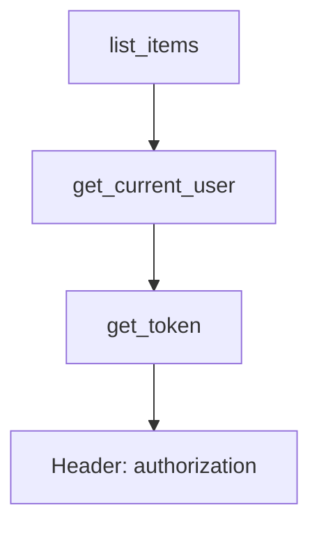

# 阶段 4 · 依赖注入系统

!!! info "本章定位"
    FastAPI 最精妙的设计——`Depends`。本章理解其设计哲学并亲手实现，对应 mini-fastapi v0.4。

---

## 本章学习目标

读完本章后，你应当能够：

1. 说清 `Depends` 解决的问题与设计哲学
2. 实现依赖树递归解析与按拓扑顺序执行
3. 实现同请求内依赖缓存
4. 实现 `yield` 依赖的资源清理（try/finally 语义）
5. 厘清 `Depends` 与中间件、上下文变量的边界
6. 对照 FastAPI 源码 `solve_dependencies` 找出实现差异

---

## 小节目录

1. [Depends 解决什么问题](#41-depends-解决什么问题)
2. [设计哲学：依赖即函数](#42-设计哲学依赖即函数)
3. [依赖树与递归解析](#43-依赖树与递归解析)
4. [依赖缓存](#44-依赖缓存)
5. [yield 依赖与资源清理](#45-yield-依赖与资源清理)
6. [在 mini-fastapi 中实现 Depends](#46-在-mini-fastapi-中实现-depends)
7. [Depends vs 中间件 vs ContextVar](#47-depends-vs-中间件-vs-contextvar)
8. [与 FastAPI 源码对照](#48-与-fastapi-源码对照)
9. [实践任务与产出](#49-实践任务与产出)
10. [小结与下一章衔接](#410-小结与下一章衔接)

---

## 4.1 Depends 解决什么问题

待补充：用"获取当前用户""获取 DB 会话""分页参数复用"三个真实场景，展示没有 Depends 时代码的重复与耦合，引入 Depends 后的清爽。

---

## 4.2 设计哲学：依赖即函数

待补充：讲 FastAPI 把"获取依赖"建模为普通函数的核心洞察——可声明、可缓存、可测试、可组合，对比传统 DI 容器（如 Spring XML 配置）的笨重。

---

## 4.3 依赖树与递归解析

```python
def get_token(authorization: str = Header()): ...
def get_current_user(token: str = Depends(get_token)): ...
def list_items(user: User = Depends(get_current_user)): ...
```

待补充：画出上述例子的依赖树，讲递归解析算法：从端点参数出发，遇到 `Depends` 就递归解析子依赖，构建执行计划。



---

## 4.4 依赖缓存

待补充：同一次请求内，同一个 `Depends(get_xxx)` 只执行一次，结果缓存复用。讲缓存 key 的选取（基于依赖函数身份与参数）、`use_cache=False` 的场景。

---

## 4.5 yield 依赖与资源清理

待补充：`yield` 依赖的语义——`yield` 前是初始化，`yield` 的值是注入的依赖，`yield` 后是清理。用 DB 会话示例展示 try/finally 如何保证连接归还。

```python
async def get_session():
    async with session_factory() as session:
        yield session
```

待补充：讲实现要点——用 `contextlib` 或手动 `gen = dep(); value = next(gen); try: ... finally: next(gen, None)`。

---

## 4.6 在 mini-fastapi 中实现 Depends

### 4.6.1 solve_dependencies 骨架

待补充：给出 `solve_dependencies(func, path_params, query_params, body)` 的完整实现，包含递归解析、缓存字典、yield 清理栈。

### 4.6.2 集成到请求分发

待补充：在阶段 3 的请求分发流程中，调用端点前先 `solve_dependencies`，把结果作为 kwargs 传入。

### 4.6.3 跑通示例

待补充：用 `Depends` 注入"当前用户"与"DB 会话"的完整示例。

---

## 4.7 Depends vs 中间件 vs ContextVar

待补充：三者都能"跨层传递信息"，但适用边界不同。给出对比表与选型建议。

| 机制 | 适合 | 不适合 |
|------|------|--------|
| Depends | 请求级、可缓存、需测试替换 | 跨中间件层的信息 |
| 中间件 | 所有请求统一处理（CORS、日志） | 单个端点的特定依赖 |
| ContextVar | 异步上下文穿透（trace_id） | 需要缓存与验证的逻辑 |

---

## 4.8 与 FastAPI 源码对照

待补充：对照阅读 `fastapi/dependencies/dependencies.py` 的 `solve_dependencies` 与 `get_dependant`，找出你的简化版省略了什么（如嵌套 Body、Annotated 解析、安全依赖 OAuth2），分析这些省略是否影响核心理解。

---

## 4.9 实践任务与产出

### 任务：用 Depends 重构 CRUD

把阶段 3 的内存 CRUD 改造：用 `Depends` 注入"分页参数"（`skip`/`limit` 复用）、"当前用户"（模拟认证）、"存储仓库"。

### 产出

- mini-fastapi v0.4（打 git tag）
- 本章笔记（≥ 700 行，含依赖树解析流程图）

---

## 4.10 小结与下一章衔接

本章实现了 FastAPI 的"血管"。下一章实现它的"招牌"——从类型注解自动生成 OpenAPI 文档与 Swagger UI。

---

!!! todo "待填充标记说明"
    本文件为大纲骨架，标注「待补充」处为后续要展开的内容点。每个待补充点都已规划好要讲的核心问题与示例方向，填充时直接展开即可达到 ≥ 700 行深度。**笔记深度与数量只增不减**，本骨架的小节结构在填充时只会扩充不会删减。