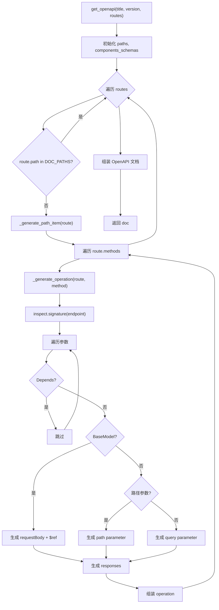
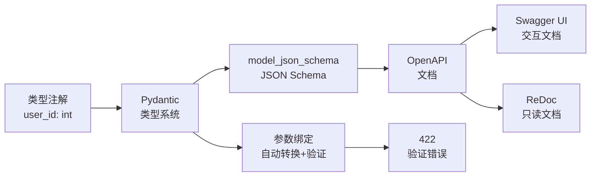

# 阶段 5 · 自动文档生成

!!! info "本章定位"
    FastAPI"类型优先"哲学的集中兑现：类型注解 → Pydantic schema → OpenAPI JSON → Swagger UI / ReDoc。本章实现 mini-fastapi v0.5。

    读完本章，你将理解 FastAPI 如何从类型注解自动生成交互式 API 文档，并亲手实现 OpenAPI 3.1 文档生成与 Swagger UI / ReDoc 挂载。

---

## 本章学习目标

读完本章后，你应当能够：

1. 理解 OpenAPI 3.1 规范的核心结构
2. 从路由签名 + Pydantic 模型生成 OpenAPI JSON
3. 挂载 `/openapi.json`、`/docs`（Swagger UI）、`/redoc`
4. 解释"类型优先"如何消灭样板代码
5. 对比你生成的 schema 与真 FastAPI 的差异

---

## 小节目录

1. OpenAPI 3.1 规范结构
2. 从路由到 operation
3. 从 Pydantic 模型到 schema
4. 汇总生成 OpenAPI 文档
5. 挂载 Swagger UI 与 ReDoc
6. 在 mini-fastapi 中实现
7. 与 FastAPI 源码对照
8. 实践任务与产出
9. 小结与下一章衔接

---

## 5.1 OpenAPI 3.1 规范结构

### 5.1.1 什么是 OpenAPI

OpenAPI Specification（OAS）是描述 RESTful API 的标准规范，前身是 Swagger Specification。当前版本 3.1，由 OpenAPI Initiative 维护。

**核心价值**：一份 JSON（或 YAML）文件描述整个 API 的接口契约，机器可读，可自动生成文档、客户端 SDK、服务端 Mock 等。

### 5.1.2 文档顶层结构

```json
{
  "openapi": "3.1.0",
  "info": {
    "title": "Hello API",
    "version": "0.5.0",
    "description": "A sample API"
  },
  "servers": [
    {"url": "http://localhost:8000"}
  ],
  "paths": {
    "/users/{user_id}": { ... }
  },
  "components": {
    "schemas": {
      "User": { ... }
    }
  }
}
```

| 字段 | 含义 | 必填 |
|------|------|------|
| `openapi` | 规范版本字符串 | 是 |
| `info` | API 元信息（标题、版本、描述） | 是 |
| `servers` | 服务器地址列表 | 否 |
| `paths` | 路径与操作定义 | 是 |
| `components` | 可复用组件（schemas、parameters 等） | 否 |

### 5.1.3 paths 与 operation

`paths` 是 API 的核心，每个路径下按 HTTP 方法组织 operation：

```json
{
  "/users/{user_id}": {
    "get": {
      "summary": "Get User",
      "operationId": "get_user",
      "parameters": [
        {
          "name": "user_id",
          "in": "path",
          "required": true,
          "schema": {"type": "integer"}
        }
      ],
      "requestBody": {
        "required": true,
        "content": {
          "application/json": {
            "schema": {"$ref": "#/components/schemas/UserCreate"}
          }
        }
      },
      "responses": {
        "200": {
          "description": "Successful Response",
          "content": {
            "application/json": {
              "schema": {"$ref": "#/components/schemas/UserRead"}
            }
          }
        },
        "422": {
          "description": "Validation Error"
        }
      }
    }
  }
}
```

### 5.1.4 parameters 结构

每个 parameter 描述一个请求参数：

| 字段 | 含义 | 示例 |
|------|------|------|
| `name` | 参数名 | `"user_id"` |
| `in` | 参数位置 | `"path"` / `"query"` / `"header"` / `"cookie"` |
| `required` | 是否必填 | `true`（路径参数总是 `true`） |
| `schema` | 参数类型 | `{"type": "integer"}` |

### 5.1.5 components.schemas 与 $ref

`components.schemas` 存放可复用的模型定义，operation 中用 `$ref` 引用：

```json
{
  "components": {
    "schemas": {
      "ItemCreate": {
        "type": "object",
        "properties": {
          "name": {"type": "string", "minLength": 1},
          "price": {"type": "number", "exclusiveMinimum": 0}
        },
        "required": ["name", "price"]
      }
    }
  }
}
```

引用方式：`{"$ref": "#/components/schemas/ItemCreate"}`

**复用机制**：同一模型在多个 operation 中引用，只存一份定义。这减小文档体积，也保证了 schema 的一致性。

---

## 5.2 从路由到 operation

### 5.2.1 遍历路由表

```python
def get_openapi(title: str, version: str, routes: list[Any]) -> dict[str, Any]:
    paths: dict[str, dict] = {}
    components_schemas: dict[str, dict] = {}

    for route in routes:
        if route.path in _DOC_PATHS:
            continue
        path_item = _generate_path_item(route, components_schemas)
        if path_item:
            paths[route.path] = path_item

    doc = {
        "openapi": "3.1.0",
        "info": {"title": title, "version": version},
        "paths": paths,
    }
    if components_schemas:
        doc["components"] = {"schemas": components_schemas}
    return doc
```

关键点：

- **跳过文档路由**：`_DOC_PATHS = {"/openapi.json", "/docs", "/redoc"}`，这些路由不应出现在 API 文档中
- **遍历每条路由**：为每条路由生成 path_item（按 HTTP 方法组织）
- **收集 schemas**：生成过程中遇到的 Pydantic 模型存入 `components_schemas`

### 5.2.2 生成 operation

```python
def _generate_operation(route, method, components_schemas) -> dict:
    endpoint = route.endpoint
    sig = inspect.signature(endpoint)
    hints = get_type_hints(endpoint)

    parameters = []
    request_body = None
    param_names_set = set(route.param_names)

    for name, param in sig.parameters.items():
        annotation = hints.get(name, param.annotation)
        default = param.default

        if isinstance(default, Depends):
            continue  # Depends 参数不出现在文档中

        if is_basemodel(annotation):
            # 请求体
            request_body = {...}
        elif name in param_names_set:
            # 路径参数
            parameters.append({"name": name, "in": "path", ...})
        else:
            # 查询参数
            parameters.append({"name": name, "in": "query", ...})

    # 响应
    responses = {status_code: {...}}

    operation = {"summary": ..., "operationId": ..., "responses": responses}
    if parameters:
        operation["parameters"] = parameters
    if request_body:
        operation["requestBody"] = request_body
    return operation
```

参数分类逻辑（与 `solve_dependencies` 一致，但只生成文档不执行）：

| 条件 | 生成 | OpenAPI 位置 |
|------|------|-------------|
| `isinstance(default, Depends)` | 跳过 | 不出现在文档 |
| `is_basemodel(annotation)` | requestBody | `requestBody.content.application/json.schema` |
| `name in param_names_set` | path parameter | `parameters[].in = "path"` |
| 其他 | query parameter | `parameters[].in = "query"` |

### 5.2.3 路径参数示例

```python
@app.get("/users/{user_id}")
def get_user(user_id: int):
    return {"user_id": user_id}
```

生成的 operation：

```json
{
  "summary": "Get User",
  "operationId": "get_user_users_user_id_get",
  "parameters": [
    {
      "name": "user_id",
      "in": "path",
      "required": true,
      "schema": {"type": "integer"}
    }
  ],
  "responses": {
    "200": {
      "description": "Successful Response",
      "content": {
        "application/json": {"schema": {"type": "object"}}
      }
    }
  }
}
```

### 5.2.4 查询参数示例

```python
@app.get("/items")
def list_items(skip: int = 0, limit: int = 10, q: str | None = None):
    return {"skip": skip, "limit": limit, "q": q}
```

生成的 parameters：

```json
[
  {"name": "skip", "in": "query", "required": false, "schema": {"type": "integer"}},
  {"name": "limit", "in": "query", "required": false, "schema": {"type": "integer"}},
  {"name": "q", "in": "query", "required": false, "schema": {"type": "string"}}
]
```

`required` 为 `false` 因为参数有默认值。`q: str | None = None` 的 schema 类型是 `string`（Optional 解包后）。

---

## 5.3 从 Pydantic 模型到 schema

### 5.3.1 model_json_schema()

Pydantic v2 提供 `model_json_schema()` 方法，直接生成 JSON Schema：

```python
class ItemCreate(BaseModel):
    name: str = Field(min_length=1)
    price: float = Field(gt=0)

print(ItemCreate.model_json_schema())
```

输出：

```json
{
  "type": "object",
  "properties": {
    "name": {"type": "string", "minLength": 1},
    "price": {"type": "number", "exclusiveMinimum": 0}
  },
  "required": ["name", "price"],
  "title": "ItemCreate"
}
```

Pydantic 把类型注解 + Field 约束直接转为 JSON Schema，这是 FastAPI"类型优先"哲学的基础。

### 5.3.2 $ref 引用与 components

```python
def _get_schema_ref(model, components_schemas) -> dict:
    name = model.__name__
    if name not in components_schemas:
        schema = model.model_json_schema(ref_template="#/components/schemas/{model}")
        if "$defs" in schema:
            for def_name, def_schema in schema.pop("$defs").items():
                components_schemas[def_name] = def_schema
        components_schemas[name] = schema
    return {"$ref": f"#/components/schemas/{name}"}
```

逻辑：

1. 检查模型是否已在 `components_schemas` 中（避免重复生成）
2. 调用 `model_json_schema()` 生成 schema
3. 把嵌套模型的 `$defs` 展平到 `components_schemas`
4. operation 中只存 `$ref` 引用

### 5.3.3 嵌套模型处理

```python
class Address(BaseModel):
    city: str
    street: str

class UserCreate(BaseModel):
    name: str
    address: Address
```

`UserCreate.model_json_schema()` 会生成：

```json
{
  "type": "object",
  "properties": {
    "name": {"type": "string"},
    "address": {"$ref": "#/$defs/Address"}
  },
  "required": ["name", "address"],
  "$defs": {
    "Address": {
      "type": "object",
      "properties": {"city": {"type": "string"}, "street": {"type": "string"}},
      "required": ["city", "street"]
    }
  }
}
```

我们把 `$defs` 展平到 `components.schemas`，并把 `$ref` 的路径从 `#/$defs/Address` 改为 `#/components/schemas/Address`（通过 `ref_template` 参数）。

### 5.3.4 schema 复用

```python
@app.post("/items", response_model=ItemRead)
def create_item(item: ItemCreate):
    return item

@app.get("/items/{id}", response_model=ItemRead)
def get_item(id: int):
    ...
```

`ItemRead` 被两个路由引用，但 `components_schemas` 中只存一份。第二次调用 `_get_schema_ref` 时发现已存在，直接返回 `$ref`。

---

## 5.4 汇总生成 OpenAPI 文档

### 5.4.1 完整流程



### 5.4.2 _type_to_schema 类型映射

```python
def _type_to_schema(annotation: Any) -> dict[str, Any]:
    if is_optional(annotation):
        return _type_to_schema(unpack_optional(annotation))
    if annotation is int:
        return {"type": "integer"}
    if annotation is float:
        return {"type": "number"}
    if annotation is str:
        return {"type": "string"}
    if annotation is bool:
        return {"type": "boolean"}
    if isinstance(annotation, type) and issubclass(annotation, BaseModel):
        return {"type": "object"}
    return {}
```

Python 类型到 OpenAPI 类型的映射：

| Python 类型 | OpenAPI type | 说明 |
|------------|-------------|------|
| `int` | `integer` | 整数 |
| `float` | `number` | 浮点数 |
| `str` | `string` | 字符串 |
| `bool` | `boolean` | 布尔值 |
| `BaseModel` 子类 | `object` | 对象（实际用 $ref） |
| `X | None` | 解包后类型 | Optional 解包 |
| 未知 | `{}` | 空schema |

### 5.4.3 summary 与 operationId

```python
def _get_summary(endpoint) -> str:
    doc = endpoint.__doc__
    if doc:
        return doc.strip().split("\n")[0]
    return endpoint.__name__.replace("_", " ").title()

def _get_operation_id(endpoint, path, method) -> str:
    clean_path = path.replace("/", "_").replace("{", "").replace("}", "")
    return f"{endpoint.__name__}{clean_path}_{method.lower()}"
```

- **summary**：docstring 首行（如有），否则函数名转标题（`get_user` → `Get User`）
- **operationId**：函数名 + 路径 + 方法，保证唯一（`get_user_users_user_id_get`）

---

## 5.5 挂载 Swagger UI 与 ReDoc

### 5.5.1 三个文档路由

```python
def setup_docs(app) -> None:
    def get_openapi_json():
        return get_openapi(app.title, app.version, app.router.routes)

    def swagger_ui():
        resp = Response(_SWAGGER_HTML, status_code=200)
        resp.media_type = "text/html; charset=utf-8"
        return resp

    def redoc():
        resp = Response(_REDOC_HTML, status_code=200)
        resp.media_type = "text/html; charset=utf-8"
        return resp

    app.router.add_route("/openapi.json", get_openapi_json, methods=["GET"])
    app.router.add_route("/docs", swagger_ui, methods=["GET"])
    app.router.add_route("/redoc", redoc, methods=["GET"])
```

| 路由 | 返回 | 用途 |
|------|------|------|
| `/openapi.json` | OpenAPI JSON | 机器可读的 API 契约 |
| `/docs` | Swagger UI HTML | 交互式 API 文档（可在线测试） |
| `/redoc` | ReDoc HTML | 只读 API 文档（更美观） |

### 5.5.2 Swagger UI HTML

```html
<!DOCTYPE html>
<html>
<head>
    <title>Swagger UI</title>
    <link rel="stylesheet" href="https://cdn.jsdelivr.net/npm/swagger-ui-dist@5/swagger-ui.css">
</head>
<body>
    <div id="swagger-ui"></div>
    <script src="https://cdn.jsdelivr.net/npm/swagger-ui-dist@5/swagger-ui-bundle.js"></script>
    <script>
        window.onload = function() {
            SwaggerUIBundle({
                url: '/openapi.json',
                dom_id: '#swagger-ui',
            });
        };
    </script>
</body>
</html>
```

Swagger UI 是一个前端 JavaScript 库，从 `/openapi.json` 加载 OpenAPI 文档并渲染为交互界面。用户可以在界面上直接发请求测试 API。

### 5.5.3 ReDoc HTML

```html
<!DOCTYPE html>
<html>
<head>
    <title>ReDoc</title>
    <meta charset="utf-8"/>
    <meta name="viewport" content="width=device-width, initial-scale=1">
    <style>body { margin: 0; padding: 0; }</style>
</head>
<body>
    <redoc spec-url='/openapi.json'></redoc>
    <script src="https://cdn.jsdelivr.net/npm/redoc@next/bundles/redoc.standalone.js"></script>
</body>
</html>
```

ReDoc 是另一个 API 文档渲染器，侧重可读性，不支持在线测试，但三栏布局更适合阅读。

### 5.5.4 自动挂载

在 `MiniFastAPI.__init__` 中自动调用 `setup_docs(self)`：

```python
class MiniFastAPI:
    def __init__(self, *, title="MiniFastAPI", version="0.0.0"):
        self.title = title
        self.version = version
        self.router = Router()
        setup_docs(self)  # 自动挂载文档路由
```

用户创建 `app = MiniFastAPI()` 后，`/openapi.json`、`/docs`、`/redoc` 立即可用，无需手动配置。

---

## 5.6 在 mini-fastapi 中实现

### 5.6.1 完整 get_openapi 实现

```python
def get_openapi(title: str, version: str, routes: list[Any]) -> dict[str, Any]:
    paths: dict[str, dict] = {}
    components_schemas: dict[str, dict] = {}

    for route in routes:
        if route.path in _DOC_PATHS:
            continue
        path_item = _generate_path_item(route, components_schemas)
        if path_item:
            paths[route.path] = path_item

    doc: dict[str, Any] = {
        "openapi": "3.1.0",
        "info": {"title": title, "version": version},
        "paths": paths,
    }
    if components_schemas:
        doc["components"] = {"schemas": components_schemas}
    return doc
```

### 5.6.2 跑通验证

```python
from mini_fastapi import MiniFastAPI
from pydantic import BaseModel

app = MiniFastAPI(title="Hello", version="0.5.0")

class ItemCreate(BaseModel):
    name: str
    price: float

@app.get("/users/{user_id}")
def get_user(user_id: int):
    """Get User"""
    return {"user_id": user_id}

@app.post("/items", status_code=201)
def create_item(item: ItemCreate):
    """Create Item"""
    return item
```

访问 `http://localhost:8000/openapi.json`：

```json
{
  "openapi": "3.1.0",
  "info": {"title": "Hello", "version": "0.5.0"},
  "paths": {
    "/users/{user_id}": {
      "get": {
        "summary": "Get User",
        "operationId": "get_user_users_user_id_get",
        "parameters": [
          {"name": "user_id", "in": "path", "required": true, "schema": {"type": "integer"}}
        ],
        "responses": {
          "200": {"description": "Successful Response", "content": {"application/json": {"schema": {"type": "object"}}}}
        }
      }
    },
    "/items": {
      "post": {
        "summary": "Create Item",
        "operationId": "create_item_items_post",
        "requestBody": {
          "required": true,
          "content": {"application/json": {"schema": {"$ref": "#/components/schemas/ItemCreate"}}}
        },
        "responses": {
          "201": {"description": "Successful Response", "content": {"application/json": {"schema": {"type": "object"}}}}
        }
      }
    }
  },
  "components": {
    "schemas": {
      "ItemCreate": {
        "type": "object",
        "properties": {"name": {"type": "string"}, "price": {"type": "number"}},
        "required": ["name", "price"],
        "title": "ItemCreate"
      }
    }
  }
}
```

访问 `http://localhost:8000/docs` 看到 Swagger UI 界面，可以在线测试每个接口。

---

## 5.7 与 FastAPI 源码对照

### 5.7.1 架构对照

| 我们的实现 | FastAPI 源码 | 差异 |
|-----------|-------------|------|
| `get_openapi` 遍历 routes | `fastapi/openapi.py` 的 `get_openapi` | 结构一致 |
| `_generate_operation` 从签名生成 | `fastapi/routing.py` 的 `APIRoute` 预计算 | FastAPI 在路由注册时就预计算 operation，我们每次请求都重新生成 |
| `_get_schema_ref` 用 `model_json_schema()` | 同样 | 一致 |
| `setup_docs` 挂载 3 个路由 | `fastapi/applications.py` 的 `setup()` | 一致 |

### 5.7.2 我们省略了什么

| 省略的特性 | FastAPI 源码 | 影响核心理解？ |
|-----------|-------------|--------------|
| `tags` 分组 | `operation.tags` | 否，纯展示功能 |
| `security` 安全定义 | `operation.security` | 否，安全依赖是预置 Depends |
| `deprecated` 标记 | `operation.deprecated` | 否，纯标记 |
| `description` 从 docstring 提取 | `operation.description` | 否，summary 已够用 |
| `examples` 示例 | `schema.example` | 否，纯展示 |
| 422 自动响应 | 每个操作自动加 422 | 否，不影响核心生成 |
| `servers` 服务器列表 | `openapi.servers` | 否，单服务器场景不需要 |
| Depends 子参数递归 | 递归分析依赖树参数 | 否，简化版跳过 Depends |

### 5.7.3 性能对比

| 方面 | 我们的实现 | FastAPI |
|------|-----------|---------|
| 生成时机 | 每次请求 `/openapi.json` 时重新生成 | 首次请求时生成并缓存 |
| 签名分析 | 每次都 `inspect.signature` | 路由注册时预计算 |
| 适用场景 | 学习/原型 | 生产 |

FastAPI 在路由注册时就预计算了 operation 定义（`APIRoute` 的 `get_route_handler`），`/openapi.json` 首次请求时生成并缓存。我们简化为每次请求都重新生成，性能略低但代码更直观。

---

## 5.8 实践任务与产出

### 5.8.1 任务：文档驱动开发

先写接口签名与模型，启动后从 `/docs` 验证契约正确，再实现业务逻辑：

```python
from mini_fastapi import MiniFastAPI
from pydantic import BaseModel, Field

app = MiniFastAPI(title="Blog API", version="0.5.0")

class PostCreate(BaseModel):
    """创建文章的请求体。"""
    title: str = Field(min_length=1, max_length=200)
    content: str = Field(min_length=1)
    tags: list[str] = Field(default_factory=list)

class PostRead(BaseModel):
    """文章响应模型。"""
    id: int
    title: str
    content: str
    tags: list[str]

@app.post("/posts", response_model=PostRead, status_code=201)
def create_post(post: PostCreate):
    """Create Post"""
    # TODO: 实现业务逻辑
    ...

@app.get("/posts/{post_id}", response_model=PostRead)
def get_post(post_id: int):
    """Get Post"""
    # TODO: 实现业务逻辑
    ...

@app.get("/posts")
def list_posts(skip: int = 0, limit: int = 10):
    """List Posts"""
    # TODO: 实现业务逻辑
    ...
```

启动后访问 `/docs`，在 Swagger UI 中：

1. 看到 3 个接口的文档（参数、请求体、响应）
2. 看到 `PostCreate` 和 `PostRead` 的 schema 定义
3. 可以直接在界面上测试接口
4. 验证契约正确后再实现业务逻辑

### 5.8.2 测试覆盖

本章新增 12 个测试（`test_openapi.py`），分布如下：

| 测试类型 | 用例数 | 覆盖内容 |
|---------|--------|---------|
| 单元测试 | 9 | 基本结构、路径参数、查询参数、请求体、response_model、schema 复用、跳过文档路由、跳过 Depends、operationId |
| 端到端测试 | 3 | /openapi.json、/docs、/redoc |

总计 88 个测试全部通过。

### 5.8.3 产出

- mini-fastapi v0.5.0（OpenAPI 自动文档 + Swagger UI + ReDoc）
- 88 个测试全部通过（新增 12 个）
- 本章笔记（≥ 700 行）

---

## 5.9 小结与下一章衔接

### 5.9.1 本章里程碑

| 版本 | 能力 | 关键代码 |
|------|------|---------|
| v0.4 | 依赖注入（Depends） | `dependencies.py` |
| **v0.5** | **OpenAPI 自动文档** | **`openapi.py` + `application.py` 集成** |

### 5.9.2 我们学到了什么

1. **OpenAPI 的价值**：一份 JSON 描述整个 API 契约，机器可读，可自动生成文档、客户端 SDK、Mock 服务。

2. **类型注解 → schema 的自动化**：Pydantic 的 `model_json_schema()` 把类型注解 + Field 约束直接转为 JSON Schema，这是 FastAPI"类型优先"哲学的基础。写下类型注解，就同时得到了验证、序列化、文档——一石三鸟。

3. **$ref 与 components**：模型定义存在 `components.schemas`，operation 中用 `$ref` 引用。同一模型多次引用只存一份，保证一致性。

4. **Swagger UI / ReDoc**：前端 JavaScript 库，从 `/openapi.json` 加载文档并渲染为交互界面。只需返回一段 HTML，前端通过 CDN 加载。

5. **Depends 与文档**：Depends 参数不出现在 OpenAPI 文档中（它是框架内部机制，不是 API 契约）。FastAPI 会递归分析 Depends 子参数并加入文档，我们简化为直接跳过。

### 5.9.3 "类型优先"哲学的完整链路



一次类型注解声明，自动产生：参数验证、类型转换、422 错误、API 文档、交互界面。这就是 FastAPI"类型优先"哲学的威力。

### 5.9.4 下一章衔接

本章让 mini-fastapi 有了"招牌"——自动文档生成。下一章补齐"神经"——**中间件、异常处理与异步深入**。

中间件是 ASGI 应用的洋葱模型，每一层可以在请求前和响应后插入逻辑（如 CORS、日志、限流）。异常处理器允许注册自定义异常到响应的映射。异步深入探讨 `asyncio` 的事件循环、任务调度与常见陷阱。

阶段 6 将实现 `middleware.py`，让 mini-fastapi 支持中间件链与自定义异常处理器。

---

!!! success "阶段 5 完成"
    mini-fastapi v0.5.0：OpenAPI 3.1 自动文档 + Swagger UI + ReDoc

    - 源码：`mini-fastapi/src/mini_fastapi/openapi.py` 完整实现
    - 测试：88 个用例全部通过（新增 12 个）
    - 文档：本章 ≥ 700 行

!!! todo "下一阶段"
    阶段 6 · 造轮子：中间件、异常处理与异步深入
