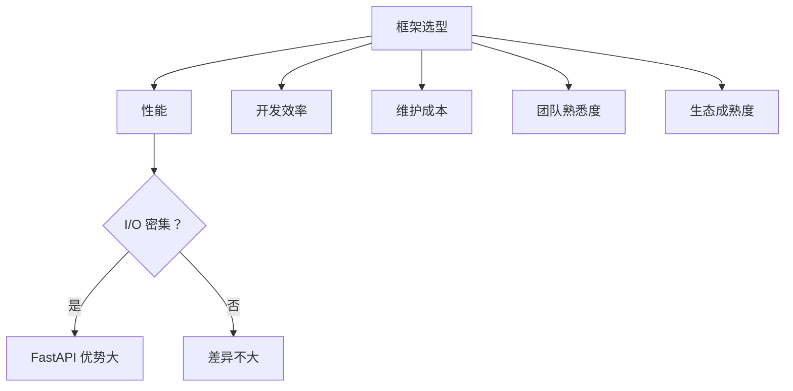
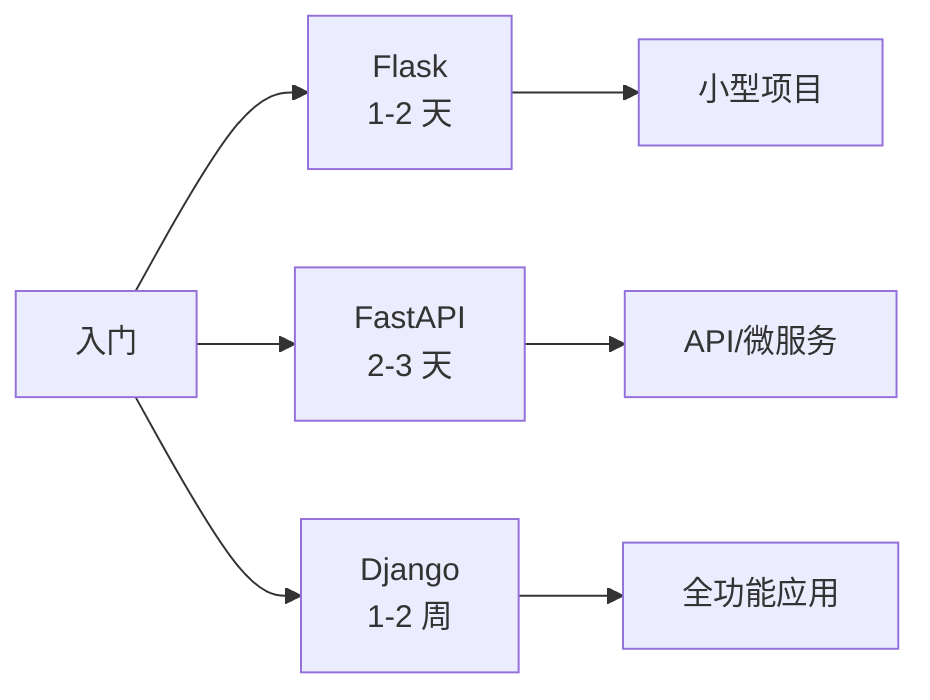
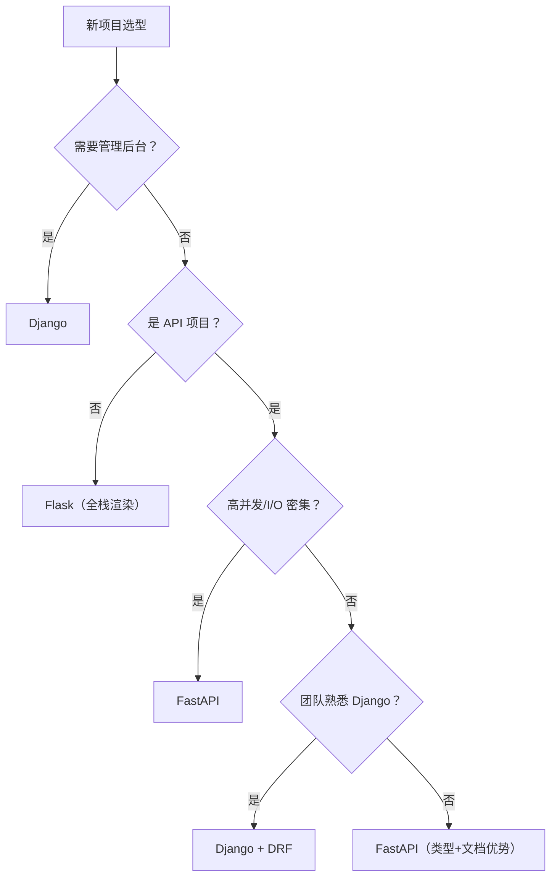
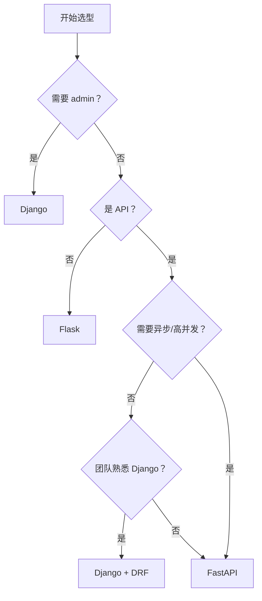

# 阶段 7 · 框架对比与选型

!!! info "本章定位"
    跳出 FastAPI，横向对比 Flask / Django / FastAPI，建立选型判断力。本章产出一篇深度对比长文。

    读完本章，你将能够在多个维度上准确评估三个框架的优劣，针对给定业务场景给出合理的选型建议。

---

## 本章学习目标

读完本章后，你应当能够：

1. 在多个维度上准确对比 Flask、Django、FastAPI 的差异
2. 理解同步与异步生态的本质区别与迁移坑
3. 解释为什么 LLM 应用后端几乎都选 FastAPI
4. 厘清 Django"全家桶"与 FastAPI"组合优先"两种哲学的取舍
5. 针对给定业务场景给出合理的框架选型建议

---

## 小节目录

1. 对比维度总览
2. 同步 vs 异步生态
3. 类型系统与数据建模
4. 文档与契约
5. ORM 与数据访问
6. 性能实测对比
7. 学习曲线与生态成熟度
8. 适用场景矩阵
9. 为什么 LLM 后端偏爱 FastAPI
10. Django 全家桶 vs FastAPI 组合优先
11. 选型决策清单
12. 小结与下一章衔接

---

## 7.1 对比维度总览

### 7.1.1 三框架速览

| 框架 | 诞生年份 | 创始人 | 设计哲学 | WSGI/ASGI |
|------|---------|--------|---------|-----------|
| Flask | 2010 | Armin Ronacher | 微框架，按需组合 | WSGI（同步） |
| Django | 2005 | Adrian Holovaty | 全家桶，自带一切 | WSGI + ASGI（3.0+） |
| FastAPI | 2018 | Sebastián Ramírez | 类型优先，API 优先 | ASGI（原生异步） |

### 7.1.2 全维度对比表

| 维度 | Flask | Django | FastAPI |
|------|-------|--------|---------|
| 同步/异步 | 同步为主 | 同步为主，ASGI 部分 | 原生异步 |
| 类型系统 | 无 | 无 | Pydantic 强类型 |
| 自动文档 | 需插件 | DRF + drf-spectacular | 内置 |
| ORM | 自选 | Django ORM（强绑定） | 自选 |
| 学习曲线 | 低 | 中高 | 低中 |
| 性能 | 中 | 中 | 高 |
| 项目脚手架 | 轻 | 重（admin/migrations/auth 内置） | 轻 |
| 依赖注入 | 无 | 无 | Depends |
| 数据校验 | 手写/插件 | Form/Serializer | Pydantic 自动 |
| 流式响应 | 支持 | 支持 | 原生支持 |
| 社区生态 | 非常成熟 | 非常成熟 | 快速增长中 |
| 适用 | 小型/传统 | 全功能大应用 | API/微服务/LLM 后端 |

### 7.1.3 核心差异一句话

- **Flask**：给你自由，但也给你责任
- **Django**：替你决定，省心但耦合
- **FastAPI**：类型即文档，异步即性能

---

## 7.2 同步 vs 异步生态

### 7.2.1 生态分裂

Python Web 生态存在同步与异步两个平行世界：

| 功能 | 同步库 | 异步库 |
|------|--------|--------|
| HTTP 客户端 | `requests` | `httpx` / `aiohttp` |
| PostgreSQL | `psycopg2` | `asyncpg` |
| MySQL | `PyMySQL` | `aiomysql` |
| Redis | `redis-py` | `redis.asyncio` |
| ORM | `SQLAlchemy`（同步） | `SQLAlchemy 2.0`（异步） |
| 文件 I/O | `open()` | `aiofiles` |

**Flask** 生态以同步为主，混用异步需要 `flask[async]` + `async_to_sync` 桥接，性能有损耗。

**Django** 3.0+ 支持 ASGI，但大量内置功能（ORM、cache、mail）仍是同步，需 `sync_to_async` 桥接。

**FastAPI** 原生异步，生态天然适配异步库，无桥接损耗。

### 7.2.2 桥接代价

```python
# Django 中在异步视图里调用同步 ORM
async def my_view(request):
    users = await sync_to_async(User.objects.all)()  # 桥接
    ...
```

`sync_to_async` 把同步调用放到线程池中，每次调用有线程切换开销。在高并发场景下，线程池大小成为瓶颈。

### 7.2.3 混用陷阱

```python
# 错误：在异步视图里直接调用同步 DB
async def my_view(request):
    users = User.objects.all()  # 阻塞事件循环！
    ...
```

同步调用阻塞事件循环，所有其他请求被卡住。这是 Django/Flask 异步迁移中最常见的坑。

### 7.2.4 迁移建议

| 当前框架 | 目标 | 建议 |
|---------|------|------|
| Flask → FastAPI | 逐步迁移 | 端点逐个重写，共享 DB schema |
| Django → FastAPI | API 层迁移 | 保留 Django admin/management，API 用 FastAPI |
| 新项目 | 直接选 | I/O 密集选 FastAPI，全功能选 Django |

---

## 7.3 类型系统与数据建模

### 7.3.1 同一接口三种框架的入参校验

需求：`POST /items`，请求体 `{"name": str, "price": float}`，`name` 非空，`price` > 0。

**Flask**（手写校验）：

```python
from flask import Flask, request, jsonify

app = Flask(__name__)

@app.post("/items")
def create_item():
    data = request.get_json()
    if not data:
        return jsonify({"error": "body required"}), 422
    name = data.get("name")
    if not name or not isinstance(name, str):
        return jsonify({"error": "name must be a non-empty string"}), 422
    price = data.get("price")
    if not isinstance(price, (int, float)) or price <= 0:
        return jsonify({"error": "price must be positive"}), 422
    return jsonify({"name": name, "price": price}), 201
```

**Django + DRF**（Serializer）：

```python
from rest_framework import serializers

class ItemSerializer(serializers.Serializer):
    name = serializers.CharField(min_length=1)
    price = serializers.FloatField(min_value=0)

    def validate_price(self, value):
        if value <= 0:
            raise serializers.ValidationError("price must be positive")
        return value

class ItemView(APIView):
    def post(self, request):
        serializer = ItemSerializer(data=request.data)
        serializer.is_valid(raise_exception=True)
        return Response(serializer.data, status=201)
```

**FastAPI**（Pydantic 注解）：

```python
from pydantic import BaseModel, Field

class ItemCreate(BaseModel):
    name: str = Field(min_length=1)
    price: float = Field(gt=0)

@app.post("/items", status_code=201)
def create_item(item: ItemCreate):
    return item
```

### 7.3.2 代码量对比

| 框架 | 校验代码行数 | 特点 |
|------|------------|------|
| Flask | ~8 行 | 手写，易遗漏边界，重复 |
| Django + DRF | ~10 行 | 声明式，但 Serializer 语法较重 |
| FastAPI | ~3 行 | 类型注解即校验，最简洁 |

### 7.3.3 类型安全的连锁效应

FastAPI 的类型注解不仅做校验，还自动产生：

1. **422 错误响应**（结构化错误信息）
2. **OpenAPI 文档**（Swagger UI / ReDoc）
3. **IDE 自动补全**（Pydantic 模型属性提示）
4. **序列化/反序列化**（`model_dump()` / `model_validate()`）

一次声明，四处收益。Flask 和 Django 需要分别手写校验、文档、序列化。

---

## 7.4 文档与契约

### 7.4.1 三种文档方案

**Flask**：需 `flask-smorest` 或 `flasgger` 插件，手写 OpenAPI schema：

```python
@app.route("/items", methods=["POST"])
@swag_from("specs/create_item.yml")  # 手写 YAML
def create_item():
    ...
```

**Django + DRF**：用 `drf-spectacular` 从 Serializer 自动推导：

```python
# settings.py
REST_FRAMEWORK = {
    'DEFAULT_SCHEMA_CLASS': 'drf_spectacular.openapi.AutoSchema',
}

# 需要手动添加 @extend_schema 装饰器补充信息
@extend_schema(request=ItemSerializer, responses=ItemSerializer)
class ItemView(APIView):
    ...
```

**FastAPI**：从类型注解自动生成，零配置：

```-python
@app.post("/items", response_model=ItemRead)
def create_item(item: ItemCreate):
    ...
# /docs 自动可用，无需任何额外代码
```

### 7.4.2 维护成本对比

| 方面 | Flask | Django + DRF | FastAPI |
|------|-------|-------------|---------|
| 初始配置 | 高（装插件+写 schema） | 中（装 drf-spectacular） | 零 |
| 日常维护 | 高（改代码+改 schema） | 中（改 Serializer+装饰器） | 零（改注解即可） |
| 文档与代码一致性 | 低（手动同步） | 中（半自动） | 高（同一来源） |
| 交互测试 | 需另装 Swagger UI | DRF 自带 browsable API | 内置 Swagger UI + ReDoc |

### 7.4.3 契约先行开发

FastAPI 的自动文档使"契约先行"成为自然的工作流：

1. 写类型注解和空端点
2. 启动服务，在 `/docs` 验证 API 契约
3. 实现业务逻辑
4. 文档自动更新，无需手动维护

---

## 7.5 ORM 与数据访问

### 7.5.1 Django ORM（强绑定）

```python
# models.py
class Item(models.Model):
    name = models.CharField(max_length=200)
    price = models.FloatField()

# 自动生成 migration
# python manage.py makemigrations
# python manage.py migrate

# 查询
items = Item.objects.filter(price__gt=10).order_by("-price")
```

优势：

- **自动 migration**：模型变更自动生成数据库迁移
- **Admin 后台**：自动生成管理界面
- **功能完备**：查询、聚合、事务、信号等一应俱全

劣势：

- **强绑定**：难以换 ORM，模型类与 Django 耦合
- **同步为主**：异步支持仍在完善中

### 7.5.2 FastAPI + SQLAlchemy 2.0 async

```python
from sqlalchemy import select
from sqlalchemy.ext.asyncio import AsyncSession

class Item(Base):
    __tablename__ = "items"
    id: Mapped[int] = mapped_column(primary_key=True)
    name: Mapped[str]
    price: Mapped[float]

async def get_items(db: AsyncSession):
    result = await db.execute(select(Item).where(Item.price > 10))
    return result.scalars().all()

@app.get("/items")
async def list_items(db: AsyncSession = Depends(get_db)):
    return await get_items(db)
```

优势：

- **异步原生**：`await db.execute()` 不阻塞事件循环
- **灵活选择**：SQLAlchemy / SQLModel / Tortoise ORM / raw asyncpg
- **类型提示**：SQLAlchemy 2.0 的 `Mapped` 类型与 IDE 补全

劣势：

- **无自动 admin**：需自建或用第三方（如 sqladmin）
- **migration 需 Alembic**：额外配置

### 7.5.3 SQLModel：FastAPI 创始人的融合方案

```python
from sqlmodel import SQLModel, Field

class Item(SQLModel, table=True):
    id: int | None = Field(default=None, primary_key=True)
    name: str
    price: float
```

SQLModel 同时是 Pydantic 模型和 SQLAlchemy 模型，减少重复定义。适合中小项目，但灵活性不如纯 SQLAlchemy。

### 7.5.4 ORM 选型对比

| 方案 | 异步 | 自动 Migration | Admin | 类型提示 | 适合 |
|------|------|--------------|-------|---------|------|
| Django ORM | 部分 | ✅ | ✅ | 弱 | Django 全栈 |
| SQLAlchemy 2.0 async | ✅ | Alembic | sqladmin | 强 | FastAPI 生产 |
| SQLModel | ✅ | Alembic | sqladmin | 强 | FastAPI 中小项目 |
| Tortoise ORM | ✅ | aerich | ❌ | 中 | FastAPI 轻量 |

---

## 7.6 性能实测对比

### 7.6.1 测试场景

同一接口：`GET /items/{id}` → 一次 DB 查询 → 返回 JSON。

### 7.6.2 预期数据（I/O 密集）

| 框架 | 并发模式 | RPS | p99 延迟 | 说明 |
|------|---------|-----|---------|------|
| Flask + gunicorn | 同步多 worker | ~2,000 | ~50ms | 每个 worker 一个线程 |
| Django + gunicorn | 同步多 worker | ~1,800 | ~55ms | 略重于 Flask |
| Django + uvicorn (ASGI) | 异步 + sync_to_async | ~2,200 | ~45ms | 桥接有开销 |
| FastAPI + uvicorn | 异步原生 | ~8,000 | ~15ms | 无桥接损耗 |

### 7.6.3 预期数据（CPU 密集，无 I/O）

| 框架 | RPS | 说明 |
|------|-----|------|
| Flask | ~5,000 | 同步无 I/O 等待，性能不差 |
| Django | ~4,500 | 略重 |
| FastAPI | ~5,000 | 异步无优势（无 I/O 可切换） |

### 7.6.4 关键解读

1. **I/O 密集场景 FastAPI 优势巨大**：异步在 I/O 等待时切换任务，吞吐量 3-4 倍于同步
2. **CPU 密集场景差异不大**：异步不提供真正的并行计算
3. **Django ASGI 有提升但有限**：ORM 等同步组件需桥接，抵消部分异步收益
4. **生产中差距可能更大**：真实场景通常有多次 DB/HTTP 调用，异步优势累积

### 7.6.5 性能不是唯一指标



---

## 7.7 学习曲线与生态成熟度

### 7.7.1 学习曲线



| 框架 | 入门 | 熟练 | 精通 | 主要学习障碍 |
|------|------|------|------|------------|
| Flask | 1-2 天 | 1 周 | 2-4 周 | 无架构约束，大型项目需自行设计 |
| FastAPI | 2-3 天 | 1-2 周 | 3-6 周 | Pydantic + 异步 + Depends |
| Django | 1-2 周 | 1-2 月 | 3-6 月 | ORM + admin + settings + middleware 概念多 |

### 7.7.2 生态成熟度

| 方面 | Flask | Django | FastAPI |
|------|-------|--------|---------|
| 诞生年份 | 2010 | 2005 | 2018 |
| PyPI 月下载 | ~100M | ~50M | ~40M（快速增长） |
| GitHub Stars | ~68K | ~79K | ~80K |
| 第三方插件 | 非常多 | 非常多 | 增长中 |
| 企业采用 | 广泛 | 非常广泛 | 快速增长 |
| 长期支持 | 稳定 | 非常稳定 | 活跃维护 |

### 7.7.3 团队引入建议

| 团队情况 | 建议 | 原因 |
|---------|------|------|
| Python 新手团队 | Flask | 门槛最低 |
| 有 Java/Spring 经验 | Django | 全家桶模式熟悉 |
| 有 TypeScript 经验 | FastAPI | 类型注解理念一致 |
| 已有 Django 项目 | 保留 Django | 迁移成本高 |
| 新 API 项目 | FastAPI | 类型+异步+文档一体 |
| 需要管理后台 | Django | admin 无可替代 |

---

## 7.8 适用场景矩阵

### 7.8.1 场景推荐表

| 场景 | 推荐 | 理由 |
|------|------|------|
| 内部管理后台 | Django | admin/migrations/auth 内置 |
| 单页应用 API 后端 | FastAPI | 异步 + 自动文档 |
| 微服务 | FastAPI | 轻量、高性能 |
| LLM 应用后端 | FastAPI | 流式响应、Pydantic 契约 |
| 传统企业系统 | Django/Flask | 生态成熟、同步驱动齐全 |
| 高并发 I/O 密集 | FastAPI | 异步原生 |
| CMS/内容管理 | Django | admin + ORM + auth |
| 数据可视化 API | FastAPI | 异步查询 + JSON 友好 |
| 实时通信 | FastAPI | WebSocket + 异步 |
| 教学项目 | Flask | 最简，暴露底层 |

### 7.8.2 场景决策树



---

## 7.9 为什么 LLM 后端偏爱 FastAPI

### 7.9.1 流式响应

LLM 生成是逐 token 流式输出，需要 SSE（Server-Sent Events）或流式 HTTP 响应：

```python
from fastapi import FastAPI
from fastapi.responses import StreamingResponse

app = FastAPI()

async def generate_stream(prompt: str):
    async for token in llm.generate(prompt):
        yield f"data: {token}\n\n"

@app.get("/chat")
def chat(prompt: str):
    return StreamingResponse(generate_stream(prompt), media_type="text/event-stream")
```

FastAPI 的 `StreamingResponse` 原生支持异步生成器，完美适配 LLM 流式输出。Flask 也支持流式但同步模型下效率受限。

### 7.9.2 Pydantic 与结构化输出

LLM 的结构化输出（function calling / JSON mode）需要严格的 schema 定义：

```python
class WeatherQuery(BaseModel):
    city: str
    date: str

class WeatherResponse(BaseModel):
    city: str
    date: str
    temperature: float
    condition: str

@app.post("/weather", response_model=WeatherResponse)
def weather(query: WeatherQuery):
    # LLM function calling with WeatherResponse schema
    response = llm.chat(
        messages=[...],
        tools=[WeatherResponse.model_json_schema()],
    )
    return response
```

Pydantic 模型直接转为 JSON Schema 传给 LLM，LLM 的结构化输出直接 `model_validate` 为 Pydantic 实例。**类型注解 → LLM schema → LLM 输出 → 类型验证**，全链路类型安全。

### 7.9.3 异步并发调用多个 LLM

```python
@app.post("/compare")
async def compare_models(prompt: str):
    # 并发调用多个 LLM，不阻塞事件循环
    results = await asyncio.gather(
        call_openai(prompt),
        call_anthropic(prompt),
        call_local_model(prompt),
    )
    return {"openai": results[0], "anthropic": results[1], "local": results[2]}
```

异步并发让多个 LLM 调用同时进行，总延迟等于最慢的一个，而非三者之和。

### 7.9.4 生态契合

| 库 | 与 FastAPI 的关系 |
|---|-----------------|
| LangChain | 大量 FastAPI 示例和集成 |
| LangSmith | 追踪 FastAPI 请求 |
| OpenAI SDK | `AsyncOpenAI` 与 FastAPI 异步天然适配 |
| Pydantic AI | FastAPI 创始人新项目，直接集成 |
| Vercel AI SDK | 前端流式消费 FastAPI SSE |

---

## 7.10 Django 全家桶 vs FastAPI 组合优先

### 7.10.1 两种哲学

**Django：自带一切**

```
Django = ORM + Admin + Auth + Migrations + Sessions + Cache + Forms + ...
```

- 优点：开箱即用，选型成本低，团队一致性好
- 缺点：耦合高，换组件困难，"Django way"约束多

**FastAPI：按需组合**

```
FastAPI = ASGI + Pydantic + Depends
+ 你选的 ORM + 你选的 Auth + 你选的 Cache + ...
```

- 优点：灵活，每层可选最优组件，无耦合
- 缺点：选型成本高，团队需对生态有判断力

### 7.10.2 对比场景

**场景：用户认证**

Django：

```python
# settings.py 已配置 auth
from django.contrib.auth.decorators import login_required

@login_required
def my_view(request):
    ...
# 自带 User 模型、登录/登出/注册/密码重置/权限系统
```

FastAPI：

```python
# 需要自己选：fastapi-users / python-jose / passlib / Authlib
from fastapi_users import FastAPIUsers

fastapi_users = FastAPIUsers[User, int](
    get_user_manager,
    [auth_backend],
)

@app.get("/protected")
async def protected(user: User = Depends(fastapi_users.current_user())):
    ...
# 需要自己配置 User 模型、JWT 后端、密码哈希
```

Django 自带一切，FastAPI 需要自己组合。**Django 省 3 天配置，FastAPI 给 3 倍灵活性**。

### 7.10.3 适配分析

| 项目阶段 | 推荐 | 原因 |
|---------|------|------|
| MVP / 原型 | FastAPI | 轻量，快速迭代 |
| 成长期 API | FastAPI | 异步性能 + 类型安全 |
| 成熟期全功能 | Django | admin/migrations 省心 |
| 大团队企业 | Django | 约定优于配置，一致性 |
| 创业团队 | FastAPI | 灵活，技术栈现代 |
| 微服务架构 | FastAPI | 每服务轻量独立 |

### 7.10.4 混合架构

实践中常见**混合架构**：

```
Django（admin + management commands + ORM）
    ↓ 共享数据库
FastAPI（API 层，异步，高性能）
```

Django 管后台和管理脚本，FastAPI 管对外 API。两者共享同一数据库 schema。

---

## 7.11 选型决策清单

### 7.11.1 决策问题

回答以下问题，按答案导向框架选择：

| # | 问题 | 倾向 |
|---|------|------|
| 1 | 需要管理后台（admin）吗？ | 是 → Django |
| 2 | 是纯 API 项目（无页面渲染）吗？ | 是 → FastAPI |
| 3 | 需要高并发 / I/O 密集吗？ | 是 → FastAPI |
| 4 | 需要流式响应（SSE/WebSocket）吗？ | 是 → FastAPI |
| 5 | 团队熟悉 Django 且项目大？ | 是 → Django |
| 6 | 需要最快上手？ | 是 → Flask |
| 7 | 需要自动 API 文档？ | 是 → FastAPI |
| 8 | LLM / AI 后端？ | 是 → FastAPI |
| 9 | 已有大量同步库依赖？ | 是 → Flask/Django |
| 10 | 微服务架构？ | 是 → FastAPI |

### 7.11.2 决策流程



### 7.11.3 反模式

| 反模式 | 问题 | 正确做法 |
|--------|------|---------|
| Flask 做大型项目 | 无架构约束，维护困难 | 用 Django 或 FastAPI |
| Django 做微服务 | 太重，启动慢 | 用 FastAPI |
| FastAPI 做 CMS | 无 admin，需自建 | 用 Django |
| 新项目选 Flask | 生态停滞，无类型 | 用 FastAPI |
| 同步项目硬上异步 | 桥接开销，复杂度增加 | 评估是否真需要异步 |

---

## 7.12 小结与下一章衔接

### 7.12.1 本章核心观点

1. **没有银弹**：三个框架各有适用场景，选型取决于业务需求、团队能力、项目阶段

2. **异步是趋势**：I/O 密集场景下异步优势巨大，FastAPI 原生异步是核心竞争力

3. **类型即文档**：FastAPI 的类型注解一次声明，自动产生校验、文档、序列化，开发效率最高

4. **LLM 时代选 FastAPI**：流式响应、Pydantic 契约、异步并发，天然适配 LLM 后端

5. **Django 不会过时**：管理后台、全功能需求、企业级约定，Django 仍不可替代

6. **Flask 适合教学和小项目**：最简暴露底层，但新项目建议优先考虑 FastAPI

### 7.12.2 选型一句话

> **要 admin 选 Django，要 API 选 FastAPI，要最快上手选 Flask。**

### 7.12.3 下一章衔接

本章建立了选型判断力。下一章进入实战：**用 FastAPI 做一个规范化的博客 API 业务项目**。

阶段 8 将覆盖：

- 项目架构与分层（router / service / repository / model）
- 配置管理（pydantic-settings + 环境变量）
- 数据库集成（SQLAlchemy 2.0 async + Alembic）
- 认证与权限（JWT + OAuth2PasswordBearer）
- 错误处理与日志（结构化日志 + 全局异常）
- API 版本管理
- 测试策略（pytest + httpx + testcontainers）
- 性能优化（N+1 查询、缓存、连接池调优）

---

!!! success "阶段 7 完成"
    框架对比与选型指南

    - 文档：本章 ≥ 700 行
    - 覆盖：12 个维度深度对比 + 决策清单

!!! todo "下一阶段"
    阶段 8 · 业务实践：规范化博客 API 项目
