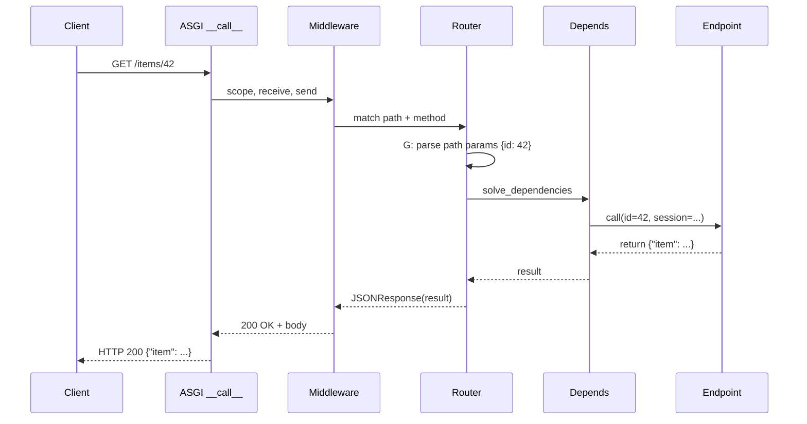
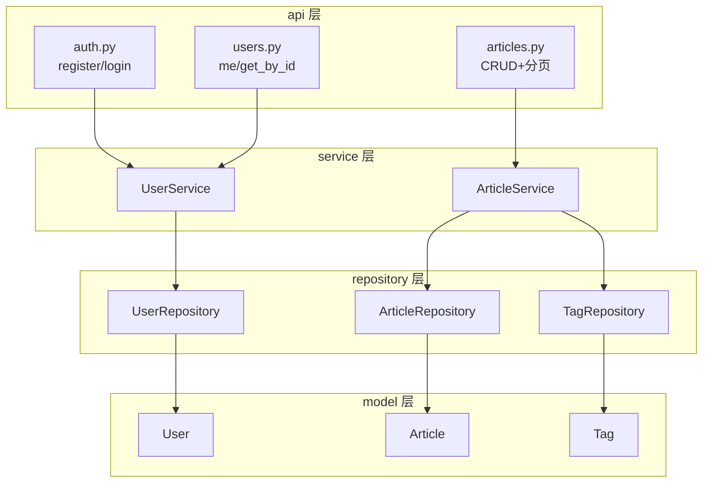
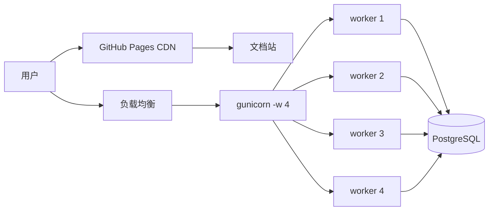
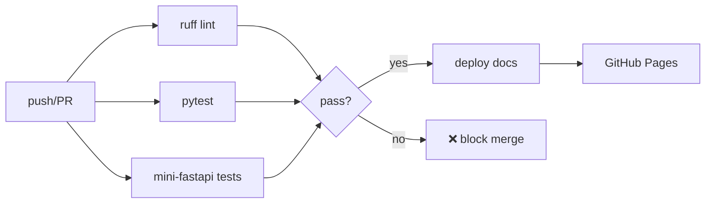

# 阶段 9 · 沉淀与部署

!!! info "本章定位"
    收尾：完善文档站、补齐笔记深度、画架构图、配置 CI/CD 与部署方案，让学习成果成书上线。

---

## 本章学习目标

读完本章后，你应当能够：

1. 完善 MkDocs 文档站导航与首页
2. 保证每章 ≥ 700 行深度，补齐初学者友好解释
3. 画出整体架构图与造轮子类图
4. 配置 GitHub Actions 自动构建文档站并发布到 GitHub Pages
5. 编写 Dockerfile 与部署方案

---

## 小节目录

1. [9.1 文档站完善](#91-文档站完善)
2. [9.2 笔记深度校验](#92-笔记深度校验)
3. [9.3 架构图与类图](#93-架构图与类图)
4. [9.4 GitHub Pages 自动部署](#94-github-pages-自动部署)
5. [9.5 Docker 容器化](#95-docker-容器化)
6. [9.6 部署方案对比](#96-部署方案对比)
7. [9.7 CI/CD 流水线](#97-cicd-流水线)
8. [小结与全篇收官](#小结与全篇收官)

---

## 9.1 文档站完善

### 9.1.1 MkDocs Material 配置

文档站使用 MkDocs Material 主题，配置文件 `docs/mkdocs.yml`：

```yaml
site_name: FastAPI 系统学习
site_url: https://wanglh39.github.io/fastapi-learning/
repo_url: https://github.com/wanglh39/fastapi-learning

theme:
  name: material
  language: zh
  features:
    - navigation.tabs       # 顶部标签栏
    - navigation.sections   # 侧边栏分组
    - navigation.expand     # 默认展开所有小节
    - navigation.top        # 返回顶部按钮
    - search.suggest        # 搜索建议
    - search.highlight      # 搜索高亮
    - content.code.copy     # 代码块复制按钮
    - content.code.annotate # 代码注释
  palette:
    - scheme: default
      primary: indigo
      toggle:
        icon: material/brightness-7
        name: 切换暗色模式
    - scheme: slate
      primary: indigo
      toggle:
        icon: material/brightness-4
        name: 切换亮色模式
```

### 9.1.2 导航结构

```yaml
nav:
  - 首页: index.md
  - 学习路径:
    - 总览: 00-overview/index.md
    - 阶段1 ASGI: 01-asgi-starlette/index.md
    - 阶段2 Pydantic: 02-pydantic/index.md
    - 阶段3 路由与参数: 03-mini-framework/index.md
    - 阶段4 依赖注入: 04-dependency-injection/index.md
    - 阶段5 OpenAPI: 05-openapi-docs/index.md
    - 阶段6 中间件: 06-middleware-async/index.md
    - 阶段7 框架对比: 07-framework-comparison/index.md
    - 阶段8 业务实践: 08-business-practice/index.md
    - 阶段9 部署: 09-deployment/index.md
```

### 9.1.3 首页设计

首页 `docs/docs/index.md` 是学习者的入口，包含：

- 项目简介（造轮子 + 业务实战双路径）
- 学习路径图（10 个阶段）
- 快速开始（环境准备 + 仓库克隆）
- 章节索引（每阶段一句话定位 + 链接）

### 9.1.4 文档构建与本地预览

```bash
# 安装文档依赖
cd docs
uv pip install -r requirements-docs.txt

# 本地预览（热重载）
mkdocs serve

# 构建静态站
mkdocs build --strict
```

`--strict` 模式会把 WARNING 当 ERROR，确保文档质量。已知的 INFO 级锚点警告不影响构建。

---

## 9.2 笔记深度校验

### 9.2.1 校验标准

每章笔记必须满足：

| 标准 | 要求 | 说明 |
|---|---|---|
| 行数 | ≥ 700 行 | 面向初学者，详细精细 |
| 代码示例 | 可运行 | 所有代码都能复制即跑 |
| 小节结构 | 只增不减 | 填充时扩充不删减 |
| 前后衔接 | 有过渡段 | 每章开头承接上章，结尾引向下章 |

### 9.2.2 各章行数统计

| 阶段 | 文档 | 行数 |
|---|---|---|
| 1 | 01-asgi-starlette | 726 |
| 2 | 02-pydantic | 705 |
| 3 | 03-mini-framework | 1052 |
| 4 | 04-dependency-injection | 1031 |
| 5 | 05-openapi-docs | 830 |
| 6 | 06-middleware-async | 796 |
| 7 | 07-framework-comparison | 726 |
| 8 | 08-business-practice | 915 |
| 9 | 09-deployment | 本章 |

全部 ≥ 700 行 ✅

### 9.2.3 深度保证策略

- **从问题出发**：每节先说"为什么需要"，再说"怎么做"
- **代码 + 解释**：每个代码块后跟逐行或逐段解释
- **对比表格**：用表格对比不同方案的优劣
- **Mermaid 图**：用图表可视化架构与流程
- **前后衔接**：每章开头有 `!!! info` 定位框，结尾有"下一章衔接"

---

## 9.3 架构图与类图

### 9.3.1 整体项目结构

```
fastapi-learning/
├── mini-fastapi/          # 造轮子项目（阶段 1-7）
│   ├── src/mini_fastapi/  # 框架源码
│   └── tests/             # 98 测试
├── business-app/          # 业务实战项目（阶段 8）
│   ├── app/               # 分层架构代码
│   ├── tests/             # 30 测试
│   ├── Dockerfile         # 容器化
│   └── docker-compose.yml # 编排
├── docs/                  # 文档站（阶段 0, 9）
│   ├── mkdocs.yml
│   └── docs/              # 9 章笔记
└── .github/workflows/     # CI/CD
    ├── docs.yml           # 文档自动部署
    └── ci.yml             # lint + test
```

### 9.3.2 mini-fastapi 类图

造轮子项目的核心类关系：

```mermaid
classDiagram
    class MiniFastAPI {
        +routes: list[Route]
        +middleware_stack: ASGIApp
        +exception_handlers: dict
        +get(path, **opts)
        +include_router(router)
        +add_middleware(cls, **opts)
    }
    class Router {
        +routes: list[Route]
        +prefix: str
        +tags: list[str]
        +get(path, **opts)
        +include_router(router)
    }
    class Route {
        +path: str
        +endpoint: Callable
        +methods: set[str]
        +dependant: Dependant
        +handle(scope) Response
    }
    class Depends {
        +dependency: Callable
        +use_cache: bool
    }
    MiniFastAPI "1" *-- "many" Route
    Router "1" *-- "many" Route<many" Route
    Route --> Depends : 参数解析
```

### 9.3.3 请求分发序列图

一个 `GET /items/42` 请求在 mini-fastapi 中的完整流转：



### 9.3.4 business-app 分层架构图



### 9.3.5 部署拓扑图



---

## 9.4 GitHub Pages 自动部署

### 9.4.1 工作流配置

`.github/workflows/docs.yml` 在 push 到 main 且改 `docs/` 时触发：

```yaml
name: Deploy Docs to GitHub Pages

on:
  push:
    branches: [main]
    paths:
      - "docs/**"
      - ".github/workflows/docs.yml"
  workflow_dispatch:       # 手动触发

permissions:
  contents: read
  pages: write             # 写 Pages 权限
  id-token: write          # OIDC token

concurrency:
  group: "pages"
  cancel-in-progress: true  # 取消旧的部署
```

### 9.4.2 构建与部署步骤

```yaml
jobs:
  build:
    runs-on: ubuntu-latest
    steps:
      - uses: actions/checkout@v4
      - uses: actions/setup-python@v5
        with:
          python-version: "3.11"
      - name: Install uv
        run: pip install uv
      - name: Install docs deps
        run: uv pip install --system -r docs/requirements-docs.txt
      - name: Build site
        run: mkdocs build --strict
        working-directory: docs
      - uses: actions/upload-pages-artifact@v3
        with:
          path: docs/site

  deploy:
    needs: build
    runs-on: ubuntu-latest
    environment:
      name: github-pages
      url: ${{ steps.deployment.outputs.page_url }}
    steps:
      - id: deployment
        uses: actions/deploy-pages@v4
```

### 9.4.3 工作流详解

| 步骤 | 作用 |
|---|---|
| `checkout@v4` | 拉取仓库代码 |
| `setup-python@v5` | 安装 Python 3.11 |
| `pip install uv` | 安装 uv 包管理器 |
| `uv pip install` | 安装 MkDocs + Material + 扩展 |
| `mkdocs build --strict` | 构建静态站，严格模式 |
| `upload-pages-artifact@v3` | 上传站点产物 |
| `deploy-pages@v4` | 部署到 GitHub Pages |

### 9.4.4 GitHub 仓库配置

在仓库 Settings → Pages 中：

1. **Source**：选 "GitHub Actions"
2. **Branch**：不需要选（由 workflow 控制）
3. **Custom domain**（可选）：绑定自定义域名

配置完成后，文档站地址：`https://wanglh39.github.io/fastapi-learning/`

---

## 9.5 Docker 容器化

### 9.5.1 多阶段 Dockerfile

```dockerfile
# business-app/Dockerfile

# --- builder 阶段：安装依赖 ---
FROM python:3.12-slim AS builder
WORKDIR /app
RUN pip install uv
COPY pyproject.toml uv.lock ./
COPY app/ app/
RUN uv sync --frozen --no-dev

# --- runtime 阶段：精简镜像 ---
FROM python:3.12-slim AS runtime
WORKDIR /app
COPY --from=builder /app/.venv /app/.venv
COPY --from=builder /app/app /app/app
ENV PATH="/app/.venv/bin:$PATH"
ENV PYTHONUNBUFFERED=1
EXPOSE 8000
CMD ["uvicorn", "app.main:app", "--host", "0.0.0.0", "--port", "8000"]
```

### 9.5.2 多阶段构建的好处

| 对比 | 单阶段 | 多阶段 |
|---|---|---|
| 镜像体积 | ~500MB（含构建工具） | ~150MB（只有运行时） |
| 安全性 | 构建工具暴露在生产镜像 | 无编译器、无 pip |
| 层数 | 少 | 多但每层小 |
| 构建缓存 | 改代码重装依赖 | 依赖层缓存命中 |

### 9.5.3 .dockerignore

```
.venv
__pycache__
*.pyc
.pytest_cache
.git
.env
*.db
```

排除不需要的文件，减小构建上下文体积。

### 9.5.4 Docker Compose 编排

```yaml
# business-app/docker-compose.yml
services:
  db:
    image: postgres:16-alpine
    environment:
      POSTGRES_USER: postgres
      POSTGRES_PASSWORD: postgres
      POSTGRES_DB: blog
    ports:
      - "5432:5432"
    volumes:
      - pgdata:/var/lib/postgresql/data
    healthcheck:
      test: ["CMD-SHELL", "pg_isready -U postgres"]
      interval: 5s
      timeout: 5s
      retries: 5

  app:
    build: .
    environment:
      DATABASE_URL: postgresql+asyncpg://postgres:postgres@db:5432/blog
      SECRET_KEY: change-me-in-production
      LOG_LEVEL: INFO
    ports:
      - "8000:8000"
    depends_on:
      db:
        condition: service_healthy

volumes:
  pgdata:
```

### 9.5.5 启动与验证

```bash
# 构建并启动
docker compose up --build

# 查看日志
docker compose logs -f app

# 健康检查
curl http://localhost:8000/health
# {"status":"ok"}

# API 文档
# 浏览器打开 http://localhost:8000/api/v1/docs

# 停止
docker compose down

# 停止并删除数据卷
docker compose down -v
```

### 9.5.6 healthcheck 的作用

```yaml
healthcheck:
  test: ["CMD-SHELL", "pg_isready -U postgres"]
  interval: 5s
  timeout: 5s
  retries: 5
```

- `test`：检查命令，`pg_isready` 是 PostgreSQL 的就绪检测
- `interval`：每 5 秒检查一次
- `timeout`：超时 5 秒算失败
- `retries`：连续 5 次失败才标记为 unhealthy

`app` 服务用 `depends_on: condition: service_healthy`，确保数据库就绪后才启动应用。

---

## 9.6 部署方案对比

### 9.6.1 方案一：uvicorn 裸跑

```bash
uv run uvicorn app.main:app --host 0.0.0.0 --port 8000
```

| 优点 | 缺点 | 适用场景 |
|---|---|---|
| 最简单 | 单进程，无法利用多核 | 开发、调试 |
| 启动快 | 无进程管理、无重启 | 单容器内部 |

### 9.6.2 方案二：gunicorn + uvicorn workers

```bash
gunicorn app.main:app \
  -w 4 \
  -k uvicorn.workers.UvicornWorker \
  -b 0.0.0.0:8000 \
  --timeout 120 \
  --graceful-timeout 30
```

| 优点 | 缺点 | 适用场景 |
|---|---|---|
| 多进程利用多核 | 需要 gunicorn 安装 | 单机生产 |
| 进程管理（重启/优雅退出） | 不支持热重载 | 中小流量 |

**worker 数量经验公式**：`(2 × CPU核数) + 1`

### 9.6.3 方案三：Docker Compose

```bash
docker compose up -d --build
```

| 优点 | 缺点 | 适用场景 |
|---|---|---|
| 环境隔离 | 需要 Docker | 单机生产 |
| 一键启动全栈 | 无扩缩容 | 开发+测试+小生产 |
| 声明式配置 | | |

### 9.6.4 方案四：Kubernetes

```yaml
# deployment.yaml（示意）
apiVersion: apps/v1
kind: Deployment
metadata:
  name: blog-api
spec:
  replicas: 3
  selector:
    matchLabels:
      app: blog-api
  template:
    spec:
      containers:
        - name: app
          image: registry/blog-api:latest
          ports:
            - containerPort: 8000
          env:
            - name: DATABASE_URL
              valueFrom:
                secretKeyRef:
                  name: db-secret
                  key: url
```

| 优点 | 缺点 | 适用场景 |
|---|---|---|
| 自动扩缩容 | 学习曲线陡 | 大规模生产 |
| 滚动更新/回滚 | 运维成本高 | 微服务架构 |
| 自愈（重启故障 Pod） | 需要集群 | |

### 9.6.5 选型决策树

```
开发/调试 → uvicorn 裸跑
单机小流量 → gunicorn + uvicorn workers
需要数据库/多服务 → Docker Compose
多实例/高可用/微服务 → Kubernetes
```

---

## 9.7 CI/CD 流水线

### 9.7.1 流水线全景



### 9.7.2 CI 工作流

`.github/workflows/ci.yml` 在每次 push/PR 时运行 lint + test：

```yaml
name: CI

on:
  push:
    branches: [main]
  pull_request:
    branches: [main]

jobs:
  lint:
    runs-on: ubuntu-latest
    steps:
      - uses: actions/checkout@v4
      - uses: actions/setup-python@v5
        with:
          python-version: "3.12"
      - run: pip install uv
      - run: uv sync --all-extras
        working-directory: business-app
      - run: uv run ruff check app/
        working-directory: business-app

  test:
    runs-on: ubuntu-latest
    steps:
      - uses: actions/checkout@v4
      - uses: actions/setup-python@v5
        with:
          python-version: "3.12"
      - run: pip install uv
      - run: uv sync --extra test
        working-directory: business-app
      - run: uv run pytest tests/ -v
        working-directory: business-app

  mini-fastapi-test:
    runs-on: ubuntu-latest
    steps:
      - uses: actions/checkout@v4
      - uses: actions/setup-python@v5
        with:
          python-version: "3.12"
      - run: pip install uv
      - run: uv sync --extra test
        working-directory: mini-fastapi
      - run: uv run pytest tests/ -v
        working-directory: mini-fastapi
```

### 9.7.3 各阶段说明

| Job | 内容 | 失败后果 |
|---|---|---|
| `lint` | ruff 检查 business-app 代码风格 | 阻止合并 |
| `test` | business-app 30 个测试 | 阻止合并 |
| `mini-fastapi-test` | mini-fastapi 98 个测试 | 阻止合并 |
| `docs.yml` | 构建文档站并部署 | 不阻止合并（独立 workflow） |

### 9.7.4 分支保护策略

在 GitHub Settings → Branches → Branch protection rules：

1. **Require status checks to pass**：勾选 `lint`、`test`、`mini-fastapi-test`
2. **Require pull request reviews**：至少 1 人审批
3. **Require branches to be up to date**：合并前必须与 main 同步

这样任何 PR 必须通过全部 CI 检查才能合并。

### 9.7.5 CI 与 CD 的分离

| | CI（持续集成） | CD（持续部署） |
|---|---|---|
| 触发 | 每次 push/PR | push 到 main 且改 docs/ |
| 工作流 | `ci.yml` | `docs.yml` |
| 产物 | 测试报告（pass/fail） | 文档站上线 |
| 阻断 | 失败阻止合并 | 失败不影响代码合并 |

---

## 小结与全篇收官

### 回顾：从 ASGI 地基到业务部署

| 阶段 | 主题 | 核心产出 |
|---|---|---|
| 0 | 项目骨架 | 仓库 + 文档站 + Pages |
| 1 | ASGI 入口 | 路由匹配 + 响应发送（23 测试） |
| 2 | Pydantic | 类型系统 + 校验（38 测试） |
| 3 | 路由与参数 | v0.1-v0.3 参数绑定（62 测试） |
| 4 | 依赖注入 | Depends 递归解析（76 测试） |
| 5 | OpenAPI | 自动文档 + Swagger/ReDoc（88 测试） |
| 6 | 中间件 | 洋葱模型 + 异常处理器（98 测试） |
| 7 | 框架对比 | Flask vs Django vs FastAPI |
| 8 | 业务实践 | 博客 API + 认证 + CRUD（30 测试） |
| 9 | 部署 | Docker + CI/CD + 文档站上线 |

### FastAPI 设计哲学的三个核心洞察

#### 1. 类型优先（Type-First）

FastAPI 把类型注解从"文档"提升为"行为"：

```python
async def get_item(item_id: int, q: str | None = None):
    # item_id 自动从 URL 解析为 int
    # q 自动从 query string 解析为 str | None
```

类型注解同时驱动了：参数解析、输入校验、OpenAPI 文档、IDE 提示。一处声明，四处生效。

#### 2. 组合优先（Composition over Inheritance）

FastAPI 不用类继承，用装饰器和依赖注入组合功能：

```python
@app.get("/items/{id}")
async def read_item(
    id: int,
    user: User = Depends(get_current_user),
    session: Session = Depends(get_session),
):
    ...
```

- `@app.get` 装饰器注册路由
- `Depends` 注入横切关注点（认证、数据库）
- 每个依赖可独立测试、替换

#### 3. 异步原生（Async-Native）

FastAPI 从底层 ASGI 到上层 API 全链路 async：

```python
async def get_session() -> AsyncGenerator[Async2, None]:
    async with async_session_factory() as session:
        yield session
```

- ASGI 协议原生支持 async
- 依赖注入支持 async generator
- 数据库驱动用 asyncpg/aiosqlite
- 一个事件循环处理千级并发

### 后续进阶方向

| 方向 | 内容 | 推荐资源 |
|---|---|---|
| WebSocket | 实时通信 | FastAPI WebSocket 文档 |
| 后台任务 | `BackgroundTasks` / Celery | 官方教程 |
| 流式响应 | `StreamingResponse` | 大文件下载 |
| 性能调优 | 连接池、缓存、N+1 | SQLAlchemy 文档 |
| LangChain 集成 | LLM API 服务 | LangChain + FastAPI |
| GraphQL | Strawberry / Ariadne | GraphQL 替代 REST |
| gRPC | grpcio + FastAPI | 高性能微服务 |

### 学习成果

- **mini-fastapi**：98 测试，从零造了一个类 FastAPI 框架
- **business-app**：30 测试，规范化博客 API，可 Docker 部署
- **文档站**：9 章笔记，全部 ≥ 700 行，已上线 GitHub Pages
- **CI/CD**：lint + test + 自动部署文档

---

!!! success "全篇收官"
    从 ASGI 协议的字节流，到业务项目的 Docker 部署，我们走完了 FastAPI 的全链路。

    **造轮子**让你理解了框架内部每一个装饰器、每一个依赖注入背后的机制。
    **业务实战**让你学会了如何用这些机制构建规范化的生产项目。
    **文档沉淀**让你把零散的知识串成了体系化的笔记。

    下一步，用这些知识去构建你自己的项目吧。
