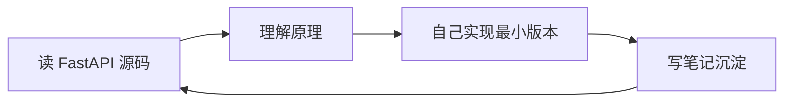

# FastAPI 系统化学习与实践

> 从底层原理到业务实践，系统掌握 FastAPI 框架。
>
> 核心方法：**亲手造一个类 FastAPI 的轻量级框架**，通过实践深入理解其内部机制；再用官方 FastAPI 完成一个规范化业务项目，最终沉淀为本文档站。

---

## 为什么这样学

很多人学 FastAPI 上来就学"怎么用"，遇到问题只能查文档。本项目的目标是理解**底层原理与设计哲学**，因此采用"造轮子"路径：



每个主题都按 **读源码 → 造轮子 → 写笔记** 三步循环，避免纯理论枯燥，也避免盲写。

---

## 两个子项目

| 项目 | 作用 | 技术栈 |
|------|------|--------|
| `mini-fastapi` | 造轮子，理解 FastAPI 内部机制 | 纯 Python + Pydantic + uvicorn |
| `business-app` | 真实业务工程化最佳实践 | FastAPI + SQLAlchemy 2.0 async + JWT |

先造轮子理解原理，再用真框架做业务——此时对框架行为有"上帝视角"，写出来的代码质量完全不同。

---

## 学习路径速览

| 阶段 | 主题 | 产出 |
|------|------|------|
| 0 | 环境与基础准备 | 项目骨架 + 文档站 |
| 1 | ASGI 协议与 Starlette | mini-fastapi v0.0 |
| 2 | Pydantic 与类型系统 | 参数验证脚本 |
| 3 | 路由与参数绑定 | mini-fastapi v0.1–v0.3 |
| 4 | 依赖注入系统 | mini-fastapi v0.4 |
| 5 | 自动文档生成 | mini-fastapi v0.5 |
| 6 | 中间件、异常、异步 | mini-fastapi v0.6 |
| 7 | 框架对比与选型 | 对比分析长文 |
| 8 | 业务工程化实践 | business-app 完整项目 |
| 9 | 沉淀与部署 | 文档站成书 |

详细说明见 [学习路径总览](00-overview/index.md)。

---

## 快速开始

=== "造轮子项目"

    ```bash
    cd mini-fastapi
    uv sync
    uv run uvicorn examples.hello:app --reload
    ```

=== "业务项目"

    ```bash
    cd business-app
    cp .env.example .env
    uv sync
    uv run uvicorn app.main:app --reload
    ```

=== "文档站本地预览"

    ```bash
    cd docs
    uv run --with-requirements requirements-docs.txt mkdocs serve
    ```

    访问 http://127.0.0.1:8000

---

## 环境要求

- Python ≥ 3.11
- [uv](https://github.com/astral-sh/uv) 作为环境与包管理器
- Git

---

## 写作规范

- 每章 ≥ 700 行，面向初学者，详细精细
- 代码示例必须可运行，附预期输出
- 架构关系优先用 mermaid 图
- 关键概念先讲"为什么"再讲"怎么做"
- 笔记深度与数量只增不减